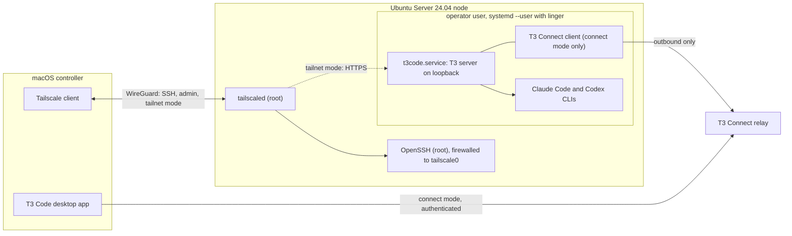

<h1 align="center">Harbor</h1>

<p align="center">
  <strong>Turn a spare Ubuntu machine into a private agent node.</strong>
</p>

<p align="center">
  Bash tooling that provisions Ubuntu Server 24.04 as a headless host for Claude Code and Codex,<br>
  driven from T3 Code on your Mac. Every change is journaled, so teardown removes only what Harbor owns.
</p>

<p align="center">
  <a href="#current-status"></a>
  <a href="#development"></a>
  <a href="#security"></a>
  <a href="LICENSE"></a>
</p>

<p align="center">
  <a href="#first-run">First run</a> ·
  <a href="#how-it-works">How it works</a> ·
  <a href="#access-modes">Access modes</a> ·
  <a href="#security">Security</a> ·
  <a href="#current-status">Current status</a>
</p>

---

## Why

A spare laptop or desktop can host a T3 Code server, the agent CLIs it drives, and the network route that lets your Mac reach it. Setting that up by hand means a dozen decisions about users, SSH, firewalls, sleep behavior, runtimes, and vendor logins. Undoing it means remembering every one of them.

Harbor makes those decisions once, verifies the result, and records what it changed.

```text
spare Ubuntu machine
  └─ harbor bootstrap ──▶ hardened node ──▶ attended vendor logins ──▶ harbor provision
                             │                                            │
                             └─ ownership journal ────────────────────────┴──▶ exact teardown
```

It connects vendor-owned tools rather than replacing them. Ubuntu Server 24.04 LTS is the operating system. Tailscale supplies the private network, identity, and MagicDNS names — Harbor never runs Tailscale Funnel. Node.js is installed at an exact pinned version under a root-owned prefix. Claude Code and Codex are the agent CLIs, authenticated interactively. T3 Code is the controller: its own `t3` package runs the server on the node, and the macOS desktop app connects to it.

Harbor calls their documented commands, checks the result, and journals its own changes. It does not fork or reimplement any of them.

> **Pre-release.** `bootstrap` exists and is heavily tested, but no release has been tagged and the rest of the lifecycle is still being built. Read [Current status](#current-status) before pointing this at real hardware.

## First run

The planned v1 flow has two mutating commands on the node — `bootstrap` and `provision` — with attended vendor logins and Mac client setup around them. Only bootstrap exists today.

| Step | What you do | What Harbor does | Status |
| --- | --- | --- | --- |
| **Bootstrap** | `cd fleet && sudo ./bin/harbor bootstrap` | Checks Ubuntu 24.04 and amd64, installs and re-executes Harbor from a root-owned release, then installs packages, creates the operator, and configures Node.js, SSH, the firewall, power, and Tailscale | Implemented; needs a release tag, so not yet runnable |
| **Join** | `harbor auth tailscale` | Opens the attended Tailscale login and verifies the node joined your tailnet | Implemented |
| **Provision** | `harbor provision` | Installs Claude Code, Codex, and T3 at pinned versions, then installs T3's user service | Planned |
| **Authenticate** | `harbor auth claude`, `harbor auth codex` | Hands each login to the vendor and verifies the result without reading credentials | Implemented; `harbor auth connect` is planned |
| **Connect** | `harbor client setup` on the Mac | Prepares the selected route and verifies the desktop can reach the node | Planned |
| **Operate** | `harbor status`, `doctor`, `upgrade`, `teardown` | Reports health, updates pinned components, or reverses only Harbor-owned changes | Planned |

Bootstrap runs from a clean checkout at an exact release tag. It stages a root-owned copy under `/usr/local/lib/harbor/<tag>/`, links `/usr/local/bin/harbor` to it, then re-executes itself from that installed copy before changing the machine. Later commands run installed code, never a checkout under a user's home directory.

The full lifecycle is designed to be **idempotent** — running a command again on a healthy node should make no extra changes. Bootstrap is the part implemented and tested today.

## How it works



Each managed component has one small adapter. Harbor's role is deliberately narrow:

| Component | Owner | Harbor's role |
| --- | --- | --- |
| Operator user (`harbor` by default) | Harbor | Creates an unprivileged account for agent work, with no `sudo` or extra groups; `--operator NAME` changes the name |
| OpenSSH | Ubuntu | Writes an operator-scoped drop-in requiring public-key authentication; global hardening is opt-in |
| Firewall (`ufw`) | Ubuntu | Allows inbound SSH through the Tailscale interface and preserves existing policy unless you explicitly adopt it; `--allow-lan-ssh` adds an opt-in local-network rule and reports degraded status |
| Power | Ubuntu | Prevents a laptop from sleeping when its lid closes |
| Node.js | Harbor | Installs the exact version in `fleet/versions.lock` under `/opt/harbor/node`, verifies its SHA-256 checksum, and journals links for `node`, `npm`, `npx`, and `corepack` |
| Tailscale | Tailscale | Installs the pinned version or preserves an existing install; grants the operator role on Harbor-owned installs, otherwise prints the vendor command unless `--adopt-tailscale` opts in |
| T3 server | T3 Code | Planned: invokes `t3 service install`; Harbor writes no service unit, launcher, port, or environment |
| Claude Code and Codex | Anthropic and OpenAI | Runs each vendor's attended login and records the verified result; installing the pinned versions is planned |
| Ownership journal | Harbor | Records each mutation under the root or operator state directory so recovery and teardown know what Harbor owns |
| Command lock | Harbor | One exclusive lock per journal, so two Harbor commands cannot change the same state at once |

Versions live in [`fleet/versions.lock`](fleet/versions.lock) — one exact value per key, filled in by the PR that installs the component. Ubuntu 24.04, Tailscale 1.102.3, Node.js 24.20.0 with a recorded SHA-256, Claude Code 2.1.267, Codex 0.154.0, and T3 0.0.38 are pinned today. Direct downloads require a recorded checksum and fail closed when it does not match.

## Access modes

The route from the desktop app to the T3 server is an explicit choice. Exactly one planned mode is active at a time.

| Mode | Route | Inbound on node | Tailnet-private? |
| --- | --- | --- | --- |
| `connect` (default) | The node opens an authenticated outbound tunnel to T3's relay; the signed-in desktop reaches it through that relay | None | No — controller traffic passes through T3's relay |
| `tailnet` | Tailscale Serve fronts the loopback server at its MagicDNS name (`harbor-node.TAILNET.ts.net` is a documentation placeholder, not a hostname Harbor sets) | Port 443 inside the WireGuard tunnel | Yes |
| `ssh` | The desktop launches its own remote T3 server over SSH and forwards a loopback port | SSH through Tailscale only | Yes |

SSH stays available over the tailnet in every mode. Harbor opens no public inbound port unless you explicitly request the local-network SSH rule with `--allow-lan-ssh`. Access-mode commands are designed but not implemented yet.

## Security

- **No new public inbound ports by default.** The standard firewall rule admits SSH only through `tailscale0`. Harbor preserves pre-existing policy and never configures Funnel or a reverse proxy. The explicit `--allow-lan-ssh` flag also permits port 22 from the node's local RFC 1918 network and makes bootstrap report degraded status.
- **SSH is tailnet-only unless you opt out.** OpenSSH can start before the Tailscale interface exists, so the firewall — not the SSH bind address — enforces the boundary.
- **Scoped hardening.** The default SSH drop-in changes authentication only for the Harbor operator. It does not lock out the administrator who ran bootstrap.
- **Installed code is the trust boundary.** Root commands execute the root-owned installed release, not mutable code from an operator checkout.
- **Every mutation is journaled.** Each entry records the target, operation, prior state, intended state, and whether Harbor created, modified, or only observed it.
- **Logins stay attended.** Tailscale, Claude Code, Codex, and T3 Connect authentication happens in the vendor's own terminal or browser flow. Harbor never reads their credential stores.
- **Versions are pinned before installation.** Direct downloads require a recorded checksum and fail closed on mismatch.

See [SECURITY.md](SECURITY.md) for the threat boundary and vulnerability reporting process.

## Current status

Harbor is incomplete. The CLI surface today is:

- **`harbor bootstrap`** — Ubuntu 24.04 and amd64 checks, checkout trust, root-owned release installation, the operator user, authorized SSH keys, operator-scoped SSH hardening, firewall rules, lid and sleep behavior, Node.js, Tailscale, user lingering, state, locking, and ownership journaling.
- **`harbor auth tailscale | claude | codex`** — hands each login to the vendor's own attended flow and records the verified result without reading the credential store. `harbor auth connect` is not part of this release.
- **`harbor journal resolve`** — lets the journal owner mark an undecidable entry as reverted after inspecting it by hand.

Everything else — provisioning, pairing, access and service management, health checks, upgrades, teardown, and the macOS client — is not implemented. The dispatcher reports those as unknown subcommands.

No Harbor release has been tagged, and bootstrap's checkout-trust rule requires an exact tag, so the repository cannot yet bootstrap a real node. The build order is section 8 of the [design specification](docs/superpowers/specs/2026-09-01-harbor-design.md).

## What it is not

- Not an orchestrator. Harbor prepares one node and defines no policy for what agents do there.
- Not a fork of T3 Code, Tailscale, Claude Code, or Codex.
- Not a central fleet manager. Each installation manages its local node.
- Not a public service. No Funnel, no reverse proxy, no inbound port outside the tailnet unless you enable the local-network SSH escape hatch.
- Not a GUI. T3 Code is the interface; Harbor prepares the machine behind it.
- Not a manager of agent data. Harbor does not read T3 sessions, agent credentials, or worktrees.

## Repository

```text
fleet/                 Harbor itself
├── bin/harbor         single entry point; dispatches commands, contains no business logic
├── lib/               shared libraries plus one adapter per managed component
├── node/bootstrap.sh  root bootstrap implementation
├── versions.lock      exact third-party versions
└── tests/             Bats tests, vendor shims, fixtures, lint scripts
docs/superpowers/      design specification, implementation plans, pin provenance
t3-reasoning/          maintained T3 Code patch stack and verification tooling
```

`t3-reasoning/` pins an exact upstream T3 Code revision plus a checksummed patch set and the scripts that verify and rebuild it — reasoning identity, queued updates, thread forks, managed runtime releases, and update coordination. It has its own [README](t3-reasoning/README.md) and CI; Harbor does not depend on it at runtime.

## Development

Clone with submodules — the Bats test libraries are vendored that way:

```sh
git clone --recurse-submodules https://github.com/kgarg2468/harbor
```

Run the same unit suite and safety scans CI runs:

```sh
fleet/tests/run_unit.sh
fleet/tests/lint/placeholder_scan.sh
fleet/tests/lint/engines_check.sh
```

ShellCheck, shfmt, gitleaks, and markdownlint are also required; exact commands and versions are in [CONTRIBUTING.md](CONTRIBUTING.md).

Tests call shims — small stand-ins for system and vendor commands — instead of touching the real machine. The macOS CI lane runs non-node Bash under the system Bash 3.2, the compatibility floor for code shared with the future Mac client.

## Contributing

Read the [design specification](docs/superpowers/specs/2026-09-01-harbor-design.md) first. Pull requests follow its section 8 plan one row at a time. [CONTRIBUTING.md](CONTRIBUTING.md) has the ground rules, lint and test commands, and commit conventions.

## License

[MIT](LICENSE)
