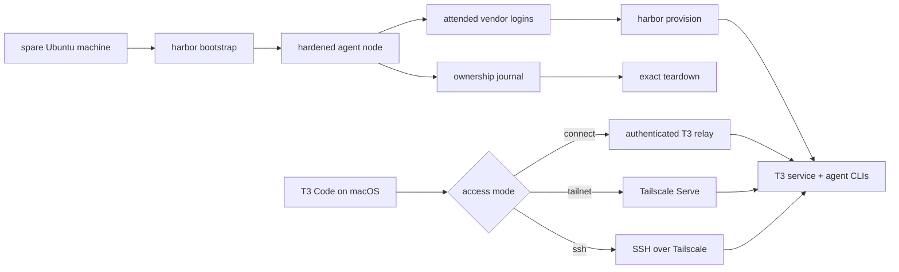
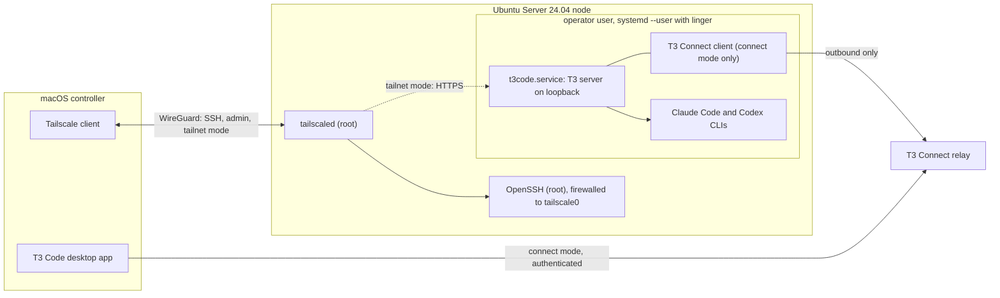

# Harbor

Turn a spare Ubuntu machine into a private, always-on agent node you drive from T3 Code on your Mac.

Harbor is a set of Bash tools that provisions an Ubuntu Server 24.04 machine as a headless host
for Claude Code and Codex. You reach it through your own Tailscale network or T3's authenticated
tunnel. Every change Harbor makes is written to an ownership journal, so it can later inspect and
undo exactly what it owns.

Harbor is pre-release. The bootstrap command exists and is heavily tested, but no release has
been tagged and the rest of the lifecycle is still being built. See
[Current Status](#current-status) before trying it on real hardware.

[Design](docs/superpowers/specs/2026-09-01-harbor-design.md) ·
[Security](SECURITY.md) · [Contributing](CONTRIBUTING.md)

## Product

A spare laptop or desktop can host a T3 Code server, the agent CLIs it drives, and the network
route that lets your Mac reach it. Setting that up by hand means making a dozen decisions about
users, SSH, firewalls, sleep behavior, runtimes, and vendor logins. Undoing it means remembering
every one of them.

Harbor makes those decisions once, verifies the result, and records what it changed. The planned
v1 gives you one command surface to build the node, check its health, upgrade it, and reverse the
setup without removing anything Harbor did not create.

Harbor connects vendor-owned tools instead of replacing them:

- **Ubuntu Server 24.04 LTS** is the node operating system.
- **Tailscale** provides the private network, identity, and MagicDNS names. Harbor never runs
  Tailscale Funnel, which would expose the node to the public internet.
- **Node.js** is installed at an exact pinned version, checksum-verified, under a root-owned
  prefix that the T3 server can use.
- **Claude Code** and **Codex** are the agent CLIs. You authenticate them interactively.
- **T3 Code** is the controller. Its own `t3` package runs the server on the node, and its desktop
  app on macOS connects to it.

Harbor does not fork or reimplement these tools. It calls their documented commands, checks the
result, and journals its own changes.

## First Run

The planned v1 flow has two mutating commands on the node—`bootstrap` and `provision`—with
attended vendor logins and Mac client setup around them. Only bootstrap exists today.

| Step | What you do | What Harbor does | Status |
| --- | --- | --- | --- |
| Bootstrap | `cd fleet && sudo ./bin/harbor bootstrap` | Checks Ubuntu 24.04 and amd64, installs and re-executes Harbor from a root-owned release, then installs packages, creates the operator, and configures Node.js, SSH, the firewall, power, and Tailscale | Implemented; needs a release tag, so not yet runnable |
| Join | `harbor auth tailscale` | Opens the attended Tailscale login and verifies the node joined your tailnet | Planned |
| Provision | `harbor provision` | Installs Claude Code, Codex, and T3 at pinned versions, then installs T3's user service | Planned |
| Authenticate | `harbor auth claude`, `codex`, and `connect` | Hands each login to the vendor and verifies the result without reading credentials | Planned |
| Connect | `harbor client setup` on the Mac | Prepares the selected route and verifies the desktop can reach the node | Planned |
| Operate | `harbor status`, `doctor`, `upgrade`, and `teardown` | Reports health, updates pinned components, or reverses only Harbor-owned changes | Planned |



Bootstrap runs from a clean checkout at an exact release tag. It stages a root-owned copy under
`/usr/local/lib/harbor/<tag>/`, links `/usr/local/bin/harbor` to it, then re-executes itself from
that installed copy before changing the machine. Later commands run installed code, not a
checkout under a user's home directory.

The full lifecycle is designed to be **idempotent**—running a command again on a healthy node
should make no extra changes. Bootstrap is the part implemented and tested today.

## Architecture



| Component | Owner | Harbor's role |
| --- | --- | --- |
| Operator user (`harbor` by default) | Harbor | Creates an unprivileged account for agent work, with no `sudo` or extra groups; `--operator NAME` changes the name |
| OpenSSH | Ubuntu | Writes an operator-scoped drop-in that requires public-key authentication; global hardening is opt-in |
| Firewall (`ufw`) | Ubuntu | Allows inbound SSH through the Tailscale interface and preserves existing policy unless you explicitly adopt it; `--allow-lan-ssh` adds an opt-in local-network rule and reports degraded status |
| Power | Ubuntu | Prevents a laptop from sleeping when its lid closes |
| Node.js | Harbor | Installs the exact version in `fleet/versions.lock` under `/opt/harbor/node`, verifies its SHA-256 checksum, and journals links for `node`, `npm`, `npx`, and `corepack` in `/usr/local/bin` |
| Tailscale | Tailscale | Installs the pinned version or preserves an existing install; grants the operator role on Harbor-owned installs and otherwise prints the vendor command unless `--adopt-tailscale` opts in |
| T3 server | T3 Code | Planned: invokes `t3 service install`; Harbor writes no service unit, launcher, port, or environment |
| Claude Code and Codex | Anthropic and OpenAI | Planned: installs pinned versions; authentication remains attended and vendor-owned |
| Ownership journal | Harbor | Records each mutation under the root or operator state directory so later recovery and teardown know what Harbor owns |
| Command lock | Harbor | Uses one exclusive lock per journal so two Harbor commands cannot change the same state at once |

## Access Modes

The route from the desktop app to the T3 server is an explicit choice. Exactly one planned mode
is active at a time.

| Mode | Route | Inbound on node | Tailnet-private? |
| --- | --- | --- | --- |
| `connect` (default) | The node opens an authenticated outbound tunnel to T3's relay; the signed-in desktop reaches it through that relay | None | No; controller traffic passes through T3's relay |
| `tailnet` | Tailscale Serve fronts the loopback server at its MagicDNS name; `harbor-node.TAILNET.ts.net` is the documentation placeholder, not a hostname Harbor sets | Port 443 inside the WireGuard tunnel | Yes |
| `ssh` | The desktop launches its own remote T3 server over SSH and forwards a loopback port | SSH through Tailscale only | Yes |

SSH remains available over the tailnet in every mode. Harbor opens no public inbound port unless
you explicitly request the local-network SSH rule with `--allow-lan-ssh`. Access-mode commands are
designed but not implemented yet.

## What It Proves

| Question | Harbor's answer |
| --- | --- |
| Can a headless laptop stay available after logout or a closed lid? | Bootstrap configures systemd power policy and user lingering. Planned provisioning uses T3's own user-level background service so it survives SSH disconnects and reboots without an interactive login |
| Does Harbor open the node to the internet? | Not by default. Harbor's SSH rule is limited to Tailscale; `--allow-lan-ssh` can explicitly add access from the node's local RFC 1918 network and reports the node as degraded. `tailnet` and `ssh` keep controller traffic on Tailscale; `connect` uses an authenticated outbound T3 tunnel |
| Can Harbor safely rerun setup? | Bootstrap compares real state with its journal before acting. The same idempotency rule is part of every planned command |
| Can teardown remove only Harbor's work? | The journal distinguishes artifacts Harbor created, modified, or merely observed. Planned teardown reverses only owned mutations whose current state still matches the journal |
| Does Harbor hide vendor behavior behind its own runtime? | No. Vendor calls live in small adapters, versions are pinned, and T3 owns its service, updates, snapshots, and rollback |
| Can this repository be public without exposing the operator? | CI scans for secrets and private identifiers. Tests and docs use fixed placeholders instead of real tailnet names, IP addresses, emails, or pairing links |

## Security

- **No new public inbound ports by default.** Harbor's standard firewall rule admits SSH only
  through `tailscale0`. It preserves pre-existing policy and never configures Funnel or a reverse
  proxy. The explicit `--allow-lan-ssh` flag also permits port 22 from the node's local RFC 1918
  network and makes bootstrap report degraded status.
- **SSH is tailnet-only unless you opt out.** OpenSSH can start before the Tailscale interface
  exists, so the firewall—not the SSH bind address—enforces the boundary.
- **Scoped hardening.** The default SSH drop-in changes authentication only for the Harbor
  operator. It does not lock out the administrator who ran bootstrap.
- **Installed code is the trust boundary.** Root commands execute the root-owned installed
  release, not mutable code from an operator checkout.
- **Every mutation is journaled.** Each entry records the target, operation, prior state, intended
  state, and whether Harbor created, modified, or only observed it.
- **Logins stay attended.** Tailscale, Claude Code, Codex, and T3 Connect authentication happens
  in the vendor's terminal or browser flow. Harbor does not read their credential stores.
- **Versions are pinned before installation.** Ubuntu, Tailscale, Node.js, and the target T3
  version are pinned today. The agent CLI and remaining install keys are filled by the pull
  request that installs each component. Direct downloads require a recorded checksum and fail
  closed when it does not match.

See [SECURITY.md](SECURITY.md) for the threat boundary and vulnerability reporting process.

## Current Status

Harbor is incomplete. The current CLI surface is:

- `harbor bootstrap`, with implementation for Ubuntu 24.04 and amd64 checks, checkout trust,
  root-owned release installation, the operator user, authorized SSH keys, operator-scoped SSH
  hardening, firewall rules, lid and sleep behavior, Node.js, Tailscale, user lingering, state,
  locking, and ownership journaling.
- `harbor journal resolve`, which lets the journal owner mark an undecidable entry as reverted
  after inspecting it by hand.
- Bats tests for the dispatcher, bootstrap, and each supporting library. CI runs the suite on
  Ubuntu and macOS, including macOS's Bash 3.2.

The remaining product commands—provisioning, authentication, pairing, access and service
management, health checks, upgrades, teardown, and the macOS client—are not implemented. The
dispatcher currently reports them as unknown subcommands.

No Harbor release has been tagged. Bootstrap's checkout trust rule requires an exact tag, so the
repository is not ready to bootstrap a real node yet. The build order is documented in section 8
of the [design specification](docs/superpowers/specs/2026-09-01-harbor-design.md).

## Repository Layout

```text
fleet/                 Harbor itself
  bin/harbor           single entry point; dispatches commands and contains no business logic
  lib/                 shared libraries plus one adapter per managed component
  node/bootstrap.sh    root bootstrap implementation
  versions.lock        exact third-party versions
  tests/               Bats tests, vendor shims, fixtures, and lint scripts
docs/superpowers/      design specification, implementation plans, and pin provenance records
t3-reasoning/          maintained T3 Code patch stack and verification tooling
insomnia/              separate macOS menu bar utility sharing this repository
```

`t3-reasoning/` pins an exact upstream T3 Code revision plus a checksummed patch set and the
scripts that verify and rebuild it. The patches cover reasoning identity, queued updates, thread
forks, managed runtime releases, and update coordination. It has its own
[README](t3-reasoning/README.md) and CI; Harbor does not depend on it at runtime.

## Development

Clone with submodules because the Bats test libraries are vendored that way:

```sh
git clone --recurse-submodules https://github.com/kgarg2468/harbor
```

Run the same unit suite and safety scan CI runs:

```sh
fleet/tests/run_unit.sh
fleet/tests/lint/placeholder_scan.sh
fleet/tests/lint/engines_check.sh
```

ShellCheck, shfmt, gitleaks, and markdownlint are also required. The exact commands and versions
are in [CONTRIBUTING.md](CONTRIBUTING.md).

Tests call shims—small stand-ins for system and vendor commands—instead of touching the real
machine. The macOS CI lane runs non-node Bash under the system Bash 3.2, which is the compatibility
floor for code shared with the future Mac client.

## What It Is Not

- Not an orchestrator. Harbor prepares one node and defines no policy for what agents do there.
- Not a fork of T3 Code, Tailscale, Claude Code, or Codex.
- Not a central fleet manager. Each Harbor installation manages its local node.
- Not a public service. No Funnel or reverse proxy, and no inbound port outside the tailnet unless
  you explicitly enable the local-network SSH escape hatch.
- Not a GUI. T3 Code is the interface; Harbor prepares the machine behind it.
- Not a manager of agent data. Harbor does not read T3 sessions, agent credentials, or worktrees.

## Contributing

Read the [design specification](docs/superpowers/specs/2026-09-01-harbor-design.md) first. Pull
requests follow its section 8 plan one row at a time. [CONTRIBUTING.md](CONTRIBUTING.md) has the
ground rules, lint and test commands, and commit conventions.

## License

[MIT](LICENSE)
