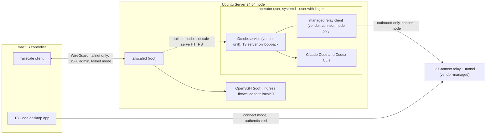

# Harbor design specification

- Status: proposed (PR 1), revised after technical review
- Date: 2026-09-01
- Repository: `kgarg2468/harbor`
- Author: Claude Fable 5.1; technical review: Codex; owner review pending

Harbor turns a spare machine into a private, always-on AI-agent node. It is the public,
reproducible glue between four things Harbor does not own: Ubuntu Server, Tailscale, the agent
runtimes (Claude Code and Codex), and T3 Code as the controller UI and server. Harbor provisions
the node, drives and verifies the vendor-owned T3 background service, sets up and verifies the
client route, reports health, and removes exactly what it created.

Harbor is a new repository rather than an extension of `kgarg2468/foreman`. Foreman holds
orchestration policy and configuration; Harbor holds machine and network plumbing and links to
Foreman as an optional layer without depending on it.

Where this document cites T3 Code behavior, the source of truth is the T3 source tree's
`docs/internals/` and `docs/user/` documents for remote access, T3 Connect, server updates, and
the background service at the pinned release. Harbor relies only on commands and fields those
documents or the CLI's `--help` promise.

## 1. Goals, non-goals, audience, success criteria

### Goals

1. A fresh Ubuntu Server 24.04 install becomes a working agent node with one root bootstrap
   run and one operator provision run, both re-runnable, plus the attended Tailscale login,
   vendor logins, and pairing steps the vendors require.
2. No inbound port on the node is reachable from any non-tailnet address. SSH is tailnet-only.
   The controller route is one of three explicit access modes (section 3.3); the default, T3
   Connect, is an authenticated outbound managed tunnel that needs no inbound port but is not
   tailnet-private.
3. The T3 server survives reboots, SSH disconnects, and lid closes with nobody logged in, using
   T3's own background service.
4. Every step is idempotent, observable through `harbor status`, and reversible through
   `harbor teardown`, which removes only artifacts recorded in Harbor's ownership journal.
5. The repository is safe to publish: no secrets, no owner tailnet or T3 Connect identifiers,
   no copied private application state.
6. Every automatable behavior has a test that runs in GitHub Actions without real credentials.
   Attended flows have documented manual acceptance checks.

### Non-goals

- Harbor is not an orchestrator and defines no policy. That is Foreman's job or the operator's.
- Harbor does not vendor, fork, patch, or re-implement T3 Code, Tailscale, Claude Code, Codex,
  or Foreman. It renders no T3 service unit, start wrapper, updater, or rollback (section 3.2).
- Harbor does not manage agent worktrees. T3 owns the worktrees it drives; Foreman owns
  orchestration policy. Harbor may recommend paths in its runbook but invents no branch or path
  semantics.
- Harbor does not manage, read, or observe T3 session or chat data, agent credentials, or
  pairing state beyond what vendor status commands report.
- Each Harbor installation manages only its local node.
- Harbor never opens public inbound ports, configures reverse proxies, or uses Tailscale Funnel.
- Harbor has no GUI. The GUI is T3 Code.

### Audience

Engineers who own a spare laptop or desktop, already use Claude Code or Codex, and want a
private remote node they can trust and explain. They are comfortable with a terminal, `sudo`,
and reading a systemd unit. They need not know Tailscale or T3 Connect internals.

### Success criteria for v1

| Criterion | Measure |
| --- | --- |
| Fresh node to connected controller | Under 30 minutes of operator time following the runbook, excluding OS install and attended browser steps |
| Idempotent reruns | A second `harbor bootstrap` and `harbor provision` on a healthy node report zero changes, mint no new pairing token, and exit 0 |
| Unattended recovery | After `sudo reboot` with no interactive login, operator `harbor status` and `sudo harbor status --system` each report healthy within 2 minutes |
| Exact teardown | After `harbor teardown --level node`, every applied `created` or `modified` journal entry is reverted or named in a warning, `observed` entries being outside that scope, nothing outside the journal has changed, and the operator user still exists. With `--delete-user`, the user and home are also gone |
| Public safety | Secret scanning and the placeholder scan pass on every commit in CI |
| Coverage | Every subcommand has Bats tests; the Ubuntu 24.04 integration lane exercises bootstrap, provision, vendor service install, status, and teardown end to end against fixture shims |

## 2. Supported topology and compatibility floor

### v1 topology

- Controller: one macOS machine running the T3 Code desktop app and the Tailscale client.
- Node: one x86_64 machine running Ubuntu Server 24.04 LTS. The reference hardware is an ASUS
  ROG Zephyrus G14 used headless; only the lid and power handling is laptop-specific.
- Network: one Tailscale tailnet containing both machines, MagicDNS enabled. The tailnet is the
  SSH and administrative route in every access mode.
- Runtimes: Claude Code and Codex CLIs on the node, authenticated interactively, running under
  the operator user.
- Controller server: the T3 Code server on the node, run by T3's own user-level background
  service (`t3code.service`), bound to loopback by the vendor default.
- Controller route: one of `connect` (default), `tailnet`, or `ssh` (section 3.3).



### Compatibility floor

| Component | Floor | Notes |
| --- | --- | --- |
| Node OS | Ubuntu Server 24.04 LTS, amd64 | systemd 255, bash 5.2, `apt`. Later releases untested in v1 |
| Controller OS | macOS 14 or later | Client scripts run under macOS's bundled bash 3.2 |
| Shell | bash 3.2 subset for `client/` and `lib/`; bash 5 permitted in `node/` | Enforced by ShellCheck and the pinned `macos-14` runner |
| Tailscale | Stable channel from `pkgs.tailscale.com` on the node; App Store or standalone client on the Mac | MagicDNS required |
| Node.js | An exact release satisfying the locked `t3_engines_node` range | See version pinning |
| T3 Code | The `t3` npm package at the locked exact version; a matching desktop release on the Mac | T3 warns on skew and offers its own update |

### Version pinning

All third-party versions live in `versions.lock` at the repository root, one exact value per
key: `ubuntu_release`, `tailscale_apt_channel`, `tailscale_version`, `nodejs_version`,
`nodejs_install`, `nodejs_sha256`, `claude_code_version`, `claude_code_install`,
`codex_version`, `codex_install`, `t3_version`, `t3_install`, `t3_engines_node`. This document
records the schema, not values.

- Values are first set in the PR that installs each component, except that `t3_version` and
  `t3_engines_node` are always set together: PR 3 sets Node.js, Tailscale, and that T3 pair,
  since Node.js cannot be pinned against an unpinned T3; PR 4 installs T3 at the already pinned
  `t3_version` and proves the pair, and sets `t3_install`, Claude Code, and Codex; the macOS
  client installs none. Thereafter values change only by a dedicated version-bump PR containing `versions.lock`
  plus any adapter changes in `lib/<component>.sh` the new release requires, such as new
  `t3 service status` phrases. It must pass the integration and vendor-smoke lanes (section 7).
- Every command reads the `versions.lock` of the release directory it executes from: the
  trusted checkout (section 5.1) when `sudo ./bin/harbor bootstrap` runs from one, otherwise the installed copy under
  `/usr/local/lib/harbor/<tag>/`. The one exception is `sudo harbor upgrade --system --from
  <checkout>`, which runs from the installed copy but reads the `versions.lock` of the
  explicitly named checkout it is asked to stage (section 6.4). No operator command reads a
  checkout (section 5.2).
- Installers compare installed to locked before acting: match is a no-op, mismatch installs the
  locked version, never `latest`. Downloads outside a package manager require a recorded
  SHA-256 and fail closed. Methods must yield a verifiable exact version and work without root
  in the operator's home prefix, except Node.js, which root installs during bootstrap. If a
  pinned Tailscale version is unavailable from the vendor apt repository, the installer fails
  naming the lock file.
- T3 is driven through the `t3` npm package's CLI at the locked version; `t3 service install`
  and `t3 service update` install the CLI version that invokes them.
- Node.js: T3's `engines.node` range belongs to T3, so Harbor never hard-codes it in code.
  `t3_engines_node` is that range copied verbatim from the pinned T3 release; the version-bump
  PR extracts it from the pinned package, reviews it next to `nodejs_version`, and CI proves
  `nodejs_version` satisfies it. Root commands validate Node.js by running the root-owned
  `/opt/harbor/node/bin/node --version` against the locked version and range alone and act on
  nothing read from operator state; the one operator-shell probe bootstrap runs, `sh -lc
  'node --version'` as the operator (section 5.2), is report-only. `lib/versions.sh` repeats the check at provision time against
  the installed `t3` package's own `engines.node` and exits 3 on failure. Node lives at the
  fixed prefix `/opt/harbor/node`, with journaled symlinks for `node`, `npm`, `npx`, and
  `corepack` in `/usr/local/bin`, so it resolves from a non-interactive `sh -lc` shell and from
  the user manager's default `PATH`, because T3's service launcher and desktop-managed SSH
  launch run without an interactive profile.

## 3. Trust and security model

### 3.1 Principals

| Principal | Runs as | Purpose |
| --- | --- | --- |
| `harbor bootstrap` | root via `sudo` | OS packages, Node.js, operator user, authorized key, operator-scoped sshd drop-in, firewall, power, Tailscale install or adoption and operator setting, linger, root journal |
| `tailscaled`, `sshd` | root system services | Vendor and distribution defaults |
| `harbor provision` and everything after | operator user, default `harbor`, no privileged groups | Agent CLI and T3 install, `t3 service install`, access-mode configuration, operator-owned status and diagnostics, teardown of user-level state |
| `harbor status --system`, `harbor doctor --system` | root via `sudo` | Observational evaluation, rewriting nothing but `prepared` journal markers during recovery (section 5.6), of root-managed checks (`ufw`, `sshd`, power, linger, Node.js and Tailscale ownership, installed release, root journal) under the root lock alone (section 5.6) |
| `t3code.service` | operator user, `systemd --user` | T3's own service and launcher. Harbor never edits it |
| Managed relay client | operator user, child of the T3 service | T3 Connect's relay client, installed by `t3 connect link`. Harbor never invokes it |
| Agent processes | operator user, children of the T3 server or an SSH session | Read and write only under the operator home |

Root is used for bootstrap, which is the install entry on a fresh node and the recovery entry
at any later time (section 5.2), and otherwise only for
`harbor upgrade --system`, which touches root-owned components alone (section 6.4), or
`harbor teardown --level node`, whose operator phases still run as the operator through an
explicit privilege drop (section 5.7), or `sudo harbor journal resolve` against the root
journal (section 3.7), or the observational `sudo harbor status --system` and
`sudo harbor doctor --system` (section 5.6), which evaluate root-managed checks that plain
operator commands cannot read. Every root step is inside `node/bootstrap.sh`, the system phase
of upgrade, the root phase of teardown, root `journal resolve`, or the root status and doctor
variants; no other script calls `sudo`.
Once bootstrap has installed it, every root and operator command runs Harbor's installed entrypoint
`/usr/local/bin/harbor` (section 5.2), never a checkout under a user's home, with two narrow
exceptions, both `sudo ./bin/harbor teardown --level node` from a clean tagged checkout that
passes the section 5.1 trust rules: once a node-level teardown has removed `/var/lib/harbor`,
and so the installed entrypoint with it, that command may run to confirm that no root state
remains; and once a node-level teardown has unlinked the installed entrypoint but crashed
before removing `/var/lib/harbor`, it may resume the finalization that the root journal proves
is all that remains (section 5.7). A checkout is trusted because the administrator who invoked
`sudo` owns it, never because a local tag is proof of who published it. Bootstrap sets
the Tailscale operator (section 5.2), the vendor's mechanism for letting a non-root user run
`tailscale status`, `serve`, and `up`. Harbor verifies only the read side of that grant, an
unprivileged `tailscale status --json`; a later write such as `serve` or `up` may still be
refused by the daemon, in which case the Harbor command fails safely, exit 3 with the vendor's
own output and nothing mutated.

### 3.2 The T3 service is vendor-owned

T3 Code ships its own Linux background service, and Harbor uses it as-is. `t3 service install`
writes `~/.config/systemd/user/t3code.service`, enables lingering, and starts a launcher that
owns exact-version runtimes, selection state, database snapshots before update trials, and
rollback when a trial fails. `t3 service status|update|uninstall` complete the lifecycle. The
service binds to loopback by vendor default; Harbor sets no bind address, port, or environment.

Harbor's role is orchestration around those commands: preflight (Node satisfies the engines
range, linger is on, disk has headroom for a snapshot), invocation at the locked version, and
verification. Harbor therefore has no unit template, start wrapper, T3 runtime directory, port
variable, or service rollback. `harbor service <start|stop|restart|status|logs>` prints the
vendor command it runs and runs it. The user manager has no `network-online.target`; T3
documents that the server retries its own networking, so Harbor adds no start gate.

**Service status adapter.** The `t3 service` CLI has no JSON mode. `lib/t3.sh` treats
`t3 service status` as a version-pinned adapter: exit code first, then the minimum set of stable
phrases needed to distinguish installed-and-current, update-pending, and not-installed, backed
by fixtures captured from the pinned release. Unrecognized output classifies as `unknown`, never
a guess. A vendor change to that text is an adapter change made in the dedicated version-bump
PR. A healthy service means the adapter reports installed and current and
`systemctl --user is-active t3code.service` is `active`; the vendor log file need not exist yet.

### 3.3 Access modes

The node-to-desktop route is an explicit choice recorded as `access_mode` in
`~/.config/harbor/config`. Exactly one mode is active. Modes map directly onto the access
methods T3 documents; Harbor invents no transport.

| Mode | Default? | Route | Inbound on node | Tailnet-only? | Vendor commands wrapped |
| --- | --- | --- | --- | --- | --- |
| `connect` | recommended, pending owner approval | Managed T3 Connect tunnel: the node links to T3's relay with the operator's T3 Connect account; the desktop, signed into the same account, reaches it through the relay with bearer and DPoP credentials | none | no | `t3 connect login`, `t3 connect link`, `t3 connect status --json`, `t3 connect unlink`, `t3 connect logout` |
| `tailnet` | `--access-mode tailnet` | T3 asks Tailscale Serve to front the loopback server over HTTPS at `https://harbor-node.TAILNET.ts.net/`; the desktop pairs through the ordinary pairing URL | 443 on `tailscale0`, terminated by `tailscaled` | yes | `t3 pair --tailscale`, `tailscale serve status`, `tailscale serve --https=443 off`, and the T3 environment descriptor at `/.well-known/t3/environment` (section 5.5) |
| `ssh` | `--access-mode ssh` | Desktop-managed SSH launch over the tailnet; the desktop starts or reuses its own launcher-managed remote T3 server under `~/.t3/ssh-launch/<host-key>/`, separate from `t3code.service`, and forwards a loopback port | SSH only | yes | none on the node; Harbor prepares Mac SSH config and a non-interactive Node on the node |

Facts that hold in every mode:

- SSH is always available over the tailnet and is the only inbound service in `connect` and
  `ssh` modes.
- T3 Connect traffic never traverses the tailnet. Operators who require that no controller
  traffic leaves the tailnet must choose `tailnet`.
- Harbor never invokes `tailscale funnel`. The v1 invariant is no public inbound exposure, so
  any Funnel exposure on any port, whoever created it, makes `harbor status` exit 2. Harbor
  removes only Serve mappings it created whose current normalized state equals the journaled
  `post_state`, and never mutates one it did not create, including one that fronts something
  other than this node's T3 server (section 5.5). A foreign Funnel or Serve mapping is reported
  with the vendor command that would remove it.
- `harbor access set <mode>` reverts the previous mode's journal entries (section 5.7),
  configures the new one, and reports any attended step still needed.

### 3.4 Network posture on the node

- Ingress is allowed only on `tailscale0`, through `ufw` with preserved pre-state. If `ufw` is
  inactive before bootstrap, Harbor sets `default deny incoming`, `default allow outgoing`, adds
  `allow in on tailscale0 to any port 22 proto tcp comment harbor`, and enables it. If `ufw` is
  already active, Harbor adds only its tagged rule, journals the existing defaults, and changes
  nothing else. Changing those defaults requires `--adopt-firewall`, which journals the prior
  defaults so teardown restores them exactly. No rule references a physical interface.
- The `firewall.rules` health check matches the preserved pre-state. When Harbor enabled `ufw`,
  it expects Harbor's deny-incoming posture. When `ufw` was already active, it requires only
  Harbor's tagged rule and verifies the journaled original defaults are unchanged, unless the
  operator adopted firewall management, in which case it expects the adopted posture. A
  deliberately preserved pre-existing default is never reported as broken; a permissive one
  appears as an informational note that does not affect the exit code.
- In `tailnet` mode, HTTPS 443 arrives inside the WireGuard tunnel and needs no `ufw` rule.
- OpenSSH listens on all interfaces because `sshd` starts before `tailscale0` exists; the
  firewall provides the interface restriction.
- Break-glass access is the physical console. `--allow-lan-ssh` adds a journaled rule permitting
  port 22 from the node's current RFC 1918 network and is reported in status as a warning.

### 3.5 SSH hardening is scoped to the operator

Harbor writes one drop-in, `/etc/ssh/sshd_config.d/50-harbor-operator.conf`, limited to the
operator account: public-key-only authentication with password and keyboard-interactive
authentication disabled for that user. It contains no `AllowUsers`, `DenyUsers`, or other
directive that changes who may log in. Acceptance, tested in the integration lane: `sshd -t`
passes; `sshd -T -C user=<operator>` reports `passwordauthentication no` and
`kbdinteractiveauthentication no`; `sshd -T -C user=<installation user>` is unchanged for every
directive.

**Authorized-key bootstrap.** The operator needs a key before password login is disabled for
it. The default source is the invoking `SUDO_USER` only: bootstrap validates that it names a
non-root local user and copies that user's `~/.ssh/authorized_keys` only if the file exists, is
readable, and is non-empty. Otherwise it requires `--authorized-key-file PATH` and refuses to
proceed. Harbor never guesses another account. The journal entry records source path and mode,
target path, and the SHA-256 of both; after the copy, bootstrap verifies the target is owned by
the operator with mode 0600 inside a 0700 `.ssh`. An existing operator `authorized_keys` is left
untouched and journaled as `observed`.

Global hardening (`PermitRootLogin no`, global `PasswordAuthentication no`) is opt-in through
`--harden-sshd`, which writes a separately journaled `51-harbor-global.conf` removable on its own
with `harbor teardown --unharden-sshd`, and refuses unless the installation user has an
authorized key. Tailscale SSH is available with `--tailscale-ssh` where tailnet policy permits,
subject to the section 3.6 operator-permission gate.

### 3.6 Authentication and pairing are attended, never scripted

Provisioning is idempotent and unattended. Anything that needs a browser or mints a credential
is a separate, explicitly invoked attended command.

- Tailscale: `harbor auth tailscale`, run unprivileged by the operator only after the section 5.2
  operator-access probe succeeds, is allowed only on a Harbor-installed, not-running install. It
  runs `tailscale up --hostname=harbor-node`, plus `--ssh` when bootstrap recorded
  `--tailscale-ssh`, and shows the login URL. The probe proves read access only; if the daemon
  refuses the `up` for lack of authority, the command exits 3 with the vendor's output,
  mutates nothing, and prints `sudo tailscale up --hostname=harbor-node` for the owner to run
  outside Harbor. Whether the pinned Tailscale lets the operator
  user run that exact `tailscale up --hostname=harbor-node --ssh` form without sudo is not
  assumed: the vendor-smoke lane runs it as the operator against the never-logged-in daemon
  with a short `--timeout` and records whether the daemon accepts the preference change or
  refuses it for lack of root. Until that record shows acceptance, `--tailscale-ssh` is not a
  supported flag: `harbor auth tailscale` runs `up` without `--ssh` and prints the root-owned
  alternative, `sudo tailscale set --ssh`, for the owner to run outside Harbor, and the feature
  gate in PR 3 fails rather than shipping the flag. Tailscale authentication is vendor state Harbor
  observes but never journals: there is no automatic inverse, and only the explicit
  `--purge-tailscale` teardown flag (section 5.7) ever logs a Harbor-created installation out.
  Pre-auth keys are unsupported in v1. Pre-existing installs are never logged in, logged out,
  or reconfigured beyond the section 5.2 operator rule.
- Claude Code, Codex, and T3 Connect login: `harbor auth <claude|codex|connect>` journals the
  tool's documented machine-readable auth status, runs the tool's own login, and records an
  `auth` entry (`created`) only when that run transitioned logged-out to logged-in. A tool with
  no such status command gets no entry and is never logged out by Harbor. Credentials land in
  the tool's own store; Harbor never reads, copies, prints, or inspects them.
- T3 Connect (`connect` mode): `harbor auth connect` runs `t3 connect login` when
  `authenticated` is false (over SSH the CLI uses its out-of-band URL-and-code flow) and
  `t3 connect link` when `linked` is false, passing the vendor's relay-client download prompt
  through rather than pre-answering it, then restarts the service and verifies.
- Pairing (`tailnet` mode): `harbor pair` first inspects any existing HTTPS 443 Serve mapping
  itself (section 5.5) and refuses, without calling the vendor or touching Serve, unless the
  mapping is absent or fronts this node's T3 server. Only then does it run
  `t3 pair --tailscale`, which prints a one-time pairing URL and QR code. Harbor passes that
  output straight to the terminal, never logs, stores, or bundles it, and afterwards verifies
  the mapping the vendor left. It refuses other modes.
- `harbor provision` never runs any of the above. It configures the selected mode and, when a
  vendor-observable precondition is unmet, reports `needs_tailscale_login`, `needs_login`,
  `needs_pairing`, `needs_connect_login`, or `needs_connect_link` with the command to run.
  Rerunning provision never mints a pairing token.
- Harbor cannot observe whether a desktop is paired or a session exists; it verifies
  vendor-reported preconditions (section 5.6) and the runbook has the operator confirm in T3 Code.

### 3.7 Ownership journal and reversibility

Every mutation Harbor makes is a journaled transaction. There is one journal per principal:
`/var/lib/harbor/journal/` for root steps, `~/.local/state/harbor/journal/` for operator steps,
and the same operator path on the Mac. Each transaction is one file, `NNNN-<op>.json`.

| Field | Meaning |
| --- | --- |
| `op` | `file`, `package`, `harbor-install` (a release directory under `/usr/local/lib/harbor/`), `bootstrap-flags` (the flag set a bootstrap run was given, section 5.2), `runtime-install` (Node.js, Claude Code, Codex, `t3`), `ufw-rule`, `ufw-default`, `systemd-mask`, `linger`, `user`, `authorized-keys`, `auth` (`claude`, `codex`, `connect`), `tailscale-install`, `tailscale-operator`, `tailscale-serve`, `t3-service`, `t3-connect-link`, `ssh-include` |
| `target` | the path, package, runtime, tool, exact rule text, mapping, unit, or user |
| `pre_state` | normalized observation before mutation: `absent`, or file SHA-256 plus mode and owner, package or runtime version and install method, auth status, firewall default, `Linger=` value, `BackendState`, operator (`absent`, the exact value the pinned CLI's `tailscale get operator` prints, or the result of the unprivileged `tailscale status --json` probe when no exact value is readable), serve mapping, `linked` flag |
| `post_state` | the intended state after mutation in the same form, including the SHA-256 of any content Harbor writes |
| `ownership` | `created` (absent before; Harbor made it), `modified` (pre-existing; Harbor changed a recorded aspect), `observed` (pre-existing; unchanged; recorded for status only). A `bootstrap-flags` entry records intent rather than an artifact: it is written `observed` and directly `applied`, mutates nothing, and is never inverted or counted by teardown |
| `phase` | `prepared`, `applied`, or `reverted` |

**Command lock.** Each state root (`/var/lib/harbor/`, `~/.local/state/harbor/`, and the
operator path on the Mac) has one exclusive lock, the directory `lock.d` beside its journal,
taken by atomic `mkdir` in `lib/lock.sh`; this needs no `flock` and behaves the same on Ubuntu
and macOS bash 3.2. Every command for that principal, including `status` and `doctor`, holds it
from before journal recovery until exit, so within one state root no command observes a
half-applied mutation. Nothing is promised across principals (section 5.6). A state root is
created by the first command of its principal that needs the lock, immediately before
acquisition and with the modes below: root bootstrap creates `/var/lib/harbor/` (section 5.2),
and any operator command that journals or recovers, `harbor journal resolve` from PR 2 and
`harbor auth tailscale` from PR 3 onward, creates `~/.local/state/harbor/` (`0700`). A command
that is a no-op without a state root, such as an operator-level teardown with none or the
node-level teardown with no root state root (section 5.7), creates nothing. A holder record
names hostname, boot ID (`/proc/sys/kernel/random/boot_id` on Linux, `sysctl kern.boottime` on
macOS), the top-level shell's PID taken from `$$` outside any subshell, that process's start time
(the start ticks field of `/proc/<pid>/stat` on Linux; `ps -o lstart=` only on macOS), and the
command line. Holder and gate records are written to a temporary file in the same directory and
renamed into place, so a record is either absent or complete. The records are not secret: under
the root state root, `lock.d/holder` and `reclaim.d/holder` are `0644` inside `0755`
directories so that operator `status` can classify the visible root lock without root (section
5.6); under an operator state root, which is itself `0700`, the `lock.d` and `reclaim.d`
directories are `0700` and their holder records `0600`, readable by their owner only.

Every acquisition, whether the lock is absent, live, or stale, passes through one atomic gate,
the sibling directory `reclaim.d`, with no wait or retry at any step:

1. `mkdir reclaim.d`. Failure means another contender is inside the gate or a crash left it:
   exit 3 immediately with the inspection command. Success: atomically write the contender's
   identity to `reclaim.d/holder`.
2. Under the gate, inspect `lock.d`. Absent: `mkdir lock.d`, atomically write `lock.d/holder`.
   Holder live (same hostname and boot ID, PID alive at the same start time): remove the own
   gate, exit 3 with `lock.busy` naming the holder. Holder stale (same hostname with a different
   boot ID, a PID that is gone, or a PID reused with a different start time): rename `lock.d` to
   `lock.<timestamp>.stale`, `mkdir lock.d`, atomically write `lock.d/holder`. Anything else (no
   holder file, unparseable record, different hostname, unreadable start time): remove the own
   gate and fail closed with exit 3 and the inspection command.
3. Only once a fresh `lock.d/holder` exists does the acquirer remove its own gate.

Inspection and creation both happen under the gate, so no contender can classify the lock and
then acquire it while another is renaming. A crash inside the gate leaves `reclaim.d`, so the
next command fails closed. Manual recovery: the operator confirms that neither the PID in
`reclaim.d/holder` nor the one in `lock.d/holder`, if present, is a running `harbor` process,
removes `reclaim.d` and any `lock.d` lacking a `holder` file (a crash between its `mkdir` and
the holder rename), and reruns; a still-stale populated `lock.d` is then reclaimed
automatically, and archived `lock.*.stale` directories are informational and may be deleted.
Immediately before every journal write, the holder re-reads `lock.d/holder` and requires it to
name itself; otherwise it aborts with exit 2 and writes nothing, because the lock was reclaimed
out from under it. The `EXIT` trap removes `lock.d` under the same test, so a reclaimed, child,
or subshell process never removes another's lock, and treats an absent `lock.d` as already
released, which happens only when the holder removed its whole state root as its final action
(section 5.7). The journal sequence `NNNN` is allocated under the lock as the highest existing
entry plus one; a collision is caught by the creation protocol below and aborts with exit 2
naming both files rather than overwriting.

Write protocol: before mutating, Harbor writes the entry with `phase: prepared` to a temporary
file in the journal directory and `fsync`s it, then creates the final `NNNN-<op>.json` as a
hard link to it with `ln`, which fails with `EEXIST` rather than overwriting an existing name,
then unlinks the temporary file and `fsync`s the directory. It then mutates, re-observes,
verifies actual state equals `post_state`, and rewrites the entry as `applied` by writing a
temporary file, `fsync`ing it, renaming it over the existing entry, and `fsync`ing the
directory. Reverting uses the same rewrite to reach `reverted`; only phase rewrites rename over
an existing file. An `observed` entry mutates nothing, so it is created directly as `applied`
with no `prepared` window. The pre and post states, not a boolean flag, make recovery decidable.
Durability: `lib/journal.sh` syncs each written file and its directory individually where the
platform's `sync` accepts file operands, as Ubuntu 24.04 coreutils does; on macOS, whose `sync`
takes none and whose bash 3.2 has no alternative, the client journal may fall back to a
whole-filesystem `sync` at each of those points. Ubuntu never uses the fallback.

Recovery: every Harbor command, holding the lock, first scans its journal for `prepared`
entries. For each, it observes actual state. Equal to `pre_state`: the mutation never landed;
mark `reverted`. Equal to `post_state`: it landed; mark `applied`. Neither: refuse to continue,
exit 2, and print the entry (`op`, `target`, `pre_state`, `post_state`) beside the observed
state, mutating nothing. Nothing else proceeds until the journal is clean. Manual resolution is
never editing the JSON: the operator follows the `docs/runbook.md` steps for that `op`, which
bring real state to the recorded `pre_state` or `post_state` with the vendor's own command (for
a Serve mapping, `tailscale serve status`, then `tailscale serve --https=443 off` only if the
mapping is theirs), and reruns so recovery marks the entry itself. If the real state belongs to
someone else and must stay, the runbook has the operator run
`harbor journal resolve <NNNN> --reverted` (as root via `sudo` for the root journal). It is
the one command that proceeds with a dirty journal: it acquires the owning state root's lock
and runs normal recovery on every `prepared` entry except the named one, marking each decidable
entry `reverted` or `applied`. Any other entry that is still undecidable is printed beside its
observed state and left `prepared`; it is reported but never prevents resolution of the named
entry. The command then acts only if the named entry is still `prepared` and still
undecidable, otherwise it exits 3 saying so. It prints the entry and real state again,
requires the exact entry number typed back, records `resolved_by: operator` with a timestamp,
and marks the entry `reverted` so the foreign artifact is never treated as Harbor's; it never
mutates the artifact. Remaining undecidable entries keep blocking every ordinary command with
exit 2 until each is resolved the same way, one entry per invocation. This is the only basis
on which this document promises exact teardown across a crash.

Idempotency and teardown derive from this contract:

- A rerun applies a step only when inspection of real state fails (section 6.1), so a rerun on
  a healthy node writes no new `created` or `modified` entry.
- Teardown walks `applied` entries in reverse order. State equal to `post_state`: apply the
  recorded inverse and mark `reverted`. Equal to `pre_state`: mark `reverted` with no action.
  Neither (for example a file edited after Harbor wrote it): warn and leave the artifact. Only
  `created` entries are removed; `modified` entries are restored to `pre_state` only when the
  inverse is exact and verified (a firewall default, a `Linger=` value, a runtime whose prior
  version the same method reinstalls and `--version` confirms), otherwise teardown warns and
  leaves the artifact; `observed` entries are never acted on.
- Journals are preserved until the whole requested teardown completes and every `created` or
  `modified` entry in scope is `reverted`, explicitly warned and left, or resolved by the
  operator; `observed` entries record state that was already in place, are never inverted,
  and are outside that finalization test entirely. Only the `agents` and `node` levels, which remove their state root,
  then finalize the journal as `<state-root>.journal.<timestamp>.done` beside that root, that
  is `~/.local/state/harbor.journal.<timestamp>.done` and
  `/var/lib/harbor.journal.<timestamp>.done` (section 5.7); the `access` and `service` levels
  retain the journal. A partial teardown leaves the journal in
  place and a rerun resumes from the remaining entries.
- Harbor never runs `ufw reset`, never disables a firewall it did not enable, never purges, logs
  out, or reconfigures a Tailscale installation or identity it did not create beyond an operator
  adopted under section 5.2 with an exact prior value, never runs `tailscale serve reset`, never
  logs out a tool it did not log in, never removes packages, runtimes, or tools it did not
  install or `openssh-server`, and never touches paths outside its journal.
- Identity- or data-bearing removals (the operator user and home, a Harbor-installed Tailscale
  identity and package) each require a separate explicit flag and a typed confirmation. T3's
  home and data are never removed by Harbor.

### 3.8 No secrets on the command line or in the repository

- No Harbor subcommand accepts a token, key, password, or credential-bearing URL as an argument
  or environment variable. Secrets are handled by the vendor tool's own flow.
- The repository contains no secrets, live tailnet IPs, private hostnames, personal emails,
  pairing URLs, tunnel hostnames, bearer tokens, API keys, DPoP material, T3 Connect user IDs,
  or copied application state. Documentation and tests use only these placeholders:
  `harbor-node` (node hostname), `TAILNET.ts.net` (MagicDNS suffix), `TAILNET_IP` (node
  Tailscale IPv4), `OPERATOR` (non-default operator name), `operator@example.com` (any account
  email), `RELAY_HOSTNAME` (any relay or tunnel hostname).
- CI runs gitleaks with the default ruleset plus Harbor rules flagging: IPv4 literals in the
  Tailscale carrier-grade NAT range, any MagicDNS suffix other than `TAILNET.ts.net`, the
  Tailscale auth-key prefix, emails outside `example.com`, Clerk user-ID prefixes, and URL
  parameters or fragments named `token`, `code`, `key`, `secret`, or `wsTicket`.

### 3.9 Least-collection logging and fail-closed diagnostics

- Harbor's own logs (`~/.local/state/harbor/harbor.log`, `/var/lib/harbor/bootstrap.log`)
  record only step names, check identifiers, exit codes, versions, and vendor argv with
  secret-bearing arguments replaced by their flag names. Vendor stdout and stderr go to the
  terminal and are not stored.
- `harbor status --json` and `sudo harbor status --system --json` emit only the allowlisted
  identifiers and values in section 5.6.
- Diagnostic bundles are allowlist-based, one per principal. The operator bundle,
  `harbor doctor --bundle PATH`, includes exactly: `~/.local/state/harbor/harbor.log`, the
  operator journal with hashes only, the installed release's `versions.lock` versus
  `installed.lock`, `tailscale status --json` reduced to `BackendState`, `Self.Online`, and
  key expiry, the adapter's classification of `t3 service status`, and
  `t3 connect status --json` reduced to `desired`, `authenticated`, `linked`, and
  `relayClient.status`. It contains no root journal content and no output of a privileged
  command; root-managed checks appear only as their section 5.6 `unknown` rows. The system
  bundle, `sudo harbor doctor --system --bundle PATH`, includes exactly:
  `/var/lib/harbor/bootstrap.log`, the root journal as entry metadata and hashes only (`op`,
  `target`, `ownership`, `phase`, and the SHA-256 values in `pre_state` and `post_state`,
  never file content), `bootstrap.json`, the installed release's `versions.lock` versus
  `bootstrap.json`, the text of Harbor-written drop-ins, `ufw status`, the `sshd -t` result,
  and the installed-release check result. It reads nothing under the operator home. In both
  bundles `cloudUserId`, `relayUrl`, `publishAgentActivity`, and the section 5.5 environment
  descriptors and IDs are never collected; only that check's pass or fail is.
- Vendor logs are excluded from bundles in v1, with no flag to include them. Redaction cannot
  guarantee arbitrary log content is safe to share, so doctor prints the vendor log path and
  tells the operator to inspect it locally.
- Redaction of Harbor's own material is applied by `lib/diag.sh` to both bundles and fails
  closed: if the pattern set cannot load or any gitleaks rule matches the rendered bundle, the
  bundle is deleted and doctor exits 2 naming the rule.
- Harbor never asks the operator to type a secret into a shell.

## 4. Components and repository boundaries

### Repository layout

```text
harbor/
  README.md, SECURITY.md, CONTRIBUTING.md, LICENSE   public front door (PR 2); LICENSE proposed MIT
  bin/harbor            single entry point; dispatches subcommands, contains no logic
  lib/                  log, checks, versions, lock, journal, apt, diag, and one adapter per vendor:
                        node.sh, tailscale.sh, agents.sh, t3.sh
  node/                 bootstrap.sh (root), provision.sh (operator), dropins/ templates
  client/               setup.sh and verify.sh for macOS
  versions.lock
  tests/                unit/, integration/, smoke/ (Bats); shims/bin/ for every vendor binary;
                        fixtures/ including pinned t3 service status text; vendor/ bats submodules
  docs/                 architecture.md, security.md, runbook.md, troubleshooting.md, superpowers/specs/
  .github/workflows/    lint.yml, test.yml, integration.yml, vendor-smoke.yml
```

Installed on the node: `/usr/local/lib/harbor/<tag>/`, a root-owned copy of the release, and
the symlink `/usr/local/bin/harbor`, Harbor's only entrypoint after bootstrap (section 5.2).

The adapter rule: any command that invokes a vendor binary lives in that vendor's `lib/` file
and nowhere else. Tests shim the binary, not the adapter.

### Subcommands

| Command | Runs as | Purpose |
| --- | --- | --- |
| `harbor bootstrap [--operator NAME] [--authorized-key-file PATH] [--tailscale-ssh] [--allow-lan-ssh] [--harden-sshd] [--adopt-firewall] [--adopt-tailscale]` | root | Section 5.2 |
| `harbor provision [--access-mode connect\|tailnet\|ssh]` | operator | Sections 5.4 and 5.5, unattended |
| `harbor auth <claude\|codex\|tailscale\|connect>` | operator | Attended vendor login, journaled as `auth` only when Harbor's run logs the tool in; `tailscale` only on a Harbor-installed install after the section 5.2 operator-access probe succeeds; `connect` also links (section 3.6) |
| `harbor pair` | operator | `tailnet` mode only: attended `t3 pair --tailscale` |
| `harbor access <show\|set MODE>` | operator | Section 3.3 |
| `harbor service <start\|stop\|restart\|status\|logs>` | operator | Transparent vendor wrapper (section 3.2) |
| `harbor status [--json]`, `harbor doctor [--bundle PATH]` | operator | Section 5.6: operator-owned checks; root-managed checks report `unknown` |
| `harbor status --system [--json]`, `harbor doctor --system [--bundle PATH]` | root via `sudo` | Section 5.6: root-owned checks under the root lock only; operator-only checks report `unknown` with reason `requires_operator`; never reads the operator journal |
| `harbor journal resolve <NNNN> --reverted` | owner of that journal: operator, or root via `sudo` for the root journal | Section 3.7: operator reconciliation of an undecidable `prepared` entry after the runbook steps |
| `harbor upgrade`, `harbor upgrade --system --from PATH` | operator; root via `sudo` with `--system`, which requires `--from` naming a clean tagged checkout | Section 6.4, attended |
| `harbor teardown --level <access\|service\|agents\|node> [--delete-user] [--purge-tailscale] [--remove-packages] [--unharden-sshd]` | operator, root for `node` | Section 5.7 |
| `harbor client <setup\|verify> [--remove]` | Mac user | Section 5.5 |

**Unknown subcommand.** From PR 2 onward the dispatcher answers a subcommand it does not
know, before any preflight, lock, or journal access and whether or not `--json` was given,
with exit 3 and exactly one JSON object on stdout,
`{"error":"unknown_subcommand","subcommand":"<name>"}`, plus a one-line human message on
stderr. The shape is pinned so a newer client can tell a node whose release predates a
subcommand from any other precondition failure (section 5.5).

### Boundaries with other repositories

Harbor owns provisioning, orchestration of vendor lifecycles, network posture, the ownership
journal, client verification, diagnostics, and teardown. Foreman owns orchestration policy;
`docs/architecture.md` links to it and Harbor has no code path that reads Foreman files. T3 Code
owns the server, service and launcher, updates and rollback, T3 Connect, Serve publication,
pairing and sessions, and agent worktrees; Harbor owns nothing inside T3's home or unit.
Tailscale owns mesh, identity, MagicDNS, and TLS. Claude Code and Codex own their runtimes and
credential stores, which Harbor never touches.

## 5. Provisioning and data flow

Each step lists the mutation and the inspection that makes it idempotent. Every mutation follows
the journal protocol in section 3.7.

### 5.1 Preconditions

Ubuntu Server 24.04 with a sudo-capable installation user, network configured, and hostname set
(`harbor-node` here). A tailnet with MagicDNS on and the Mac joined. For `connect`, a T3 Connect
account signed into the desktop app. The repository cloned onto the node at an exact release
tag. That checkout is used only by `sudo ./bin/harbor bootstrap`, the install entry on a
fresh node and the recovery entry at any later time (section 3.1), which converges on the
installed state through the journal rather than assuming a first run and whose checkout may be
at any exact release tag, not necessarily the tag `bootstrap.json` records (section 5.2); by
`sudo harbor upgrade --system --from <checkout>` staging when named explicitly; and by
`sudo ./bin/harbor teardown --level node` in the two section 5.7 states where the installed
entrypoint is gone: after a node-level teardown has removed `/var/lib/harbor`, to confirm that
no root state remains, and after one has unlinked the entrypoint but crashed before
finalizing, to resume that finalization alone.
All three refuse a dirty or untagged checkout unconditionally: `HARBOR_DEV=1` is never
honored by a command run as root, so no root-mutating command stages or executes dirty or
untracked work (section 5.2). Every other invocation
runs the installed entrypoint `/usr/local/bin/harbor` (section 5.2), and no other
post-bootstrap command may run from the checkout.

**Checkout trust rules.** Root runs code from a checkout it does not own only under these
rules, applied identically by all three commands before any Git invocation. The path the rules
judge is the canonical absolute checkout root, never the caller's spelling: for `bootstrap` and
`teardown` Harbor derives it from the script it is really executing, `$0` resolved with
symlinks followed, whose parent directory must be named `bin` and whose grandparent is the
checkout root, so `sudo ./bin/harbor bootstrap`, the same command spelled from a parent
directory, and an absolute spelling all resolve to one absolute root; for the system upgrade
it is the `--from` argument, which is typed rather than derived and so must itself be spelled
absolute (section 6.4), then resolved the same way. Every component of that canonical path,
from `/` to the checkout root, and every directory
and file inside the checkout, is owned by root or by the invoking `SUDO_USER`, and none is
writable by group or other; a symlink anywhere in the path or the tree is followed and its
target held to the same rule. Once the operator identity exists, anything owned by the
operator user or the operator's group, or writable by either, is rejected outright, so the
operator, who runs untrusted agent code, can never place code that root executes.
The two ownership clauses can never name one principal, because the operator is never the
administrator: bootstrap exits 3 before any Git invocation, naming the clash, when
`--operator` names root, the invoking `SUDO_USER`, or an account that is a member of the
`sudo` or `admin` group, and `teardown --level node` re-checks the operator recorded in
`bootstrap.json` against the same rule (section 5.7), so a sudo-capable operator is refused
with a message that says so rather than failing every checkout under the ownership rule.
`SUDO_USER` is the authorized administrator who invoked `sudo`, the same account section 3.5
trusts for the authorized key; the trust is in that ownership boundary, and Harbor does not
claim that a local tag proves who published the tree. Every Git command against the checkout
runs as

```text
GIT_CONFIG_NOSYSTEM=1 GIT_CONFIG_GLOBAL=/dev/null git -C <checkout> \
  -c safe.directory=<checkout> -c core.fsmonitor=false -c core.hooksPath=/dev/null <args>
```

with `<checkout>` the validated absolute path, and nothing is written to any Git
configuration. That disables system and global configuration, hooks, and the filesystem
monitor for the invocation; repo-local configuration under `.git/` is still read, and is
trusted only because it sits inside the administrator-owned boundary the ownership rule has
just checked. What gets installed is never the work tree: each command stages only
`git archive` of the verified tag into a root-owned temporary directory, then normalizes every
staged mode to the installed contract of section 5.2, directories `0755`, ordinary files
`0644`, and the release's `bin/harbor` alone `0755`, before any file from it is sourced or
executed as root; `node/` and `client/` scripts are sourced or dispatched by the entrypoint and
are never relied on as executable files. Any rule failing exits 3 naming the offending path
and mutates nothing.

### 5.2 Root bootstrap: `sudo ./bin/harbor bootstrap`, then `sudo harbor bootstrap`

| Step | Mutation | Idempotency check |
| --- | --- | --- |
| Preflight | create `/var/lib/harbor/` if absent, since the root lock lives in it | `/etc/os-release` reports 24.04 amd64; root with a valid `SUDO_USER` or `--authorized-key-file`; the operator name is none of root, `SUDO_USER`, or a `sudo` or `admin` group member (section 5.1); when run from a checkout, that checkout passes the section 5.1 trust rules and is clean at an exact release tag, checked with the section 5.1 hardened Git invocation, the same rules and invocation as the system upgrade preflight (section 6.4); when run from the installed entrypoint, the executing path passes the installed-entrypoint check below, in its record-less form while `bootstrap.json` does not yet exist and in its mismatch form when the record names another tag; lock parses; `/var/lib/harbor/journal/` exists or `bootstrap.json` is absent too, since a state root holding the record but no journal is the lost-journal state of section 5.7; root command lock held; journal recovery clean; the flag set equals the newest `applied` `bootstrap-flags` entry when the root journal holds one (the flag binding below the table); `/usr/local/bin/harbor` is absent or a symlink resolving to an existing release `bin/harbor` under `/usr/local/lib/harbor/`, else exit 3 naming the foreign file for manual inspection and removal |
| Journal | create `/var/lib/harbor/journal/`; then, on a journal holding no `bootstrap-flags` entry, write this run's intent entry, `op` `bootstrap-flags`, `target` `bootstrap`, ownership `observed`, created directly as `applied` with the normalized flag set below the table as `post_state`, before any other entry and before any mutation, so the intent survives a crash at any later step without depending on `bootstrap.json` | `journal/` exists and holds an `applied` `bootstrap-flags` entry |
| Install Harbor | the first controlled operation: stage `/usr/local/lib/harbor/<tag>/` from `git archive` of the tag preflight verified, run with the section 5.1 hardened invocation, rather than by copying the work tree, so what is installed is the tagged tree and nothing a work tree could carry, the same verified-tag staging rule as `sudo harbor upgrade --system` (section 6.4); after extraction and before anything from it runs as root, every mode is normalized to the installed contract, root-owned, directories `0755`, ordinary files `0644`, and only `bin/harbor` `0755`, whatever modes the archived tag carried, with a `RELEASE` file naming tag and commit; journal `harbor-install` `created` with the tree hash as `post_state`; a directory already present at `<tag>/` whose tree hash equals its `applied` `harbor-install` entry is kept rather than restaged, and one present without such an entry or with a differing hash exits 3 naming it as an orphan; Harbor never removes a directory it cannot prove it created, so the runbook's recovery for that orphan is manual: the administrator confirms nothing of theirs is inside it, removes `/usr/local/lib/harbor/<tag>/` by hand, and with it a `/usr/local/bin/harbor` that points into it, then reruns, and bootstrap stages the tag afresh; the same manual step is the way out when the record-less or mismatch form below finds no qualifying `applied` entry for the executing release, which is how a release directory that outlived a `/var/lib/harbor` lost out of band presents; then point `/usr/local/bin/harbor` at `<tag>/bin/harbor` by writing a temporary symlink and renaming it into place, journaled `file` `created` with `pre_state` `absent`, or, when a symlink into `/usr/local/lib/harbor/` already exists there (a reinstall after a mid-unwind teardown crash, section 5.7), `modified` with the prior target as `pre_state` so the reverse walk restores it. Bootstrap then releases the root lock and `exec`s `/usr/local/bin/harbor bootstrap` with its original arguments; on a fresh node `bootstrap.json` does not exist yet, and on a reinstall it names an earlier tag, so the installed image passes the record-less or the mismatch form of the installed-entrypoint preflight below, re-acquires the lock, reruns recovery and preflight, finds this step satisfied, and continues. Every later mutation runs from the installed copy | `/usr/local/lib/harbor/<tag>/` exists with the journaled tree hash and `/usr/local/bin/harbor` resolves into it |
| Packages | `apt-get install` of `git`, `curl`, `ufw`, `jq`, `openssh-server`, `ca-certificates`; pre-state journaled | `dpkg-query` shows each installed |
| Operator user | `useradd --create-home --shell /bin/bash harbor`, no sudo, no extra groups | user exists with matching shell and home |
| Node.js | install `nodejs_version` by `nodejs_install`, checksum-verified when downloaded, to `/opt/harbor/node`, plus the `/usr/local/bin` symlinks of section 2; journal `runtime-install` with any pre-existing version and each symlink as `file` | `/opt/harbor/node/bin/node --version`, run by root with no operator state involved, equals lock and satisfies `t3_engines_node`, and each `/usr/local/bin` symlink resolves into the prefix; separately, `sh -lc 'node --version'` as the operator, who now exists, is a report-only probe of what T3's launch will see: a failure or a different version is printed as a precondition for the operator to fix in their own profile and never makes root reinstall or alter anything |
| Authorized key | copy per section 3.5 | target exists with journaled hash, owner, and mode |
| SSH | write `50-harbor-operator.conf`; `sshd -t`; the `sshd -T` assertions; reload | hash equals `post_state`; `sshd -t` passes |
| Firewall | rules from section 3.4 with pre-state journaled | `ufw status` contains the Harbor rule and the pre-state-appropriate defaults |
| Power | `/etc/systemd/logind.conf.d/harbor.conf` with `HandleLidSwitch`, `HandleLidSwitchExternalPower`, and `HandleLidSwitchDocked` set to `ignore`; mask sleep, suspend, hibernate, and hybrid-sleep targets unless already masked; restart `systemd-logind` | hash equals `post_state`; targets masked |
| Tailscale install | pre-existing: journal `observed`, compare to lock, report drift as `degraded`, change nothing unless `--adopt-tailscale`, which installs the locked version and journals `modified` with the prior version. Absent: add vendor keyring and apt source, `apt-get install tailscale=<locked>`, journaled `tailscale-install` `created` | installed version equals lock, or pre-existing install recorded |
| Linger | `loginctl enable-linger harbor`, pre-state journaled | `Linger=yes` |
| Tailscale operator | Never run `tailscale up`. Probe: the operator user runs `tailscale status --json` without sudo; success proves read access only, not authority to change preferences, and Harbor runs no mutation probe to test the latter. Harbor-installed: `tailscale set --operator=<operator>`, journaled `tailscale-operator` `created` with `pre_state` `absent`, no other preference touched. Pre-existing, probe fails: read the prior value only through the pinned CLI's documented `tailscale get operator`, and only when that command exists and prints an exact value; then, only with `--adopt-tailscale`, `tailscale set --operator=<operator>` journaled `modified` with that exact value. The current stable Tailscale may lack `tailscale get operator`, so on such a release the guarded adoption path intentionally falls back to the next case. No exact value or no flag: mutate nothing, report a precondition with `sudo tailscale set --operator=<operator>` for the owner to run outside Harbor, and once the probe passes journal `observed`. Pre-existing, probe passes: journal `observed`. `--tailscale-ssh` is recorded for `harbor auth tailscale`. Then: `BackendState` `Running`: nothing more. Not running and Harbor-installed: report `needs_tailscale_login` naming `harbor auth tailscale`. Not running and pre-existing: print that the owner must bring it up with their existing preferences | `set` exited 0 and the operator user runs `tailscale status --json` without sudo, a read-access check only; `BackendState` is checked separately; whether a write succeeds is learned only when `harbor auth tailscale` or `harbor pair` runs one, and a daemon refusal there fails safely with the vendor's output |
| State record | `/var/lib/harbor/bootstrap.json`, non-secret, mode `0644`, with lock hash, flags, Harbor release tag and the absolute `entrypoint` (`/usr/local/bin/harbor`), installed Node.js version, Tailscale ownership (`harbor-installed`, `adopted`, or `pre-existing`) with the installed version when Harbor-installed or adopted, operator name, uid, gid, and home as created, timestamp. `/var/lib/harbor`, its `lock.d`, and its `reclaim.d` are `0755` and their `holder` records `0644` (section 3.7) so the operator can stat the lock, read its holder, and read this record; `journal/` and `bootstrap.log` are `0700` root-only | present and matching |

Bootstrap prints the operator's next command and exits without switching user. The node's
MagicDNS name is always read from `tailscale status --json`, never assumed.

**Installed entrypoint.** After bootstrap, every root and operator command, including the
`runuser` phase of teardown (section 5.7), is `/usr/local/bin/harbor`, so root never executes
code from a user's checkout and the operator never depends on a checkout root cannot read.
Each command's preflight validates the path the Harbor script is really executing from: `$0`
of the release's `bin/harbor`, taken after any wrapper has `exec`ed it and resolved with
symlinks followed. It requires that path to be `bin/harbor` inside a root-owned installed
release directory `/usr/local/lib/harbor/<tag>/` whose `RELEASE` marker names that
directory's own tag, that the tag recorded in the world-readable `bootstrap.json` is that
same tag, and that the release has
the installed modes: every directory in it, the release directory
itself included, root-owned, neither group- nor world-writable, and traversable by the
operator (`0755`); every ordinary file in it root-owned, neither group- nor world-writable,
and readable by the operator (`0644`), which is how the `lib/*.sh` files stay, since they are
sourced, never executed; and only the release's `bin/harbor` additionally executable (`0755`).
Otherwise it exits 3. The record equality part of that check is the only part that needs
`bootstrap.json`, and the record is written by the last step of bootstrap, so it cannot exist
during the first re-exec'd run on a fresh node or after a crash before that step, and it names
an earlier tag while a reinstall is under way (section 5.7). `bootstrap`, the command that
authors the record, therefore has two forms that do not require record equality, both under
one proof. The record-less form applies when `/var/lib/harbor/bootstrap.json` is absent; the
mismatch form applies when the record exists but names a tag other than the executing
release's `RELEASE`. Each applies every path, ownership, and mode rule above in full, requires
the `RELEASE` marker to name the executing directory's tag, defers only the record equality
check until the record is written, and then, once it holds the root lock and recovery has run,
requires the root journal to hold an `applied` `harbor-install` entry for the executing
release directory whose tree hash still matches, else exits 3 naming the reinstall,
`sudo ./bin/harbor bootstrap` from a clean trusted checkout at any exact release tag, and the
section 5.2 orphan rule when that reinstall would find the release directory unproven. The
operator cannot forge that proof: the journal is root-only and the release is root-owned with
the installed modes, so the code such a run executes is code Harbor installed. Such a run
converges as usual on the executing release, so a Node.js or Tailscale version that the
recorded release had moved is journaled and moved as an ordinary `modified` runtime step,
which the teardown walk later inverts in turn, and it writes the record last, naming the
executing release, which is what ends a mismatch; the mismatch form stages, switches, and
prunes nothing, and differs from the record-less form in nothing else. Both forms are bound
to the original run's intent: the run must carry the same `--operator`, exiting 3 mutating
nothing when the root journal's `user` entry names a different operator, and the same flag
set, under the flag binding below. `sudo harbor journal resolve` against the root journal
shares the deferral of both forms: whether the record is absent or names another tag, it
applies every path, ownership, and mode
rule above in full, requires the `RELEASE` marker to name the executing directory's tag, and
defers only the record equality check, so an undecidable entry left by a crashed bootstrap,
reinstall, system upgrade, or teardown can always be resolved, and the recovery that must then
run is never locked out by the very entry it needs resolved. It requires no `harbor-install`
proof and no flag or operator binding, because it executes only root-owned installed-release
code with the installed modes, is root-only, requires the exact entry number typed back, and
mutates nothing but the journal marker of that one entry (section 3.7); it never touches an
artifact, the release, the symlink, or the record. Every other command, root or operator, exits
3 naming `sudo harbor bootstrap` when the record is absent while `/var/lib/harbor` exists,
apart from root `journal resolve` under the deferral just stated and the checkout-run
`teardown --level node` case below. When the executing release is a
root-owned installed release with the installed modes but its `RELEASE` tag differs from the
recorded one, exactly three commands proceed: `bootstrap` through its mismatch form, root
`journal resolve` through the deferral just stated, and `sudo harbor upgrade --system` only
with the section 6.4 journal proof; every other command exits 3 in this preflight. The message
names the two causes, the way to tell them apart, and the resumes: a system upgrade interrupted
after
switching the entrypoint and before rewriting `bootstrap.json`, resumed by
`sudo harbor upgrade --system --from <checkout>` with a checkout at the executing release's
tag (section 6.4), which fails closed naming the missing proof if that is not what happened;
and a node-level teardown interrupted while its reverse walk had restored the symlink to an
earlier release (section 5.7), whose `reverted` symlink entry makes that proof fail.
`sudo harbor bootstrap` from the installed entrypoint resolves either cause through the
mismatch form, staging nothing and rewriting the record to the executing tag, and
`sudo ./bin/harbor bootstrap` from a clean trusted checkout at any exact release tag, the
recorded one or not, does the same after reinstalling; when a teardown was what was
interrupted, `sudo harbor teardown --level node` then finishes it from the recorded release.
Every other failure names the checkout reinstall alone.

**Flag binding.** The security-relevant intent of a bootstrap run is its normalized flag set:
the operator name, the resolved authorized-key source path (the invoking `SUDO_USER`'s
`authorized_keys` or the `--authorized-key-file` path), and whether each of
`--tailscale-ssh`, `--allow-lan-ssh`, `--harden-sshd`, `--adopt-firewall`, and
`--adopt-tailscale` was given. The first run journals that set as the `bootstrap-flags`
entry of the Journal step above, before any mutation and long before `bootstrap.json` exists,
and every later bootstrap run, whichever form it takes, requires its own set to equal the
newest `applied` `bootstrap-flags` entry in the root journal, exiting 3 in preflight,
mutating nothing, and printing the recorded set beside each differing flag otherwise. A
recovery run by a different administrator resolves that administrator's own `SUDO_USER` key
path and so exits 3 the same way; the runbook's line for that case is to rerun with
`--authorized-key-file <recorded path>`, the path the message prints, which makes the set
equal. The Authorized key step then judges its target by the journaled hash, owner, and mode
and re-reads the source only if the copy had not yet landed, exactly as a first run would, so
the recorded file must still exist and be readable only in that case. The flags copied into
`bootstrap.json` are informational and never the binding, since the record is written last. A
rerun therefore finishes exactly the posture the original run intended and
never silently applies another. Changing the flag set of an installed node is not a rerun:
v1 has no posture-change command, so the runbook's way is `sudo harbor teardown --level node`
followed by a fresh bootstrap with the new flags (section 10).

This executing-path check does not resolve `/usr/local/bin/harbor` and does not require it to
point at that path; the integrity of the symlink itself is evaluated separately, by the
root-only `harbor.release` check of `sudo harbor status --system` (section 5.6), and by the
preflight of the root commands that install or replace the symlink: `bootstrap` requires it
absent or a symlink into `/usr/local/lib/harbor/` (the table above), and
`sudo harbor upgrade --system` requires it to be the symlink to the recorded release's
`bin/harbor` (section 6.4). `teardown --level node` judges the symlink only through its
journaled `file` entry during the reverse walk (section 5.7), so a foreign regular file at
that path is warned about and left, never removed. This split is what lets the integration
lane's logging wrapper (section 5.7) sit at `/usr/local/bin/harbor` for wrapper-specific runs
without weakening any production check.
`HARBOR_DEV=1` exists only so operator commands can be run from a checkout as a non-root user
for local development and unit tests: for those commands alone it relaxes the installed
entrypoint check above, never the lock or journal. It is ignored by every command run as root.
`bootstrap`, `upgrade --system`, `teardown --level node` while the recorded entrypoint
exists, and `journal resolve` against the root journal apply their checkout and entrypoint
rules regardless of the variable: they require the installed root-owned entrypoint, or the
clean trusted exact-tag checkout the documented cases name, and never stage or execute dirty
or untracked work; `journal resolve` is not one of those documented cases, so it requires the
installed root-owned entrypoint only and is never a checkout invocation. Nothing under
`HARBOR_DEV=1` can mutate root-owned state or install a release. The exceptions to the
entrypoint check, unrelated to `HARBOR_DEV`, belong to
`sudo ./bin/harbor teardown --level node` from a clean exact-tag checkout that passes the
section 5.1 trust rules, the only post-bootstrap command that may run from a checkout, in
exactly two states: after a node-level teardown has removed `/var/lib/harbor`, when there is
no `bootstrap.json` to read, so the command skips this check and follows the no-root-state
rules of section 5.7; and when `/var/lib/harbor` and `bootstrap.json` exist but the
`entrypoint` recorded there is absent, when the command acquires the root lock, runs root
journal recovery, and continues only if the root journal proves that a teardown had already
unlinked the entrypoint and reached its final steps (section 5.7), else exits 3. Any other
command run from a checkout after bootstrap, and `teardown --level node` run from a checkout
while the recorded entrypoint exists, exits 3 naming `/usr/local/bin/harbor`; when what exists
at that path is not a symlink resolving to an existing release `bin/harbor` under
`/usr/local/lib/harbor/`, the message names it as a foreign file for the administrator to
inspect and remove by hand, after which the recovery path of section 5.7 applies. `bin/harbor` sources every `lib/*.sh` file a command can need before
dispatching to it, so no code path sources, `exec`s, or reads a file from the release
directory after the node-level teardown has unlinked it (section 5.7); the running process
finishes from the files bash already holds open.

### 5.3 Node join

Bootstrap never waits on a browser. On a Harbor-installed Tailscale, once the section 5.2
operator probe passes, the operator runs `harbor auth tailscale` unprivileged, opens the login
URL on the Mac, and approves the node. Like every operator command that needs the operator
lock (section 3.7), its preflight creates the operator state root `~/.local/state/harbor/`
with the section 3.7 modes (`0700`, owner-only holder records) when it is absent, before
acquiring the operator lock or writing any journal; `harbor journal resolve` from PR 2 does
the same, and this command is the first PR 3 asserts it with. The command journals
nothing, since login is vendor state with no automatic inverse (section 3.6), waits up to 10
minutes for `Running`, then exits 0, or exits 3 on decline or timeout and is simply rerun.

### 5.4 Operator provision: `harbor provision`

Run as the operator over SSH from the Mac.

| Step | Mutation | Idempotency check |
| --- | --- | --- |
| Preflight | create `~/.local/state/harbor/` (`0700`, section 3.7) if absent, before any journaling, since the operator lock lives in it; every operator command that needs the lock does the same (section 3.7) | not root; executing from the recorded release (section 5.2); `BackendState` is `Running`, else exit 1 with `needs_tailscale_login` (Harbor-installed) or the owner's own `tailscale up` (pre-existing); lock parses; operator command lock held; `sh -lc 'node --version'` satisfies `t3_engines_node`; `Linger=yes`; journal recovery clean |
| Journal and config | `~/.local/state/harbor/journal/`; `~/.config/harbor/config` with `access_mode`, mode 0600 | exist and parse |
| Runtime install | Claude Code and Codex at locked versions by locked methods into the operator's home prefix; journal `runtime-install` (`created`, or `modified` with the prior version, or `observed`) | `<cli> --version` equals lock |
| Runtime auth | none; report `needs_login` per CLI when its documented status command reports logged out, else `unknown` | attended through `harbor auth` |
| T3 install | `t3` at the locked version by the method PR 4 records; journal `runtime-install` likewise | `t3 --version` equals lock |
| Vendor service | `t3 service install` at the locked version; journal `t3-service` | adapter reports installed and current; unit `active` |
| Access mode | section 5.5 for the configured mode | mode-specific checks; attended steps reported, not run |
| State record | `~/.local/state/harbor/installed.lock`, a copy of the lock as installed, plus `provision.json`, which carries a `timestamp` that the section 5.7 operator finalization compares against | present and matching |

If linger is off, provision prints the exact root command and exits 3. Provision exits 0 when
every unattended step holds and 1 when an attended step is still needed, naming it.

### 5.5 Access mode setup and macOS client

`connect` (default):

1. Read `t3 connect status --json`. The pinned adapter reads `desired`, `authenticated`,
   `linked`, and `relayClient.status` and ignores the rest. Unparseable output is `unknown`.
2. `authenticated` false: report `needs_connect_login`. `linked` false: report
   `needs_connect_link`. Both name `harbor auth connect`, which journals `t3-connect-link`
   (`created`, pre-state `linked: false`) before running `t3 connect link`, then restarts the
   service so it reconciles the link.
3. Healthy: `desired`, `authenticated`, and `linked` all true and `relayClient.status` is
   `available`, the valid value for the current pinned adapter. `missing` or `unsupported` is
   `degraded` with the vendor's own text.

`tailnet`:

1. Require `desired` false. If true, report that `connect` is still active and name
   `harbor access set tailnet`, which reverts the connect entries first.
2. Read `tailscale serve status` through the pinned adapter, which normalizes the HTTPS 443
   mapping into a Serve mapping object (scheme, port, proxy target). No mapping: report
   `needs_pairing` naming `harbor pair`, because T3 configures the mapping during
   `t3 pair --tailscale`. An existing mapping is never a pairing need; the environment check
   judges it.
3. Environment check, run by `harbor pair` and by every `t3.environment` evaluation and
   `harbor client verify` in this mode: `lib/t3.sh` fetches the descriptor from the local
   loopback server, located through the pinned CLI's documented runtime state rather than the
   Serve target, and from `https://harbor-node.TAILNET.ts.net/.well-known/t3/environment`, and
   compares the two environment IDs in memory. Pass: both are T3 descriptors with equal IDs.
   Fail, reported `broken`: the MagicDNS endpoint answered and the body is missing, not a T3
   descriptor, or carries a different ID, so the route fronts something other than this node's
   T3 server. `unknown`: the local server or its runtime state is unreadable (`service.t3`
   reports why) or the MagicDNS endpoint could not be reached (`tailscale.serve` or
   `tailscale.running` reports why); `unknown` never counts as a pass. The IDs are never
   logged, journaled, persisted, or bundled. On failure Harbor prints an attended remediation
   (inspect `tailscale serve status`; remove the foreign mapping with the vendor command if it
   is yours; only then rerun `harbor pair`) and mutates nothing. It never presents minting
   another pairing token as the fix for a foreign route. The check depends on the node being
   able to fetch its own Serve descriptor through its MagicDNS name. PR 5 revalidates on the
   exact pinned `tailscale_version` and `t3_version` that the node itself can fetch
   `https://harbor-node.TAILNET.ts.net/.well-known/t3/environment` and records the result; if
   it cannot, `tailnet` mode is unsupported at those versions, `harbor provision --access-mode
   tailnet`, `harbor access set tailnet`, and `harbor pair` exit 3 naming the limitation, and
   `t3.environment` is never silently reported as pass or `unknown` in its place.
4. `harbor pair` pre-check, performed by Harbor itself before the vendor runs. Harbor observes
   the normalized 443 mapping. If one exists, it runs the environment check first: pass means
   the mapping is journaled `tailscale-serve` `observed` and the vendor may reuse it; a mapping
   the adapter cannot normalize, a check result of `unknown`, or any failure exits 2 without
   invoking `t3 pair` and without mutating Serve. After the vendor returns, an `observed`
   mapping is never converted to `created` or touched: unchanged exits 0; changed but still
   passing the check exits 1 degraded reporting the difference; changed and failing is
   `broken`, exit 2. If no mapping exists, Harbor first predicts the exact normalized
   post-state from the pinned runtime state, `https:443` proxied to the loopback host and port
   the T3 server reports, journals `tailscale-serve` `prepared` with `pre_state` `absent` and
   that prediction as `post_state`, and only then runs `t3 pair --tailscale`, passing its
   output straight to the terminal without capturing or delaying it. Afterwards it re-reads the
   normalized mapping. Normalization canonicalizes the proxy target's loopback host before any
   comparison, so `localhost`, `127.0.0.1`, and `::1` are one loopback identity and a
   spelling difference never fails the prediction. Absent: the vendor failed; the entry is
   `reverted` and the vendor's message stands. Equal to the prediction: the entry becomes
   `applied`, `created`, and the
   environment check sets the exit code: pass, 0; a temporarily unreachable MagicDNS endpoint
   or descriptor is `unknown`, exit 1 degraded naming `harbor status` as the retry and never
   reported as a verified pass; a reachable descriptor that is missing, not T3, or carries
   another ID is `broken`, exit 2. Any other mapping is the undecidable case of section 3.7:
   exit 2, print the entry and the real mapping, mutate nothing, and leave reconciliation to
   the runbook. An interrupt anywhere leaves the `prepared` entry to that same recovery, so a
   mapping the vendor created before the crash is recognized by its predicted `post_state`.
   The pinned upstream command carries its own guard, which probes the descriptor through the
   mapping and reuses an existing mapping only when it reaches the same environment (source:
   <https://github.com/pingdotgg/t3code/blob/31c1c5996f88e3acf1566adc11c9b51ac7561554/apps/server/src/cli/pair.ts>).
   Harbor's independent pre-check is authoritative and does not rely on it; PR 5 must
   revalidate the vendor behavior against the exact pinned `t3_version` and record the result.
5. Healthy: an HTTPS 443 mapping to a loopback target exists, the environment check passes,
   and no Funnel exposure exists. Harbor never uses the proxy target to locate the T3 server.

`ssh`: nothing on the node beyond bootstrap and the vendor service. Provision verifies
`sh -lc 'command -v node && node --version'` succeeds for the operator, the check T3's SSH
launcher performs. The desktop starts or reuses its own launcher-managed server under
`~/.t3/ssh-launch/<host-key>/`, which Harbor neither manages nor observes; Harbor still installs
`t3code.service` in this mode for unattended direct, Connect, or tailnet access.

**Mac side.** `harbor client setup`, run from a clone on the Mac: confirm the Tailscale client is
logged in through the app-bundled CLI, exiting 3 if MagicDNS is off; print the T3 Code desktop
version next to `t3_version` (a mismatch is a warning, since T3 detects skew itself); write
`~/.ssh/harbor.conf` with a `Host harbor-node` block (`HostName` from the node's MagicDNS name,
`User harbor`, `IdentitiesOnly yes`) and add `Include ~/.ssh/harbor.conf` to `~/.ssh/config`
once, journaled as `ssh-include`. This block also serves T3's desktop-managed SSH launch.

`harbor client verify`, all modes: `tailscale ping harbor-node` succeeds, and
`ssh harbor-node harbor status --json` returns parseable JSON for every documented exit code, 0
through 4 (section 6.2): on 0 to 2 the check list, on 3 the single-`error` object, and on 4
the `interrupted` error object when the remote command emitted one. Exit 4 or any other code
arriving without a valid JSON body, including an `ssh` transport termination, is a transport
or parse failure; verify fails only on an unparseable or missing body or an undocumented
code. Until PR 7 ships `harbor status`, a real node's Harbor has no such subcommand and
answers with the pinned section 4 reply, exit 3 and the `unknown_subcommand` error object;
verify recognizes exactly that object and reports it as a precondition, exit 3, naming the
node's release as predating `harbor status` rather than as a transport failure (section 8). The client parses JSON
with macOS's built-in `/usr/bin/osascript -l JavaScript` and `JSON.parse`, so `client/` and
PR 6 need no `jq` on the Mac. By mode: `connect` requires
remote `linked: true`; `tailnet` requires a TLS connection to
`https://harbor-node.TAILNET.ts.net/` and that the remote `t3.environment` check reports pass,
proving the MagicDNS endpoint fronts this node's T3 server; `ssh` requires the remote `sh -lc`
Node check to satisfy `engines.node`. Manual acceptance per mode: the environment is listed and
connects under Settings → Connections in T3 Code; the `harbor pair` result entered in T3 Code
shows the environment; the environment is added through the desktop's SSH launch flow.

### 5.6 Health: `harbor status` and `harbor doctor`

Status and doctor exist in two forms, one per principal, and neither claims a combined atomic
view. Plain `harbor status` runs as the operator, holds only the operator lock, and evaluates
the operator-owned checks. `sudo harbor status --system` runs as root, acquires only the root
lock, runs root journal recovery, and fully evaluates the root-managed checks: `ufw`, `sshd`,
power, linger, Node.js and Tailscale ownership and version against `bootstrap.json` and the
root journal, the installed release, and the root journal itself. It never reads the operator
journal, `installed.lock`, or anything under the operator home, and never runs `t3`,
`systemctl --user`, or an agent CLI. `--system` without root, or root without `--system`,
exits 3.

Both forms mutate no system state and exit 0 healthy, 1 degraded, 2 broken, 3 usage or
precondition error, 4 interrupted (section 6.2). They are observational rather than strictly read-only: like every command
each holds the section 3.7 lock of its own state root and runs journal recovery first, which
may rewrite `prepared` markers and nothing else. While another command holds that lock it
exits 3 with `lock.busy` instead of reporting a half-applied state. Across principals there is
no such guarantee: an attended root command may be changing root-owned artifacts while
operator `status` runs, and no cross-principal atomicity is promised.

The root journal is `0700` root-only, `ufw status` and `sshd -t` need root, and drop-in and
release hashes live only in the root journal, so operator `status` cannot evaluate the
root-managed identifiers. It reports each of them as `unknown` with one of three reasons.
Because `/var/lib/harbor` is traversable (section 5.2), it stats `/var/lib/harbor/lock.d` and
reads its holder record read-only, never entering the root gate or acquiring the root lock.
No root `lock.d`: reason `requires_root`, naming `sudo harbor status --system`. A live holder:
reason `busy`. A stale or ambiguous holder, including a visible `lock.d` with no `holder`
file (a crash between its `mkdir` and the holder rename, or an acquisition in flight, which
operator `status` cannot tell apart without entering the root gate): reason `stale_lock`,
naming the same section 3.7 manual recovery for root to run as every other ambiguous or stale
root lock state. `requires_root` and `busy` never affect the exit code; `stale_lock` is
degraded. The identifiers are the same in both forms: operator `status` reports
`firewall.rules`, `ssh.config`, `power.lid`, `harbor.release`, and `journal.root` as
`unknown`, and `sudo harbor status --system` evaluates them. `linger` needs no privilege
(`loginctl show-user`), so both forms evaluate it. `versions.drift` is evaluated by both with
different references: the operator compares every `--version` it can read unprivileged,
Node.js and Tailscale included, against `installed.lock`, marking the Node.js and Tailscale
rows `unknown` with reason `busy` under a live root holder; root compares Node.js and
Tailscale against `bootstrap.json` and the root journal's ownership record.

**`--system` scope.** The system form evaluates root-owned rows only. Rows that need the
operator home, the operator config, the user manager, `t3`, or an agent CLI (`node.engines`,
`service.t3`, `t3.connect`, `t3.pairing`, `t3.environment`, `agents.claude`, `agents.codex`,
and `disk.free`) are reported `unknown` with a fourth reason, `requires_operator`, naming
`harbor status`, and never affect the system form's exit code. The Tailscale rows are mixed:
root evaluates the daemon facts it can read as root (`BackendState`, key expiry, and Funnel
exposure) and marks each subcheck that depends on operator state `requires_operator`: the
operator-permission subcheck of `tailscale.running`, which only the operator user can prove,
and the mode-dependent mapping subcheck of `tailscale.serve`, which needs `access_mode` from
the operator config. The system form never drops privilege to evaluate them, because that
would act on the operator's state root without holding the operator lock, and no combined
atomic view across the two forms is claimed. Operator `status` evaluates every Tailscale row
in full through the section 5.2 probe.

With `--json` either form always emits a JSON object: on 0 to 2 the check list below, on 3 an
object with a single `error` field, and on 4 an object with a single `error` field whose
value is `interrupted`, written by the `EXIT` trap when the interrupt lets it run; an
interrupt that kills the process before the trap produces no body, and a caller must treat
exit 4 without a valid JSON body as a transport or parse failure, never as a result.
Each identifier is stable and documented in
`docs/troubleshooting.md`. Checks that cannot be evaluated report `unknown` with a reason
rather than guessing.

| Identifier | Check | Failure level |
| --- | --- | --- |
| `os.release` | Ubuntu 24.04 amd64 | broken |
| `versions.drift` | operator: each installed version equals `installed.lock`, which equals the installed release's `versions.lock`; root: Node.js and Tailscale equal the versions and ownership recorded in `bootstrap.json` and the root journal; a preserved pre-existing Tailscale at another version is reported here | degraded |
| `node.engines` | `sh -lc 'node --version'` satisfies the installed T3 package's `engines.node` | broken |
| `tailscale.running` | `BackendState == "Running"`; the operator user can run `tailscale status --json` without sudo, which proves read access only; the system form evaluates `BackendState` and marks the permission subcheck `requires_operator` | broken |
| `tailscale.keyexpiry` | key expiry more than 7 days away or disabled | degraded |
| `tailscale.serve` | no Funnel exposure on any port; in `tailnet` mode an HTTPS 443 loopback mapping exists; in other modes no Harbor-created mapping exists | broken |
| `t3.environment` | `tailnet` mode: the loopback and MagicDNS `/.well-known/t3/environment` descriptors are both T3 and carry the same environment ID; reports only pass, fail, or `unknown` under the section 5.5 distinction, `unknown` counting as degraded, never pass; other modes: not evaluated | broken |
| `firewall.rules` | root only: `ufw` active; Harbor's tagged rule present; defaults match the journaled pre-state or adopted posture (section 3.4) | broken |
| `ssh.config` | root only: operator drop-in hash equals `post_state`; `sshd -t` passes | degraded |
| `power.lid` | root only: logind drop-in hash equals `post_state`; sleep targets masked | degraded |
| `harbor.release` | root only: `/usr/local/bin/harbor`, the `entrypoint` in `bootstrap.json`, is a symlink that resolves to `bin/harbor` of a root-owned, neither group- nor world-writable release directory whose tree hash equals the journaled `harbor-install` `post_state` and whose `RELEASE` marker names the recorded tag; this is where symlink integrity is judged, since the section 5.2 executing-path preflight does not look at the symlink | broken |
| `journal.root` | root only: after recovery, no `prepared` entry remains in the root journal | broken |
| `linger` | `Linger=yes` for the operator | broken |
| `service.t3` | adapter reports installed and current; unit `active`; `unknown` on unrecognized text | broken |
| `t3.connect` | `connect` mode: `desired`, `authenticated`, `linked` true and `relayClient.status` `available`; other modes: `desired` false | degraded |
| `t3.pairing` | `tailnet` mode: `needs_pairing` only when no Serve mapping exists, else `unknown`; a mapping that fails `t3.environment` is reported there alone, never as a pairing need; Harbor cannot observe desktop pairing | degraded |
| `agents.claude`, `agents.codex` | installed at locked version; login state from the CLI's documented status command when one exists, else `unknown` | degraded |
| `disk.free` | more than 5 GiB free on the operator home filesystem, the headroom T3's update snapshot needs | degraded |
| `thermal` | no CPU thermal zone under `/sys/class/thermal` above its critical trip point | degraded |

`harbor doctor` and `sudo harbor doctor --system` run the same checks as their `status`
counterpart by calling the shared functions in `lib/checks.sh` in-process under the one lock
each already holds; neither launches a nested `harbor status`, which would exit 3 with
`lock.busy`. Each prints the troubleshooting fix for each failed check, names
`sudo harbor doctor --system` for every `requires_root` row and `harbor doctor` for every
`requires_operator` row, and with `--bundle PATH` writes
its principal's allowlisted bundle from section 3.9.

### 5.7 Teardown: `harbor teardown --level <level>`

Levels nest; each runs the ones below it first under the section 3.7 teardown rules. Only
`agents` and `node` finalize a journal, and only once the whole requested level completes;
`access` and `service` retain theirs. Destructive-flag
confirmations are collected before any phase mutates anything; the `service` phase asks its
own confirmation before uninstalling.

| Level | Runs as | Reverses by default | Only with an explicit flag and typed confirmation |
| --- | --- | --- | --- |
| `access` | operator | `connect`: `t3 connect unlink`, which sets `desired` false, clears the persisted link, attempts live tunnel shutdown and remote relay revocation, and keeps the stored authorization. After a service restart Harbor verifies only `desired` and `linked` are false; the managed relay-client executable stays installed and may still report `available`. If vendor output does not confirm remote revocation, Harbor prints the manual account-cleanup checklist. `tailnet`: `tailscale serve --https=443 off` only if the journal records Harbor created that mapping and the current normalized HTTPS 443 mapping equals the journaled `post_state`; a differing or foreign mapping is warned about with the vendor command and left in place. `ssh`: nothing | none |
| `service` | operator | show service status, warn the operator to finish active work, require typed confirmation, then `t3 service uninstall`; remove `~/.config/harbor` | none. T3's home and data stay |
| `agents` | operator | `t3 connect logout` and each agent CLI's documented logout only for an `auth` entry journaled `created`; a pre-authenticated tool, or one with no machine-readable status, is never logged out. Remove Claude Code, Codex, and `t3` only when their `runtime-install` is `created`; restore a `modified` one to the prior version only with a verified exact inverse, else warn and leave it. Last of all, still holding the lock: finalize the journal, move it beside the state root as `~/.local/state/harbor.journal.<timestamp>.done`, then remove `~/.local/state/harbor` together with its own `lock.d` as the holder's final action, so no contender can acquire a lock in a root being removed. Any later operator-level `harbor teardown` with no operator state root is an explicit no-op that exits 0 and creates no state root, journal, or lock | none |
| `node` | root, after the `agents` phase has run as the operator through the privilege drop below | revert Harbor-created drop-ins whose hashes match; unmask targets Harbor masked; delete Harbor's tagged `ufw` rules and restore only defaults Harbor changed; disable `ufw` only if Harbor enabled it; restore `Linger` to pre-state; remove Node.js under the same `runtime-install` rules; revert `tailscale-operator` only from its journal entry: `created` clears it with `tailscale set --operator=`, `modified` restores the exact journaled value with `tailscale set --operator=<prior>`, each verified by re-reading, and `observed` is never cleared or restored; then, after every other root inverse, remove the Harbor-created release directories under `/usr/local/lib/harbor/` and the `/usr/local/bin/harbor` symlink by their `harbor-install` and `file` entries (`created` with `pre_state` `absent`, so removal is the exact inverse; a reinstall's `modified` symlink entry is reverted to its `pre_state` target exactly like an upgrade's), by unlinking, which leaves the running process usable because bash keeps its script inode open and every `lib/*.sh` file was sourced before dispatch (section 5.2); because the walk is in reverse journal order and the system upgrade retains every release directory an applied entry still references (section 6.4), each upgrade's `modified` symlink entry is reverted while its `pre_state` target still exists, restoring the symlink to that earlier release, and each release directory is removed only when its own `harbor-install` `created` entry is reached, after every symlink entry that pointed at it has been reverted; the original `created` symlink entry then removes the symlink and the original `harbor-install` entry removes the first release, so any number of upgrades unwinds safely down to nothing; last of all, still holding the lock, finalize the journal, move it beside the state root as `/var/lib/harbor.journal.<timestamp>.done`, and remove `/var/lib/harbor` with its own `lock.d` as the final action. A crash between unlinking the entrypoint and that final action is resumed only by the recovery path below the table. A later `--level node` with no root state root runs as `sudo ./bin/harbor teardown --level node` from a clean tagged checkout that passes the section 5.1 trust rules, the first section 5.2 exception, since the installed entrypoint is gone with the state root; with no destructive flag it verifies that `/var/lib/harbor` is absent, runs no operator phase because there is no `bootstrap.json` to name an operator, and exits 0 creating no state root, lock, journal, or release directory. With `--delete-user`, `--purge-tailscale`, `--remove-packages`, or `--unharden-sshd` and no root state root, it exits 3 before any confirmation prompt, explaining that the ownership record is gone so Harbor can no longer prove what it created, and naming the manual command for the operator to judge and run outside Harbor: `userdel --remove <operator>`, `tailscale logout` then `apt-get purge tailscale`, `apt-get remove <package>`, or removing `51-harbor-global.conf` and reloading `sshd`. It never claims success for a removal it did not perform | `--delete-user`: with the username typed back, `loginctl disable-linger harbor`, then `loginctl terminate-user harbor` and wait up to 30 seconds until `loginctl list-sessions` shows no session for the user and `systemctl is-active user@<uid>.service` reports `inactive`; on timeout or failure exit 2 naming what is still running and leave the user in place; only then `userdel --remove harbor`. `--purge-tailscale`: only when the root journal records `tailscale-install` with ownership `created` and `bootstrap.json` says `harbor-installed`; then, whichever attended login established the identity, `tailscale logout`, `apt-get purge tailscale`, remove the Harbor-added apt source and keyring. Adopted and pre-existing installations are refused with exit 3. `--remove-packages`: remove packages Harbor installed, never `openssh-server`. `--unharden-sshd`: remove `51-harbor-global.conf` |

**Recovery after the entrypoint is unlinked.** The root phase unlinks `/usr/local/bin/harbor`
and the release directories last and then finalizes, so a crash there leaves `/var/lib/harbor`
and its journal in place with no installed entrypoint to rerun from. The one command that may
resume is `sudo ./bin/harbor teardown --level node` from a clean exact-tag checkout that passes
the section 5.1 trust rules, and it takes this path only when `/var/lib/harbor` and
`bootstrap.json` exist and the `entrypoint` recorded there is absent; a dirty or untagged
checkout, or one failing the trust rules, exits 3 touching nothing. It acquires the existing
root lock through the section 3.7 gate, runs root journal recovery, and then requires proof
from the journal that the walk had reached its final steps: every `file` entry whose target is
the recorded entrypoint is `reverted`, and every other `created` or `modified` entry in scope
is `reverted`, already resolved by the operator, an entry the flag-less walk deliberately
leaves in place (the `user` entry and, without their flags, `tailscale-install`, `package`,
and `51-harbor-global.conf`), an entry the walk would only warn about, or a `harbor-install`
`created` entry whose directory removal the walk had not reached. It resumes only the
remainder of that tail: it removes any such remaining Harbor-created release directory whose
tree hash still equals its `post_state` and marks the entry `reverted`, marks `reverted`
without action any entry whose real state equals `pre_state`, re-warns and leaves any entry
whose state matches neither recorded state, then finalizes the journal and removes
`/var/lib/harbor` exactly as the ordinary final action. That final action is two steps in a
fixed order, an atomic rename of `journal/` to `/var/lib/harbor.journal.<timestamp>.done` and
then removal of the state root, and finalization is idempotent across a crash between them.
The `<timestamp>` in a `.done` name and the `timestamp` in `bootstrap.json` and
`provision.json` share one format, UTC `%Y%m%dT%H%M%SZ` at one-second resolution, and every
comparison between them below is a lexicographic comparison of those fixed-width strings in
which only strictly later counts; equal never does. Neither stamp is taken from the wall clock
alone: a record's `timestamp` is the later of the current time and one second past the newest
`.done` sibling then present, and the finalization rename names its `.done` with the later of
the current time and one second past the record's `timestamp`, so each stamp is strictly later
than the one it must exceed whatever the clock did in between, a same-second record write and
finalization still finishes, and a backward clock step can never make a finished lifecycle's
`.done` look older than its record or an older lifecycle's `.done` look newer than a later
record. The recovery command decides that case first, once it holds the root lock and before
journal recovery and the proof above, since after the rename there is no journal left to recover or
to prove anything from: a state root with no `journal/` whose newest `.done` sibling, by the
timestamp in its name, is later than the `timestamp` in its `bootstrap.json` is finished by
removing the state root alone, creating no second `.done` file, and exits 0; a state root
with no `journal/` and no such sibling is refused with exit 3 and the inspection command,
since nothing then proves what the journal held, and the runbook's recovery is manual
inspection and removal of that root by hand. Older `.done` files from earlier lifecycles of
the node never count, because each is dated before the record of the lifecycle that followed
it. Only when `journal/` exists does the command run recovery and require the proof above.
The operator `agents` level finalizes its own state root by the same two steps and the same
rule, its newest `.done` sibling counting only when the timestamp in its name is later than the
`timestamp` in `provision.json` (section 5.4), so a `.done` left by an earlier `agents`
teardown never finishes a later lifecycle whose journal was lost; an operator state root with
no `journal/`, a `provision.json`, and no later `.done` is refused with exit 3 and manual
inspection the same way. Every other command of either principal that finds its state root
holding its record, `bootstrap.json` or `provision.json`, but no `journal/`, exits 3 naming the
state root, since the journal was lost or a finalization interrupted and no ownership
information remains to act on. The message names the one rerun that can decide the case: on the
operator side `harbor teardown --level agents`; on the root side
`sudo ./bin/harbor teardown --level node` from a clean trusted checkout, which takes the
recovery path only while the recorded entrypoint is absent. When the entrypoint is still
present no finalization was under way, since the walk unlinks it before finalizing, so the
journal was lost out of band and no Harbor command can act; the message then names instead the
manual inspection and removal of `/var/lib/harbor` by hand, mirroring the orphan release rule,
after which the release directory presents as the section 5.2 orphan and is removed the same
way before any reinstall; a state root holding neither record nor `journal/` is a crash between
creating the root and its journal step, before anything could be journaled, and every command
treats it as an empty journal: on the operator side `harbor teardown --level agents` against
such a root finalizes nothing, creates no `.done` file, removes that empty state root as its
final action, and exits 0, its destructive flags keeping their typed confirmations, while on
the root side that root stays the section 5.2 record-absent case, exit 3 naming
`sudo harbor bootstrap`, whose record-less form is what journals into it. If
anything occupies `/usr/local/bin/harbor` after the unlink, a stray file or a hand-placed
link, the recorded entrypoint is no longer absent, so this path is refused, and bootstrap
refuses anything there but a symlink resolving into `/usr/local/lib/harbor/` (section 5.2);
both name the foreign path, the runbook has the administrator inspect and remove it by hand,
and the recovery then proceeds. It runs no operator phase, since the
root inverses only ever begin after that phase has exited 0, starts no other inverse, and
stages, installs, and journals nothing new. Any other `created` entry, or `modified` entry
with an exact verified inverse, whose real state still equals `post_state` is proof that the
walk had not reached its tail, so the command exits 3 mutating nothing and names
`sudo ./bin/harbor bootstrap` from a clean trusted checkout at any exact release tag to
reinstall the entrypoint, which proceeds through the resulting record mismatch under the
section 5.2 proof and rewrites the record, after which
`sudo harbor teardown --level node` finishes the walk from the reinstalled release and reverts
the reinstall's own entries last. Destructive flags on this path exit 3 before any prompt,
explaining that the recovery path performs no destructive removal and naming the flag-less
recovery command, after which the no-root-state-root rule in the table names the manual
commands.

**Principal transition for `--level node`.** The command starts as root under `sudo`, but the
`access`, `service`, and `agents` phases act on the operator's home, journal, and user manager,
never on root's `HOME` or the system manager. Root acquires the root lock first, holds it until
exit, and immediately runs root journal recovery under it (section 3.7); an undecidable entry
exits 2 before any operator phase. On the recovery path above there is no operator phase and
the rest of this transition does not run. Root then reads the operator name, uid, gid, and home from
`/var/lib/harbor/bootstrap.json` and validates them against `getent passwd`: same values, uid
non-zero, home existing, owned by that uid, not `/root`, and the account none of root,
`SUDO_USER`, or a `sudo` or `admin` group member (section 5.1); any mismatch exits 3 before
anything runs, naming the differing field for manual inspection. An account that
`getent passwd` no longer lists at all, removed outside Harbor, is the one validation failure
with a Harbor-run escape: root prints that the operator phase cannot run because the account
is gone and that operator-level artifacts and any vendor link are therefore out of reach,
requires the recorded operator name typed back, and runs the root inverses alone under the
ordinary walk rules, which mark the `user` and `authorized-keys` entries `reverted` because
their real state equals `pre_state` and warn about any entry, such as `linger`, that matches
neither state; `--delete-user` on that path exits 3 saying the user is already gone. If the
root state root exists but `bootstrap.json` is absent, root exits 3 naming the command that
recovers the record first, `sudo harbor bootstrap` with the original flags while the
installed entrypoint exists and `sudo ./bin/harbor bootstrap` from a clean trusted checkout
otherwise, both of which pass the record-less preflight of section 5.2 and rewrite the record
last, and never guesses an operator. Root then collects the typed confirmations for its own destructive
flags and runs the ordinary public operator command through an explicit privilege drop, with
the installed entrypoint and nothing inherited from root's environment:

```text
runuser -u <operator> -- env -i HOME=<home> USER=<operator> LOGNAME=<operator> \
  PATH=<home>/.local/bin:/opt/harbor/node/bin:/usr/local/bin:/usr/bin:/bin \
  XDG_RUNTIME_DIR=/run/user/<uid> DBUS_SESSION_BUS_ADDRESS=unix:path=/run/user/<uid>/bus \
  /usr/local/bin/harbor teardown --level agents
```

`PATH` is composed by Harbor from the validated home: the operator prefix `<home>/.local/bin`,
where provision installs the agent CLIs and `t3`, then the fixed Node prefix, then fixed system
directories. Vendor adapters resolve each operator-prefix binary explicitly under that prefix
and log the resolved path, never a bare-name lookup against an inherited `PATH`. In the test
lanes the fixture operator's home is a temporary directory whose `.local/bin` holds every shim
the operator phase needs after `runuser`, including system-named commands such as `systemctl`,
`loginctl`, and `tailscale`, so the identical composition is shim-first with no test-only
variable, token, or bypass. Because `env -i` passes nothing, those fixture-home shims carry
their scenario and log destination baked in or read them from a fixture-owned file under the
test home, `<home>/.harbor-test/shim.conf`; the test never passes `HARBOR_SHIM_LOG` or
`HARBOR_SHIM_SCENARIO` through `runuser`, and the production environment assertion stays exact.
The section 7 test hooks `HARBOR_FAIL_AFTER` and `HARBOR_PAUSE_AFTER` never pass through
`runuser` either, and production Harbor reads no hook file. In the integration lane only, the
fixture installs `/usr/local/bin/harbor` as a root-owned `0755` logging test wrapper at that
same absolute path: it appends its argv and environment to the shim log, reads the root-created,
root-owned `0644` hook file `/run/harbor-test/hooks.conf`, which the operator cannot write,
adds `HARBOR_TEST_HOOKS=1` and `HARBOR_FAIL_AFTER` or `HARBOR_PAUSE_AFTER` to the child's
environment only when that file names them, leaves the environment it received otherwise
untouched, and then `exec`s the real installed `/usr/local/lib/harbor/<tag>/bin/harbor` with the
same arguments. Because it `exec`s the release entrypoint, the child's `$0` is that release
path, so the section 5.2 operator preflight, which validates the executing path and never the
symlink, passes exactly as written and is not relaxed for the lane. The production release
and install path never contains the wrapper or the
hook file, so the `runuser` command above is unchanged in production. The wrapper is a regular
file, not the journaled symlink, so while it is installed `harbor.release` in
`sudo harbor status --system` reports broken, the `sudo harbor upgrade --system` preflight
exits 3, and ordinary bootstrap's entrypoint preflight, which requires `/usr/local/bin/harbor`
absent or a symlink into `/usr/local/lib/harbor/` (section 5.2), exits 3 naming it as
foreign, as they must; wrapper-specific tests therefore never assert any of the three. Before an
exact-teardown run or any convergence run that
expects the real journaled `/usr/local/bin/harbor`, the fixture removes the wrapper and
restores the original symlink to `/usr/local/lib/harbor/<tag>/bin/harbor` by writing a
temporary symlink and renaming it into place, so the journaled `file` entry's `post_state`
matches real state again; wrapper-specific tests are kept separate from those runs (section
7).

That is exactly the command an operator would type: it acquires the operator lock, runs
operator journal recovery, asks the `service` phase's confirmation through the controlling
terminal, and completes the `access`, `service`, and `agents` phases; with no operator state
root it is the section 5.7 operator-level no-op and exits 0, and root's own no-state-root and
destructive-flag rules above apply to the root phase. There is no nested mode, flag, token, or
confirmation bypass. Before any `systemctl --user` call it verifies the lingering user manager
is reachable (`/run/user/<uid>/bus` exists and `systemctl --user is-system-running` returns
`running` or `degraded`, waiting up to 30 seconds); otherwise it exits 2 naming the manager.

Lock order is fixed: root, then operator. `--level node` is the only command that holds both
locks and no code path acquires them in reverse, so holding both through the operator phase
cannot deadlock, and no other root command can alter root state between validation and the
root phase. Until the operator phase exits 0, root writes no new root operation entry and
mutates no root artifact; recovery marker changes are the only root journal writes allowed
before that point. If the operator lock is busy or the operator phase exits non-zero, root
prints the exit code and the operator's next command and releases the root lock, leaving root
artifacts untouched. Only after the operator phase exits 0 does root run the node-level
inverses.

The operator user is never removed without `--delete-user`. Pre-existing or adopted Tailscale
installations and identities are never removed or logged out; adoption reverts only the
recorded package version and exact operator changes. After the local steps, teardown prints a
checklist for actions only browser sessions can perform: confirm the environment is gone under
the T3 Connect account menu, remove the node from the Tailscale admin console if retired, revoke
the device in the Anthropic and OpenAI session lists for logins Harbor created, and forget the
environment in T3 Code. `harbor client setup --remove` reverts the ssh include on the Mac.

## 6. Idempotency, failure handling, upgrades

### 6.1 Idempotency by inspection

No step relies on a marker file. Each step has a `check` that inspects real system state and an
`apply` that runs only when the check fails, inside a journal transaction; after `apply`, the
check runs again and a second failure aborts naming the step. The journal is authoritative for
recovery and teardown, inspection for control flow, so a partial install is fixed by a rerun.

### 6.2 Failure handling

- Every script runs with `set -euo pipefail` and an `ERR` trap that prints the failing step, the
  command, and the operator's next command. A `prepared` entry left behind is resolved by the
  recovery rules on the next run under the command lock (section 3.7).
- A concurrent command against the same state root, including `status`, exits 3 with
  `lock.busy` (section 3.7), and `harbor teardown --level node` mutates no root artifact until
  its operator phase succeeds (section 5.7).
- Steps are ordered so a failure never leaves the node unreachable: firewall rules apply only
  after the `sshd` assertions pass, and the `tailscale0` allow rule precedes `ufw enable`. If
  Tailscale login times out, the console and, when requested, LAN SSH still work.
- Downloads and installs write to a temporary directory and move into place atomically.
- Exit codes: 0 success or no change, 1 degraded or attended step needed, 2 broken or apply
  failed, 3 precondition or usage error, 4 interrupted.

### 6.3 Reruns and partial installs

A rerun after any failure first recovers the journal, then resumes at the first failing check;
the integration lane proves convergence by killing at each step boundary (section 7).

### 6.4 Upgrades: `harbor upgrade` is attended

Harbor cannot prove the T3 server is idle: T3 exposes no lifecycle or idle API, and scanning
the service cgroup for agent processes is not a reliable proxy. In v1, `harbor upgrade` is
attended only and never runs from a timer or without a terminal.

An upgrade is two attended commands, one per principal, each holding only its own section 3.7
command lock and writing only its own journal and installed record. Neither command drops or
raises privilege; `harbor teardown --level node` remains the only command that holds both locks,
and no code path acquires them in reverse (section 5.7). The owner clones or pulls the
repository at the new tag into a checkout, then runs the system phase first, naming that
checkout explicitly, which every new Harbor tag needs because it replaces the installed
entrypoint, and the operator phase second from that new entrypoint.

**System phase, `sudo harbor upgrade --system --from <checkout>`.** The command is performed
by the installed entrypoint `/usr/local/bin/harbor`, never by the checkout's own `bin/harbor`,
and the upgrade source is only the path given to `--from`. `--from` is required; without it,
or with a relative path, since a typed source is never resolved against the working directory
(section 5.1), the command exits 3 before acquiring the lock. Root acquires only the
root lock, runs root journal recovery under it (section 3.7), and only then runs a preflight
that mutates nothing. The preflight first validates the `--from` path under the section 5.1
trust rules: absolute, existing, every component and every file owned by root or the invoking
`SUDO_USER` and writable by neither the operator, group, nor other, and a Git work tree whose
`HEAD` is an exact release tag with a clean work tree, checked with the section 5.1 hardened
invocation, which disables system and global Git configuration, hooks, and the filesystem
monitor on the command line and persists nothing; the current working directory plays no
part. It then checks the installed release: ordinarily the running process executes from the
recorded release (section 5.2) and `/usr/local/bin/harbor` is the symlink to that release's
`bin/harbor`, else exit 3. The one case that may proceed through a release-marker mismatch is
a system upgrade to this same release interrupted after switching the entrypoint and before
rewriting `bootstrap.json`. It is proved, never assumed: the running process executes from a
root-owned installed release with the installed modes whose `RELEASE` tag is not the recorded
one; `/usr/local/bin/harbor` is the symlink to that release's `bin/harbor`; the `--from`
checkout's verified tag is that same tag; and the root journal, after recovery, holds an
`applied` `harbor-install` entry for that release directory whose tree hash still matches, and
an `applied` `file` entry for `/usr/local/bin/harbor` whose `post_state` is that release's
`bin/harbor` and whose `pre_state` is the recorded release's, a `prepared` entry that recovery
has just decided counting as whichever phase it reached. With all of that proved the command
skips step 1 below, staging and switching nothing, and resumes at step 2 to reconcile the
remaining record update in step 4. A mismatch lacking any part of that proof, or a `--from` at
any other tag, exits 3 naming the proof that failed and the section 5.2 bootstrap recovery,
`sudo harbor bootstrap` from the installed entrypoint or `sudo ./bin/harbor bootstrap` from a
clean trusted checkout, which proceeds through the mismatch under bootstrap's own journal
proof; no other state passes this preflight, and apart from `bootstrap` and root
`journal resolve`, which mutates only a journal marker (section 5.2), no other command
proceeds through a mismatch. Then the checkout's
`versions.lock`, read from the verified tag, parses, and its `nodejs_version` satisfies its
`t3_engines_node`, else exit 3 naming the range before any staging or symlink change. This
reads only the two lock files and the root record `/var/lib/harbor/bootstrap.json`, never
operator state. It then diffs the new lock against that root record and prints the plan for
the root-owned components only:

1. Harbor release: stage `/usr/local/lib/harbor/<newtag>/` from `git archive` of the verified
   exact tag, run with the section 5.1 hardened invocation, rather than by copying the work
   tree, so what is installed is the tagged tree and nothing a work tree could carry; after
   extraction and before anything from it runs as root, normalize every mode to the installed
   contract, root-owned directories `0755`, ordinary files `0644`, and only `bin/harbor`
   `0755`, and write the `RELEASE` marker, the same layout as bootstrap's install step. Journal it
   `harbor-install` `created`, and switch `/usr/local/bin/harbor` to it by temporary symlink
   and rename, journaled `file` `modified` with the prior target as `pre_state`; preflight
   has already required that `/usr/local/bin/harbor` is the symlink to the recorded
   release's `bin/harbor`, exiting 3 otherwise, since that target is the `pre_state` this
   entry records. The phase never removes a release directory that any `applied` root
   journal entry still references, whether its own `harbor-install` entry or a symlink
   entry's `pre_state` or `post_state`, because the teardown reverse walk restores each
   earlier symlink target from those directories (section 5.7); after several upgrades every
   installed release therefore stays. It prunes only a release directory that Harbor created,
   that no `applied` entry references, and whose own `harbor-install` entry is `reverted`
   without `resolved_by: operator`, which a crash-recovered staging can leave behind, removing
   it and leaving that entry `reverted`. A directory whose entry carries
   `resolved_by: operator` was declared foreign by the operator (section 3.7) and is never
   pruned, whatever its name or contents.
2. Node.js: install the already validated `nodejs_version` at its fixed prefix and verify
   `--version`.
3. Tailscale: `apt-get install tailscale=<locked>`, only for a Harbor-installed or adopted
   installation recorded in the root journal; a pre-existing installation is reported and left
   alone.
4. On success, rewrite the lock hash, release tag, and component versions in
   `/var/lib/harbor/bootstrap.json`, which is what selects the new release for the operator
   phase. On the resumed path this is the step the crash skipped, and rewriting it is what
   ends the mismatch; until then every other command, `bootstrap` and root `journal resolve`
   apart (sections 5.2 and 3.7), keeps exiting 3 in preflight naming this resume.

It never reads or writes the operator home, the operator journal, `installed.lock`, agent
CLIs, `t3`, or the user manager, and it never runs `t3` or `systemctl --user`. `--system`
without root, root without `--system`, or `--from` without `--system`, exits 3.

**Operator phase, `harbor upgrade`.** The operator holds only the operator lock and never
reads a checkout. It runs from the installed entrypoint, so the release it executes from is
the new one the system phase switched to; the new `versions.lock` is that release's own copy
(section 2), diffed against `~/.local/state/harbor/installed.lock`. That the system phase
completed rather than crashed between switching and recording is not a check of this phase:
the section 5.2 preflight every operator command runs has already required that the
root-owned `RELEASE` marker of the executing release names the tag recorded in the
world-readable `/var/lib/harbor/bootstrap.json` (the only root file this phase reads), exiting
3 before the operator lock and naming the system resume otherwise, so no
`upgrade.system_required` exit exists for that state. Once it holds the operator lock, and
before mutating anything, it verifies the remaining system requirements: the installed Node.js
equals `nodejs_version` and satisfies the new lock's `t3_engines_node`, and a Tailscale that
`bootstrap.json` records as Harbor-installed or adopted equals `tailscale_version`. If either
fails it exits 3 with `upgrade.system_required`, naming the component and
`sudo harbor upgrade --system --from <checkout>` as the next command, and mutates nothing. The installed old
`t3` package's `engines.node` is not a gate here: a mismatch against it is a warning, because
this attended command is about to replace that package, and gating on it would deadlock an
upgrade whose whole point is to move both. It then upgrades the operator-owned components only:

1. Agent CLIs: install the locked Claude Code and Codex versions into the operator prefix and
   verify `--version`.
2. T3: Harbor shows the service and T3 Connect status, warns the operator to finish active work
   in T3 Code, and requires an explicitly typed confirmation. It refuses if the adapter reports
   an update already pending. It then installs the `t3` package at the new locked `t3_version`
   by the locked `t3_install` method into the operator prefix, journaled `runtime-install`
   `modified` with the prior version as `pre_state`, and verifies `t3 --version` equals the
   lock; only then does it invoke that new CLI's `t3 service update`, which installs the CLI
   version that invokes it (section 2), and delegates the rest to T3: its launcher stages,
   snapshots, trials, and rolls back on its own. Afterwards Harbor verifies the adapter reports
   installed and current at the new version, the unit is active, the installed package's
   `engines.node` equals the locked `t3_engines_node`, and Node.js satisfies it, exiting 2
   naming the range on any mismatch.
3. On success, write the new `installed.lock`.

Harbor has no rollback command; T3 rollback belongs to T3's launcher, and rolling back an agent
CLI or Tailscale is checking out the previous Harbor tag and running the matching upgrade phase
again, the system phase with `--from` naming that checkout. Updates triggered from the desktop app use the same vendor launcher and need nothing from
Harbor.

## 7. Test strategy

Every automatable behavior runs in CI. Attended flows (Tailscale and vendor logins, T3 Connect
link, pairing, desktop confirmation, attended upgrade) have manual acceptance checks written into
`docs/runbook.md`, and each PR touching them lists the checks it re-ran.

**Static, `lint.yml`:** ShellCheck (`-s bash -x -S warning`, `require-variable-braces`,
`check-sourced`); shfmt (`-i 2 -ci -bn -d`); gitleaks with the section 3.8 rules; a placeholder
scan over every tracked file except `tests/fixtures` for work-in-progress markers and any
identifier outside the placeholder list; markdownlint with line length disabled.

**Unit lane, `test.yml`:** runs on `ubuntu-24.04`, `macos-14` (the pinned compatibility runner,
system bash 3.2), and `macos-latest`; the macOS jobs run `client/` and `lib/` only. Every vendor
or system binary Harbor invokes is a shim from `tests/shims/bin/`: all an operator-phase command
needs, system-named commands included, is linked into the fixture operator's `.local/bin`, first
on the fixed `PATH` of section 5.7, and root-phase commands find the same shims first on the
test process `PATH`; each appends its argv to a shim log and replies from a fixture selected by
a scenario name. Root-phase shims take both from `HARBOR_SHIM_LOG` and `HARBOR_SHIM_SCENARIO`
in the test process environment in this unprivileged lane, and in the integration lane from
the explicit `sudo env` argument list below; fixture-home shims, which run behind `env -i`, take them from
`<home>/.harbor-test/shim.conf` or have them baked in (section 5.7). Unit-lane shims are fully
fake, `sudo`, `runuser`, `systemctl`, and `loginctl` included; two test-only hooks exist,
`HARBOR_FAIL_AFTER=<step>`, which kills the process at that step boundary, and
`HARBOR_PAUSE_AFTER=<step>`, which pauses there until a test-controlled file appears. The hook
code ships in the release, confined to one function in `lib/log.sh` that every step boundary
calls, and is inert unless `HARBOR_TEST_HOOKS=1` is also present in the process environment,
which every lane sets explicitly beside the hook; with it set, the hook can only exit or pause
the process at a boundary, the equivalents of a crash or a stop signal that the same principal
could already deliver to its own process, and it can skip no check, alter no path, and mutate
nothing. No production code path reads either variable, neither passes through `sudo`'s
`env_reset` or the `runuser` `env -i` of section 5.7, and production Harbor reads no hook
file. Unit tests run
unprivileged: they source the `lib/*.sh` files and exercise the path, mode, lock, and journal
functions against disposable temporary fixture roots created under the test's own temporary
directory, and run public operator commands only against such fixture homes and journals.
They never stage into the real `/usr/local`, never touch `/var/lib`, and never invoke a
root-mutating public command; there is no production prefix override, so the real paths,
the clean tagged bootstrap, and the system upgrade are exercised only in the integration lane
below, which runs on an ephemeral Ubuntu VM with passwordless `sudo` and a locally created
exact release tag. Scenarios cover
healthy, not-running, wrong-version, funnel-enabled,
connect-unauthenticated, connect-unlinked, relay-client-missing, update-pending,
unrecognized-service-text, pre-existing-tailscale, pre-existing-ufw, the three `prepared`
recovery outcomes, environment-mismatch, environment-non-t3, environment-missing,
environment-unknown, environment-unknown-post-vendor, foreign-serve-mapping,
ambiguous-serve-mapping, same-environment-mapping, observed-mapping-changed,
predicted-post-mismatch, serve-interrupted, and timeout. Tests assert on the shim log (for
example, zero mutating invocations on a second run). Lock tests run on all three runners and
are enumerated in the map below.

**Integration lane, `integration.yml`:** runs on the GitHub-hosted `ubuntu-24.04` VM with
systemd as PID 1, the only lane with passwordless `sudo`, so it alone runs the root-mutating
public commands at their real paths: the fixture creates an exact test tag locally on the
checkout under test, and bootstrap and `sudo harbor upgrade --system --from <checkout>` stage
from that tag into the real `/usr/local/lib/harbor/` and `/var/lib/harbor`, which the VM
discards afterwards. It uses Ubuntu archive packages and deterministic fixture shims or locally
built packages for every third-party component, so ordinary PRs never depend on npm, the
Tailscale repository, or vendor download hosts. The `t3` shim implements the pinned CLI contract
Harbor relies on: `service install` writes a real user unit running a trivial loopback listener
and enables linger, `service status` emits the pinned fixture text, `connect status --json`
emits fixture JSON. Actually executed: operator user creation, authorized-key copy, the sshd
drop-in with its `sshd -t` and `sshd -T` assertions for operator and runner user, the logind
drop-in, and masking; the firewall step against the lane's `ufw` wrapper, which is a fake
rather than a pass-through because real UFW stays disabled on the runner, since enabling it
risks the runner's connectivity: the wrapper logs every mutating argv (`default`, `allow`,
`delete`, `enable`, `disable`) without running it and answers `ufw status` from fixture state
selected per scenario, and the rendered rule set is asserted textually for both firewall
pre-states; `loginctl enable-linger`, then real `systemctl --user` against the operator's manager through
`runuser` with `XDG_RUNTIME_DIR` set, failing rather than skipping if the manager is not up
within 30 seconds; in this lane the `systemctl` and `loginctl` wrappers are logging
pass-throughs to the real binaries wherever real behavior is asserted, unlike the fully fake
unit-lane shims; the installed-entrypoint copy, symlink, re-exec, and preflight checks; shimmed
installs with `--version` assertions and a shimmed `t3 service install` producing a real
active user unit; the Tailscale apt step against a local file-based apt repository holding a
stub package at the locked version; real `harbor status`, `harbor doctor --bundle`, and
`sudo harbor status --system`, `sudo harbor doctor --system --bundle`, and
`harbor teardown --level node` with the assertions in the map below; and kill-and-rerun
convergence at each step boundary via `HARBOR_FAIL_AFTER=<step>`, including between mutation
and the `applied` write. Root-phase runs receive the shim `PATH`, the shim log and scenario
variables, and any hook explicitly on the command line, as
`sudo env PATH=<shims>:/usr/local/sbin:/usr/local/bin:/usr/sbin:/usr/bin:/sbin:/bin HARBOR_SHIM_LOG=<log> HARBOR_SHIM_SCENARIO=<name> HARBOR_TEST_HOOKS=1 HARBOR_FAIL_AFTER=<step> <entrypoint> <command>`
(or `HARBOR_PAUSE_AFTER=<step>`), never through `sudo` environment inheritance, whose
`env_reset` and `secure_path` would drop or alter them silently. `<entrypoint>` is
`/usr/local/bin/harbor` for every root-phase run on a bootstrapped node, including every
teardown, upgrade, and system status run that injects a scenario or hook, and the wrapper
below, when installed, passes that command line through unchanged; it is `./bin/harbor` from
the checkout under test only where the design itself names the checkout: the fresh-node
bootstrap and the bootstrap reinstall the recovery cases name, `teardown --level node` in the
two section 5.7 states with no installed entrypoint, and the negative runs that assert a
checkout invocation is refused;
operator-phase runs behind `runuser` take them from the section 5.7 test wrapper, which the
fixture installs at `/usr/local/bin/harbor` after the bootstrap and upgrade assertions and only
for runs that inject into the dropped operator phase, writing `/run/harbor-test/hooks.conf` as
root before each such run and removing it after. The wrapper passes the section 5.2 operator
preflight unchanged because that preflight validates the executing release path the wrapper
`exec`s, not the symlink; no lane relaxes the preflight. Before the exact-teardown run and before any
convergence run that expects the real journaled symlink, the fixture removes the wrapper and
atomically restores the original journaled `/usr/local/bin/harbor` symlink (section 5.7), and
asserts the restored target equals the journaled `post_state`; the wrapper-specific tests,
privilege-drop runs (d) and (h) and the wrapper row of the installed-entrypoint test, are
separate from those runs. The `systemctl` and `loginctl` wrappers stay logging pass-throughs
to the real binaries wherever real behavior is asserted.

Always shimmed in every lane: `tailscale up|set|login|logout|serve|status`, `t3 connect`,
`t3 pair`, agent CLI login and logout, and anything requiring an account, credential, or peer.

**Vendor-smoke lane, `vendor-smoke.yml`:** scheduled weekly, runnable manually, and required on
version-bump PRs. It performs real installs of Node.js, Tailscale (package only, daemon started
just for the operator check, never logged in), Claude Code, Codex, and `t3` at the locked
versions, runs real `t3 service install`, asserts the adapter classifies real `t3 service status`
output and that real `t3 connect status --json` matches the pinned shape, runs the operator
check in the map below, and records the section 3.6 `--ssh` probe. A failure opens an issue
rather than blocking unrelated PRs.

### Test to requirement map

| Requirement | Test |
| --- | --- |
| Idempotent reruns | unit: zero mutating shim calls on second run; integration: second run exits 0 with no new `created` or `modified` entry |
| Crash-safe journal | unit: all three `prepared` recovery outcomes; integration: kill between mutation and `applied`, rerun converges |
| Serialized commands | unit, all three runners: a second command racing for one state root exits 3 with `lock.busy` and mutates nothing; every attempt tries the `reclaim.d` gate, observed through filesystem state and `HARBOR_PAUSE_AFTER`, never a `mkdir` shim: a loser that finds the gate already present exits 3 without claiming or releasing it, and a loser that takes the gate and finds a live holder releases only its own gate; a lock whose PID is gone, reused with a different start time, or recorded under a different boot ID is reclaimed under the gate and the command proceeds; a holder record with a different hostname, an unreadable start time, or a `lock.d` without a `holder` file is refused with the inspection command and left in place; double contender: two commands racing one stale lock, and two racing one absent lock, each yield exactly one holder, one exit 3, no `reclaim.d` left behind, and, for the stale case, one archived `lock.*.stale`; interrupted acquisition: `HARBOR_FAIL_AFTER=lock-gate` (after the gate is taken) and `HARBOR_FAIL_AFTER=lock-mkdir` (after `mkdir lock.d`, before its holder) each leave `reclaim.d`, the next command exits 3 with the inspection command and touches nothing, and after the documented manual removal, which for the second case also removes the unpopulated `lock.d`, the next command acquires; ownership re-check: a holder paused with `HARBOR_PAUSE_AFTER` before a journal write, whose `lock.d/holder` the test then forges to name another process (a genuinely live holder is never reclaimed), exits 2 and writes nothing; nested command (PR 2, using only commands PR 2 ships): against a fixture journal holding one undecidable `prepared` entry, a nested public `harbor journal resolve <NNNN> --reverted` launched by the test while the parent holds the lock exits 3 with `lock.busy`, leaves the parent's lock in place, and leaves the entry `prepared`; held lock (PR 2): `harbor journal resolve` against a lock held by a paused command exits 3 with `lock.busy` and writes nothing; PR 7 adds the `harbor status` variants of both cases, in which the nested and held-lock `status` each exit 3 with `lock.busy` and report no half-applied check; entry creation via `ln` yields unique `NNNN` values and a forced collision aborts without overwriting; `journal resolve` with three `prepared` entries, the named undecidable one, a second decidable one, and a third undecidable one, recovers the decidable entry, prints the third beside its observed state and leaves it `prepared`, marks the named entry `reverted` with `resolved_by: operator`, leaves both artifacts untouched, and the next ordinary command still exits 2 naming the third entry until it too is resolved; `journal resolve` acts on the named entry only while it stays undecidable and refuses without the exact number typed back; integration: `status` during a `HARBOR_PAUSE_AFTER` pause exits 3 with `lock.busy`; operator `status` with no root command active reports the root-managed identifiers `unknown` with reason `requires_root` naming `sudo harbor status --system` and exits 0 on an otherwise healthy node, during a paused root command reports them `unknown` with reason `busy`, and against a forged stale root holder, or a root `lock.d` with no `holder` file, reports them `unknown` with reason `stale_lock` naming the section 3.7 manual recovery and exits 1, in every case without touching `/var/lib/harbor/lock.d` or `reclaim.d`; `sudo harbor status --system` during a paused operator command proceeds, evaluates every root-owned identifier, reports the operator-only identifiers `unknown` with reason `requires_operator` without affecting its exit code, and the shim log shows no read under the operator home, with a focused `strace -e trace=openat` run of that command on the Ubuntu runner asserting no `openat` of any path under that home; `--system` without root exits 3 |
| Serve target verified | unit: with a pre-existing mapping, the environment-mismatch, environment-non-t3, environment-missing, environment-unknown, foreign-serve-mapping, and ambiguous-serve-mapping scenarios make `harbor pair` exit 2 with the remediation, the shim log shows zero `t3 pair` invocations and zero `serve` mutations, the mapping is left in place, and `t3.pairing` is `unknown` rather than `needs_pairing`; environment-unknown reports `t3.environment` `unknown`, the others `broken`; same-environment-mapping journals `observed`, invokes `t3 pair` once, and verifies the mapping unchanged; observed-mapping-changed leaves the entry `observed`, mutates nothing, and exits 1 when the check still passes and 2 when it fails; with no mapping, the `prepared` entry carries the predicted normalized post-state before `t3 pair` is invoked once, and the entry is `created` with that object as `post_state`, not CLI text; environment-unknown-post-vendor marks `applied` yet exits 1 naming `harbor status` and never reports pass; predicted-post-mismatch exits 2, prints the entry and real mapping, mutates nothing, blocks every later command until `harbor journal resolve` with the entry number typed back, and that command refuses without it; serve-interrupted (`HARBOR_FAIL_AFTER=t3-pair` with the shim having created the predicted mapping) leaves `prepared`, and the next command marks `applied` without invoking `t3 pair`; no environment ID appears in the log, journal, or bundle |
| Teardown privilege drop | integration: (a) `--level node` with root's `HOME` poisoned by a decoy user unit, decoy `~/.config/harbor`, and decoy operator journal asserts the operator's real `t3code.service` and journal were acted on through `runuser` with the validated `HOME`, `XDG_RUNTIME_DIR`, and `DBUS_SESSION_BUS_ADDRESS`, root's decoys untouched, root journal recovery run before the operator phase, and the root lock acquired before and released after the operator lock; (b) shimmed `t3 service uninstall` fails: exit 2, every root artifact present, no new root operation entry, root journal changes limited to recovery markers of a pre-seeded `prepared` entry, root lock released; (c) operator lock pre-held by another shimmed command: exit 3 with `lock.busy`, no root mutation, root lock released; (d) the `runuser` argv is the public `teardown --level agents` through `/usr/local/bin/harbor`, no extra flag, exactly the listed environment variables and no shim or hook variable, with `PATH` equal to the operator-prefix, Node-prefix, system composition, as recorded by the section 5.7 test wrapper before it adds anything, and the shimmed `service` confirmation is prompted for in the operator phase; (e) after a completed `--level node`, a second run, necessarily `sudo ./bin/harbor teardown --level node` from the clean tagged checkout since the installed entrypoint is gone, exits 0 as a no-op creating nothing and running no `runuser`, a second run with `--delete-user` exits 3 naming `userdel --remove` with the user still present, and, on a separately bootstrapped node with the entrypoint present and `bootstrap.json` removed, `sudo harbor teardown --level node` exits 3 naming `sudo harbor bootstrap` and mutates nothing, after which `sudo harbor bootstrap` with the original flags passes the record-less preflight, rewrites `bootstrap.json`, and the teardown then proceeds, while the same rerun with `--harden-sshd` added, with `--allow-lan-ssh` dropped, or with another `--authorized-key-file` exits 3 in preflight naming the flag beside the recorded set, makes no mutating shim call, and leaves the record absent; (f) with the operator state root already removed, the dropped `teardown --level agents` exits 0 creating nothing and the root phase proceeds; (g) `--delete-user`: the shim log shows `disable-linger`, then `loginctl terminate-user`, then the `list-sessions` and `is-active user@<uid>.service` polling, before `userdel --remove`, and a shim that keeps a session or the manager alive past the 30-second wait exits 2 with the user present; (h) with `/run/harbor-test/hooks.conf` naming `HARBOR_FAIL_AFTER` at an operator-phase step boundary, the operator process dies there, root prints its exit code and the operator's next command, writes no root operation entry, and releases the root lock with every root artifact present, and a rerun converges; naming `HARBOR_PAUSE_AFTER` there, `harbor status` run as the operator exits 3 with `lock.busy` and root still holds its lock until the pause is released; (i) entrypoint-gone recovery: `HARBOR_FAIL_AFTER` at the root boundary after the `/usr/local/bin/harbor` symlink is unlinked and before the last release directory is removed, and separately after that removal and before the journal is finalized, each leave `/var/lib/harbor` with its journal and `bootstrap.json` and no entrypoint; `sudo ./bin/harbor teardown --level node` from the clean trusted checkout then acquires the root lock through the gate, runs recovery, in the first case removes only the remaining Harbor-created release directory and marks its entry `reverted`, finalizes the journal to `/var/lib/harbor.journal.<timestamp>.done`, removes `/var/lib/harbor`, runs no `runuser`, and the shim log shows no other mutating call; the same rerun with a seeded still-`applied` `created` drop-in entry whose hash matches exits 3 naming `sudo ./bin/harbor bootstrap` and mutates nothing, a subsequent bootstrap from the checkout at a local tag other than the recorded one reinstalls the entrypoint with a `created` symlink entry, proceeds through the resulting record mismatch, journals its own install entries and, since every other root inverse had already run, new entries for the root steps it re-converges, Node.js, the drop-ins, and the `ufw` rules among them, and rewrites `bootstrap.json` to its tag, and `sudo harbor teardown --level node` then finishes with every entry `reverted` or warned, the retained `user` entry and the `observed` `bootstrap-flags` entry excepted, as in the exact-teardown row; on the recovery path `--delete-user` exits 3 before any prompt with the user present; from a checkout writable by the operator, or dirty, the recovery rerun exits 3, mutates nothing, and leaves no `lock.d` or `reclaim.d` behind; (j) with the recorded operator account removed by `userdel --remove` outside Harbor, `--level node` prints that the operator phase is skipped, requires the operator name typed back, runs no `runuser`, marks the `user` and `authorized-keys` entries `reverted` without action, warns about `linger`, completes the root inverses, and finalizes, while a record whose uid differs from `getent passwd`, or whose operator has been added to the `sudo` group, exits 3 before any prompt naming the field, and `--delete-user` with the account already gone exits 3; (k) after the first crash of (i), a root-owned regular file seeded at `/usr/local/bin/harbor` makes the recovery rerun exit 3 naming that path and mutating nothing, and after its manual removal the rerun resumes as in (i); (l) a crash between the journal rename to `/var/lib/harbor.journal.<timestamp>.done` and the state-root removal, forced with `HARBOR_FAIL_AFTER` there, is finished by the recovery rerun, which decides that before any journal recovery, removes the state root, creates no second `.done` file, and exits 0, also when an older `.done` from a previous complete teardown of the same VM sits beside the newer one; a seeded state root with neither `journal/` nor a `.done` sibling, or with only a `.done` whose timestamp predates or equals its `bootstrap.json` timestamp, makes it exit 3 touching nothing, and a seeded `bootstrap.json` whose `timestamp` lies ahead of the clock is still finalized to a `.done` named one second after that record, which the rerun then finishes; `sudo harbor status --system`, `sudo harbor bootstrap`, and `sudo harbor teardown --level node` against a state root holding `bootstrap.json` but no `journal/` while the entrypoint is present each exit 3 naming the state root and its manual removal rather than a rerun and mutate nothing, and `sudo ./bin/harbor teardown --level node` from the checkout in that state exits 3 naming `/usr/local/bin/harbor`; on the operator side the same crash inside `teardown --level agents` is finished by rerunning it, which removes the operator state root beside its newest `.done`, dated after the `provision.json` timestamp, and exits 0, while the rerun against an operator state root holding `provision.json` but no `journal/` beside only a `.done` older than that record exits 3 touching nothing, `harbor status` and `harbor provision` against an operator state root holding `provision.json` but no `journal/` each exit 3 naming the state root and the `teardown --level agents` rerun, and against one holding neither they proceed with an empty journal, while `harbor teardown --level agents` against one holding neither removes that empty state root, creates no `.done`, and exits 0 |
| Upgrade principal boundary | unit, by sourcing the library functions against disposable fixture roots and a fixture checkout rather than the real paths, with the staging, symlink switch, retention, and installer ordering below asserted again at the real paths in the integration lane: `sudo harbor upgrade --system --from <checkout>` runs from the installed entrypoint, acquires only the root lock, exits 3 in preflight when `/usr/local/bin/harbor` is not the symlink to the recorded release's `bin/harbor`, reads nothing under the operator home and nothing from any checkout other than the `--from` path, and in preflight exits 3 when the new `nodejs_version` fails the new `t3_engines_node`, when the `--from` checkout is dirty, untagged, or missing, or when `--from` is omitted or relative, with no release directory staged, no symlink change, and no journal entry written; the same `--from` checkout validates identically from any current working directory, including one that is itself a different dirty checkout, a `--from` checkout that fails the section 5.1 trust rules (writable by the operator, by group, or by other at any component or file, or owned by the operator) exits 3 naming the path with nothing staged, and the shim log shows every Git invocation run with `GIT_CONFIG_NOSYSTEM=1`, `GIT_CONFIG_GLOBAL=/dev/null`, `-c safe.directory=<exact checkout>`, `-c core.fsmonitor=false`, and `-c core.hooksPath=/dev/null` with no Git configuration written, and a checkout seeded with a repo-local hook and `core.fsmonitor` setting, plus a `core.hooksPath` seeded in `/etc/gitconfig` and in root's `~/.gitconfig`, runs none of them, proven by markers they would write; on a passing preflight it stages the new release directory from `git archive` of the verified tag, so a tracked file modified in the work tree makes the preflight fail rather than being staged and an untracked file in the work tree never appears in the release, and switches the symlink atomically, then runs the Node.js and Tailscale installers in that order, invokes nothing else, never `t3` or `systemctl --user`, and skips a pre-existing Tailscale; a second system upgrade leaves every release directory an `applied` entry references in place, the original and the first upgrade's included, and prunes only a seeded Harbor-created directory whose `harbor-install` entry is `reverted` without operator resolution, leaving in place a second seeded directory whose `reverted` entry carries `resolved_by: operator`; interrupted system upgrade: `HARBOR_FAIL_AFTER` after the symlink switch and before the `bootstrap.json` rewrite leaves the entrypoint at the new release and the record at the old tag, `harbor upgrade` and `sudo harbor status --system` each exit 3 before acquiring any lock naming `sudo harbor upgrade --system --from <checkout>`, and rerunning that command with the same `--from` checkout acquires the root lock, runs recovery, proves the mismatch from the journal, stages nothing, switches nothing, runs the installers, rewrites `bootstrap.json`, and exits 0, after which every command passes preflight; the same rerun with `--from` at a third tag, with the `harbor-install` entry seeded `reverted`, with the symlink entry's `post_state` seeded to another target, or with a file in the executing release altered so its tree hash differs, exits 3 mutating nothing and writing no entry; the same interruption before the `applied` write of the symlink entry leaves it `prepared`, and the rerun's recovery marks it `applied` before the proof is evaluated; `harbor upgrade` with the running release's `RELEASE` marker differing from the tag in `bootstrap.json` exits 3 in the section 5.2 preflight before acquiring the operator lock, naming the system resume and never `upgrade.system_required`, with no lock taken and no shim call; with the tags equal it acquires only the operator lock, reads no checkout and no path outside the installed release, the operator home, and `bootstrap.json`, which the test proves by deleting the checkout first, exits 3 with `upgrade.system_required` naming `sudo harbor upgrade --system --from <checkout>` and makes no mutating shim call when Node.js or an eligible Tailscale drifts from the installed release's lock, or Node.js fails the new lock's `t3_engines_node`, only warns when Node.js fails the installed old `t3` package's range, refuses T3 without typed confirmation and on update-pending, exits 2 after `t3 service update` when the installed package's `engines.node` differs from the lock or Node.js fails it, and never invokes `sudo` or a root installer; `--system` without root exits 3; integration: with the root lock pre-held, `harbor upgrade` proceeds, and with the operator lock pre-held, `sudo harbor upgrade --system --from <checkout>` proceeds |
| Unattended recovery | integration: restart of the user manager, then operator `status` and `sudo harbor status --system` each exit 0 within 120 seconds |
| Exact teardown | integration: run with the real journaled symlink restored and no wrapper present; after `--level node`, every entry `reverted` or warned, the retained `user` entry and the `observed` `bootstrap-flags` entry excepted, `/var/lib/harbor.journal.<timestamp>.done` and `~/.local/state/harbor.journal.<timestamp>.done` present beside their removed state roots, the Harbor release directories and `/usr/local/bin/harbor` gone with the process still exiting 0; a variant after two consecutive `sudo harbor upgrade --system --from <checkout>` runs against two further local test tags, so three release directories exist, asserts from the shim log and filesystem that the walk restores the symlink to each earlier release in turn while that release's directory still exists, removes each release directory only when its own `harbor-install` entry is reached, removes the symlink at the original `created` entry, and ends with no release directory, no symlink, and exit 0; a crash of that unwind, forced with `HARBOR_FAIL_AFTER` after the symlink has been restored to the first upgrade's release and before the next entry, leaves every command other than `bootstrap`, root `journal resolve`, and the system upgrade exiting 3 in preflight with the message naming both causes and the bootstrap recovery, and `sudo harbor upgrade --system --from <checkout>` at that release's tag then fails closed naming the `reverted` symlink entry and mutates nothing; from that state the variant runs each of three recoveries in turn on a freshly re-created crash, each carrying the original bootstrap flag set, as the flag binding requires: `sudo ./bin/harbor bootstrap` from a clean trusted checkout at a fourth local test tag, neither the recorded tag nor the one the symlink now targets, stages that release, reinstalls the symlink with a `modified` entry recording the prior target, re-execs, passes the mismatch form on the strength of its own `applied` `harbor-install` entry, stages nothing further, rewrites `bootstrap.json` to the fourth tag last, and exits 0; `sudo ./bin/harbor bootstrap` from the checkout at the original tag keeps its already present release directory, reinstalls the symlink with a `modified` entry recording the prior target, and rewrites `bootstrap.json` the same way; and `sudo harbor bootstrap` from the installed entrypoint passes the mismatch form staging nothing and writing no install entry, and rewrites `bootstrap.json` to the executing tag; after each, every command passes preflight, and `sudo harbor teardown --level node` unwinds everything, the reinstall's entries included, restoring the symlink to each earlier release while that release's directory still exists and removing each directory only at its own `harbor-install` entry, to no release directory, no symlink, and exit 0; and a focused `strace -e trace=openat` run of that teardown on the Ubuntu runner asserting no `openat` of any path under `/usr/local/lib/harbor/` after the unlink, rather than a shim-log assertion, since sourcing and `exec` from the release involve no shim; pre-seeded non-Harbor drop-in, `ufw` rule, and package untouched, `getent passwd harbor` succeeds; after `--delete-user`, it fails; `--purge-tailscale` runs `tailscale logout` and the purge only with a `created` `tailscale-install` entry and `harbor-installed` in `bootstrap.json`, and exits 3 without any Tailscale call for adopted or pre-existing installations; with no root state root, `sudo ./bin/harbor teardown --level node` from the clean tagged checkout exits 0 mutating nothing and creating no `/var/lib/harbor`, `lock.d`, journal, or release directory, and each of `--delete-user`, `--purge-tailscale`, `--remove-packages`, and `--unharden-sshd` from that checkout exits 3 before any prompt, names the manual command, makes no shim call, and leaves the user, package, and drop-in present; from a dirty or untagged checkout, or one that fails the section 5.1 trust rules, the same command exits 3 creating nothing; with `/var/lib/harbor` and the recorded entrypoint both present, `sudo ./bin/harbor teardown --level node` from the checkout exits 3 naming `/usr/local/bin/harbor` and mutates nothing, and the entrypoint-gone recovery cases are the privilege-drop run (i); and with no root state root, `sudo ./bin/harbor status --system` from the checkout exits 3 creating nothing, proving no other post-bootstrap command runs from the checkout |
| Installed entrypoint | integration: bootstrap from a dirty or untagged checkout exits 3 before creating anything; bootstrap from a checkout that fails the section 5.1 trust rules exits 3 naming the offending path before creating anything, exercised with a checkout root, a parent directory, and a single tracked file made writable by group or by other in turn, a checkout whose canonical path passes through a symlinked component whose target directory is group-writable, and, on a rerun after the operator user exists, a checkout owned by the operator and one whose single file is writable by the operator's group; the caller's spelling is never the judged path: `sudo ./bin/harbor bootstrap` from the checkout root, `sudo harbor/bin/harbor bootstrap` from its parent, and the absolute spelling each derive the same canonical absolute root, shown by the `-C` and `safe.directory` arguments in the shim log; a `--operator` naming the runner user, root, or a seeded `sudo` group member exits 3 naming the clash before any Git invocation; a clean trusted one stages the release from `git archive` of the verified tag, so a tracked file modified in the work tree makes the preflight fail rather than being staged and an untracked file in the work tree never appears in the release, with the shim log showing every Git invocation run with `GIT_CONFIG_NOSYSTEM=1`, `GIT_CONFIG_GLOBAL=/dev/null`, `-c safe.directory=<exact checkout>`, `-c core.fsmonitor=false`, and `-c core.hooksPath=/dev/null` and no Git configuration file written, a seeded repo-local hook, a `core.hooksPath` and `core.fsmonitor` seeded in `/etc/gitconfig`, and the same seeded in root's `~/.gitconfig` each never running, proven by markers they would write, and the staged release carrying the normalized modes even when the archived tag holds an executable `node/bootstrap.sh` and a `0664` file, then points `/usr/local/bin/harbor` at it, re-execs, and the shim log shows every later mutation invoked from `/usr/local/lib/harbor/<tag>/`; a rerun of the installed `sudo harbor bootstrap` with the original flags skips the step, and one with a differing flag exits 3 in preflight naming the flag beside the recorded set with no mutating shim call; the `bootstrap-flags` entry is the first entry of the root journal, written before the `harbor-install` entry, and its `post_state` is the normalized set of the flags given; the re-exec'd process of that first bootstrap completes its preflight before `bootstrap.json` exists, asserted by the shim log ordering of its preflight against the record write; with `bootstrap.json` removed on a bootstrapped node, every operator command and `sudo harbor status --system` exit 3 naming `sudo harbor bootstrap`, `sudo harbor bootstrap` with the original flags passes the record-less preflight and rewrites the record, after which every command passes, and the same rerun with `--operator` naming another account, with `--harden-sshd` added, with the executing release made group-writable, or with its `harbor-install` entry seeded `reverted` exits 3 mutating nothing; with the section 5.7 test wrapper installed at `/usr/local/bin/harbor`, the unmodified operator preflight passes because the wrapper `exec`s the release `bin/harbor` and the executing `$0` lies inside the recorded release, the shim log shows that `exec` with unchanged argv, `sudo harbor bootstrap` through the wrapper exits 3 in preflight naming the wrapper as a foreign entrypoint and mutates nothing, and, once PR 7 ships it, `sudo harbor status --system` in the same state reports `harbor.release` broken, proving the wrapper satisfies only the executing-path check and never the symlink check, a wrapper-specific run after which the fixture restores the journaled symlink; the installed release has root-owned `0755` directories, root-owned `0644` files, and a `0755` `bin/harbor`, with no other executable file; with the installed release directory or any file in it made group- or world-writable, a `lib/*.sh` file made unreadable by the operator, `bin/harbor` made non-executable, or any of them chowned away from root, every operator command exits 3 naming `sudo ./bin/harbor bootstrap` before acquiring the lock, and a `lib/*.sh` file left `0644` and non-executable is not a failure; with `bootstrap.json` recording a tag other than the executing release's `RELEASE`, every operator command, `harbor upgrade` included, and `sudo harbor status --system` exit 3 before acquiring a lock, naming `sudo harbor upgrade --system --from <checkout>` as the resume for an interrupted upgrade and `sudo harbor bootstrap` or `sudo ./bin/harbor bootstrap` for either cause, and none proceeds, while `sudo harbor bootstrap` with the original flags in that state acquires the root lock, proves the executing release from its `applied` `harbor-install` entry, stages nothing and writes no install entry, rewrites `bootstrap.json` to the executing tag last, and exits 0, after which every command passes, and the same run with that entry seeded `reverted`, with a file in the executing release altered so its tree hash differs, with `--operator` naming another account, or with a differing flag exits 3 mutating nothing and leaving the record as it was; in that same mismatch state with one undecidable `prepared` root entry seeded, a `file` entry whose target matches neither recorded state, `sudo harbor bootstrap` with the original flags exits 2 naming that entry and `journal resolve` and mutates nothing, then `sudo harbor journal resolve <NNNN> --reverted` with the entry number typed back passes the entrypoint preflight without record equality, acquires the root lock, marks exactly that entry `reverted` with `resolved_by: operator`, changes no other entry, the seeded artifact, the release, the symlink, or the record, and exits 0, after which `sudo harbor bootstrap` with the original flags passes recovery, proves the executing release, and rewrites `bootstrap.json` to the executing tag; the same `journal resolve` with `bootstrap.json` removed instead proceeds identically, and with the executing release made group-writable or its `RELEASE` altered to another tag it exits 3 leaving the entry `prepared`; with the original checkout deleted after bootstrap, every operator command still works, which proves it reads nothing from the checkout; with `/var/lib/harbor` present, the shipped command run as `sudo ./bin/harbor <command>` from the checkout exits 3 naming `/usr/local/bin/harbor`; with a root-owned regular file seeded at `/usr/local/bin/harbor`, `sudo ./bin/harbor bootstrap` exits 3 naming it as foreign and creating nothing. The command each PR asserts with is the one it ships: PR 3 uses `harbor auth tailscale` against the shimmed not-running Tailscale whose `up` transitions to `Running`, asserting that it creates `~/.local/state/harbor/` `0700` before the operator lock is taken, PR 4 adds `harbor provision`, and PR 7 adds `harbor status` |
| Vendor lifecycle untouched | unit: no shim invocation writes under `~/.config/systemd/user/` or the T3 home; integration: unit content equals what the shim's `service install` wrote |
| Vendor status honesty | unit: unrecognized `t3 service status` text yields `unknown`; smoke: adapter classifies real output |
| No secrets in diagnostics | integration: gitleaks against both the operator and the system bundle; unit: each bundle aborts on residual match and contains no vendor log content, the operator bundle contains no root journal content and no `ufw`, `sshd`, or other privileged command output, and the system bundle contains root journal metadata and hashes only, with no `pre_state` or `post_state` file content and nothing read from the operator home |
| No public exposure | unit: funnel-enabled scenario exits 2 and no removal is attempted for a foreign mapping; integration: rendered `ufw` rules contain no physical interface |
| Preserved pre-state | unit: pre-existing-ufw and pre-existing-tailscale scenarios show no default change, no `tailscale up`, no operator mutation without `--adopt-tailscale` and an exact `tailscale get operator` value, and status not broken; smoke: on the pinned Tailscale, whether `tailscale get operator` exists and prints an exact value is recorded, and when it does not, the recorded result is that the section 5.2 adoption path falls back to the owner-run `sudo tailscale set --operator`; after `tailscale set --operator` the smoke lane records the `tailscale status --json` behavior, exit code and `BackendState` readability, for both the configured operator user and an ordinary non-operator user, and whether that operator can run the exact `tailscale up --hostname=harbor-node --ssh` form without sudo is recorded, failing the section 3.6 feature gate when the daemon refuses it; no no-op mutation is run to probe write authority |
| Operator-scoped SSH | integration: `sshd -T -C user=<runner user>` unchanged by bootstrap |
| Client verify accepts all codes | unit (macOS jobs), through the shimmed `ssh`: fixtures for exit 0 through 4 each parse, the exit 4 fixture being the `interrupted` error object; exit 4 with an empty body, an `ssh` transport exit 255 with no body, and a non-JSON body on any code each fail as a transport or parse failure; a valid body on an undocumented code fails as undocumented; the pinned section 4 unknown-subcommand reply, exit 3 with the `unknown_subcommand` error object naming `status`, the pre-PR 7 node, fails as the precondition naming `harbor status` (section 5.5), and an exit 3 whose `error` is anything else fails as an ordinary precondition |
| bash 3.2 compatibility | `macos-14` job |

## 8. PR plan

Every implementation PR must be independently testable, keep CI green, and not merge with an
unresolved Critical or Important finding from Greptile or the independent reviewer. The size
guideline is under 600 changed lines excluding fixtures and vendored test helpers.

| PR | Scope | Tests added | Merge gate |
| --- | --- | --- | --- |
| 1 | This design | none | owner approval of the decisions in section 9 |
| 2 | Foundation: minimal `README.md` with honest project status and architecture link, `SECURITY.md`, `CONTRIBUTING.md`, `LICENSE`, `bin/harbor` with the pinned section 4 unknown-subcommand reply, `lib/log.sh` with the `HARBOR_TEST_HOOKS`-gated step-boundary hook, `lib/checks.sh`, `lib/versions.sh` with a schema-only `versions.lock`, `lib/lock.sh` with the `reclaim.d` acquisition gate for every acquisition and the ownership re-check, `lib/journal.sh` with `ln` creation, rename-over rewrites, the platform sync helper, and `harbor journal resolve`, Bats harness and shim skeleton, `lint.yml`, `test.yml` on all three runners | dispatcher, logging, lock parsing; every lock case in the map including both double contenders, both interrupted acquisitions, and the nested-command and held-lock cases exercised through `harbor journal resolve` against a prepared-entry fixture, since `harbor status` does not exist until PR 7; journal prepare, apply, revert, `ln` collision, all three recovery outcomes, and `journal resolve` refusing without the typed entry number and the three-entry case in the map, recovering the decidable entry, reporting and keeping the other undecidable one, and resolving only the named one; placeholder scan against fixtures | lint and unit green on all runners, including the lock tests under macOS bash 3.2 |
| 3 | Ubuntu bootstrap: `lib/apt.sh`, `lib/node.sh`, the installed entrypoint (the section 5.1 checkout trust rules and hardened Git invocation, clean-tag check, release staged from `git archive` of the verified tag under `/usr/local/lib/harbor/` with normalized modes, atomic `/usr/local/bin/harbor` symlink, re-exec, and the recorded-entrypoint preflight with its record-less and mismatch bootstrap forms under the journal proof and the root `journal resolve` record deferral that shares them, the `bootstrap-flags` intent entry with its flag binding, and its mismatch message naming both causes and the resumes), the sudo-capable-operator refusal, operator user before the report-only Node.js operator probe, authorized-key bootstrap, operator-scoped sshd drop-in, pre-state-aware `ufw`, logind and sleep handling, Tailscale install with `tailscale-install` journaling, adopt, `get operator`, `set --operator`, and `up` adapter, `harbor auth tailscale` with no login journaling, linger, `node/bootstrap.sh`, the `0644` `bootstrap.json` with Tailscale ownership and `entrypoint`, `integration.yml`; real `ubuntu_release`, `nodejs_*`, and `tailscale_*` lock values plus the `t3_version` and `t3_engines_node` pair, the range extracted from that pinned package; `--tailscale-ssh` ships as a supported flag only if the section 3.6 smoke probe records that the operator can run the exact `up --ssh` form without sudo, otherwise `harbor auth tailscale` prints the root-owned `sudo tailscale set --ssh` alternative | unit: every check and apply pair including pre-existing scenarios; integration: real bootstrap against shims, the installed-entrypoint row of the map asserted through `harbor auth tailscale`, including the writable-release exit 3 and the deleted-checkout success, kill-and-rerun; CI proves `nodejs_version` satisfies `t3_engines_node` | integration green; `ufw` dry-run rule sets and `sshd -T` assertions green; the section 5.2 operator flow and the `--ssh` probe verified on the pinned Tailscale by the smoke lane or a recorded manual acceptance |
| 4 | Provision and vendor service: `lib/agents.sh`, `lib/t3.sh` (locked invocation, service status adapter with fixtures, engines check), `node/provision.sh` writing `installed.lock` and a `provision.json` whose schema carries the `timestamp` field from the start, since the PR 8 operator finalization compares against it (sections 5.4 and 5.7), `harbor auth <claude\|codex\|connect>` with `auth` journaling, `harbor service`, real `claude_code_*`, `codex_*`, and `t3_install` lock values, installing T3 at the `t3_version` PR 3 pinned and proving in the smoke lane that the installed package's `engines.node` equals the pinned `t3_engines_node`, `vendor-smoke.yml` | unit: version drift, engines mismatch against both the lock and the installed package, status classification including `unknown`, no writes to vendor paths; integration: shimmed installs, active unit, the installed-entrypoint row of the map asserted through `harbor provision`; smoke: real installs | `t3code.service` active in the lane; smoke lane green once |
| 5 | Remote access: `access_mode` config, `harbor access`, `connect` reporting and `harbor auth connect` link step, `tailnet` reporting, `harbor pair` with Harbor's own Serve pre-check, and the `t3.environment` descriptor check with the pinned runtime-state field it reads and its `broken` versus `unknown` distinction, `ssh` checks, Funnel detection; revalidation of the pinned `t3 pair --tailscale` guard against the exact `t3_version`, and of the node's ability to fetch its own MagicDNS Serve descriptor on the exact pinned `tailscale_version` and `t3_version` (section 5.5), both recorded in the PR; if the self-fetch fails, `tailnet` mode ships as an explicit exit 3 unsupported gate rather than a silently accepted mode | unit: every mode in healthy, needs-login, needs-link, needs-pairing, relay-missing, funnel, environment-mismatch, environment-non-t3, environment-missing, environment-unknown, environment-unknown-post-vendor, foreign-serve-mapping, ambiguous-serve-mapping, same-environment-mapping, observed-mapping-changed, predicted-post-mismatch, and serve-interrupted scenarios; rerun mints no pairing token; mode switch reverts the previous mode's entries | unit green; zero `t3 pair` invocations in every rejected pre-existing-mapping scenario; no mode runs `tailscale serve reset` or `funnel`; no scenario mutates a mapping Harbor did not create; the self-fetch revalidation result is recorded in the PR |
| 6 | macOS client: `client/setup.sh`, `client/verify.sh`, `harbor client`, journaled ssh include, T3 Code version report, per-mode verification, JSON parsing through the built-in `osascript -l JavaScript` with no `jq` dependency; `client verify` calls the remote `harbor status --json` that PR 7 ships and handles every documented exit code, 0 through 4 (section 5.5); it may merge before PR 7, and until PR 7 lands a real node reports the missing remote status command as a precondition, exit 3, rather than a transport failure | macOS jobs with shimmed Tailscale CLI and `ssh`, fixtures for every status exit code including the exit 4 `interrupted` object, the no-body transport cases, and the pre-PR 7 unknown-subcommand reply; no real node is required | both macOS jobs green; the gate never depends on PR 7 or on a real node |
| 7 | Status and diagnostics: operator `harbor status` and `harbor doctor` with the root-managed identifiers reported `unknown` under `requires_root`, `busy`, or `stale_lock`; `sudo harbor status --system` and `sudo harbor doctor --system` under the root lock only, evaluating `firewall.rules`, `ssh.config`, `power.lid`, `harbor.release`, `journal.root`, `linger`, and the root `versions.drift` rows and reading nothing under the operator home; `lib/diag.sh` with the per-principal allowlisted bundles and fail-closed redaction; pre-state-aware `firewall.rules`; troubleshooting identifiers | unit: every identifier in every scenario for both forms, including the four `unknown` reasons and their exit-code effect, the `stale_lock` classification of a root `lock.d` with no `holder` file, and the `harbor status` variants of the nested-command and held-lock cases in the serialized-commands row; each bundle's abort on residual match and content allowlist; integration: the operator and system `status` runs in the map, the installed-entrypoint row asserted through `harbor status`, both bundles' secret scans, and the `strace -e trace=openat` no-operator-home-read assertion for `--system` | both bundle scans green; operator `status` makes no privileged call and `--system` reads nothing under the operator home in the shim log |
| 8 | Teardown and upgrade: journal-driven teardown at all four levels with finalization, relocation to `<state-root>.journal.<timestamp>.done`, state-root removal as the final action, the post-teardown `sudo ./bin/harbor teardown --level node` checkout exception as a no-op rerun, the entrypoint-gone recovery path that resumes only the journal-proved tail under the existing root lock, and the exit 3 for a destructive flag with no root state root or on the recovery path, the `--level node` privilege drop with root recovery first, operator identity validation with the missing-account root-only path, the missing `bootstrap.json` exit, the idempotent two-step finalization decided before journal recovery against the newest `.done` sibling dated after the record for both principals, the lost-journal state-root exit for both principals naming the rerun or the manual removal, the foreign-entrypoint refusal, the composed `PATH`, and root-then-operator lock order, destructive flags with typed confirmation including `loginctl terminate-user` and the session and manager wait before `userdel`, `--purge-tailscale` gated on `created` ownership, best-effort unlink with checklist, exact-match Serve removal, release-directory and symlink removal as the last root inverse, `client setup --remove`, attended `sudo harbor upgrade --system --from <checkout>` performed by the installed entrypoint with the required explicit `--from` source, root recovery before preflight, and the no-mutation preflight (the section 5.1 trust rules and hardened Git invocation, clean exact tag, `nodejs_version` against the checkout's `t3_engines_node`, and the journal-proved resume through an interrupted upgrade's release-marker mismatch that fails closed without that proof) before staging the new release from `git archive` of the verified tag with normalized modes and switching the symlink atomically under the root lock only, with pruning that never touches an entry carrying `resolved_by: operator`, and attended `harbor upgrade` under the operator lock only, reading no checkout, relying on the section 5.2 preflight for the `RELEASE`-against-`bootstrap.json` precondition, with the new-lock-only Node gate, the journaled `t3` runtime install at the new lock before invoking that CLI's `t3 service update`, and the post-update service and engines checks | integration: exact teardown with and without `--delete-user` after the fixture restores the journaled symlink, the multiple-upgrade unwind variant and its mid-unwind crash recovery, the `--purge-tailscale` gate, the no-state-root destructive-flag exits, pre-seeded artifacts untouched, journal finalized last, the privilege-drop runs (a) to (l) in the map, the two cross-lock upgrade runs in the map, the interrupted-upgrade resume and its fail-closed variants, and the upgrade staging, symlink switch, release retention, and operator-resolved pruning exclusion at the real paths; unit: the upgrade principal boundary cases in the map against fixture roots | exact-teardown, privilege-drop, and upgrade principal boundary assertions green |
| 9 | Full documentation: `docs/architecture.md`, `docs/security.md`, `docs/runbook.md` with attended steps and manual acceptance checks, `docs/troubleshooting.md`, Foreman link, expanded README | placeholder scan; link check | reviewer walks the runbook against the integration lane output |

Dependencies: 2 before all others; 3 before 4; 4 before 5; 5 before 7 and 8, since status
identifiers and access teardown depend on the access modes; 7 before 8, since the
privilege-drop run (h), the record-less preflight assertions, and the exact-teardown checkout assertions use `harbor status`; 5
before 6's per-mode verification, otherwise 6 depends only on 2. PR 6 does not depend on 7:
its `client verify` tests run against `ssh` shims and status fixtures, so it may merge first,
and the remote `harbor status --json` it calls is a runtime precondition it reports clearly
on a real node until 7 lands, never a CI dependency. PR 9 is last.

## 9. Decisions requiring owner approval

Each has a recommended default that PR 2 onward will implement unless changed.

1. Default access mode `connect` (authenticated but not tailnet-private), with `tailnet` and
   `ssh` as explicit alternatives. This is a recommendation; the alternative is defaulting to
   `tailnet` and making T3 Connect opt-in.
2. Firewall: `ufw` enabled with ingress only on `tailscale0` when no firewall pre-exists;
   pre-existing firewalls are only added to, never reconfigured without `--adopt-firewall`.
3. SSH: operator-scoped key-only authentication, key sourced only from `SUDO_USER` or an
   explicit file; global hardening opt-in and separately reversible; Tailscale SSH behind a flag.
4. Operator username default `harbor` with no sudo; Node.js installed by root to
   `/opt/harbor/node` with symlinks in `/usr/local/bin`; Harbor itself installed by bootstrap
   under `/usr/local/lib/harbor/` behind `/usr/local/bin/harbor` (section 5.2); bash 3.2 floor
   for `lib/` and `client/`.
5. Version-bump policy: a dedicated version-bump PR containing `versions.lock`, including
   `t3_engines_node` extracted from the pinned T3 package and reviewed next to
   `nodejs_version`, and any required adapter changes, gated on the integration and
   vendor-smoke lanes.
6. Pre-existing Tailscale preserved and reported as drift; its version and operator change only
   with `--adopt-tailscale`, the operator only when the exact prior value is readable.
7. Upgrades attended only in v1, with no automatic idle detection.
8. License: MIT, added in PR 2. This is a recommendation subject to owner review on this PR.

## 10. Acceptance criteria and deferred scope

### v1 acceptance

1. The success criteria table in section 1 is met and each row is backed by a test named in
   section 7 or a manual acceptance check in the runbook.
2. Operator `harbor status` and `sudo harbor status --system` on the owner's node each report
   healthy after a reboot with no interactive login.
3. T3 Code on the Mac drives an agent on the node through the configured access mode, with no
   port on the node reachable from any non-tailnet address, verified by a scan from the LAN. In
   `tailnet` mode, `t3.environment` passes, proving the MagicDNS endpoint fronts this node's
   T3 server.
4. `harbor teardown --level node` without flags leaves the operating system, the installation
   user, every pre-existing package, firewall rule, and Tailscale installation and identity, the
   operator user, and the operator's repositories, and touches nothing under root's home. With
   `--delete-user` the operator user and home are also gone.
5. Two Harbor commands never run concurrently against one state root: the second exits 3 with
   `lock.busy`, and a crashed command's lock is reclaimed only with proof the holder is gone.
6. Lint, all three unit jobs, and the integration lane are green on `main`, and the vendor-smoke
   lane has passed at the locked versions.
7. `docs/runbook.md` has been followed verbatim on a fresh install by someone other than the
   author, including the attended pairing or T3 Connect steps and the attended upgrade.

### Deferred

- Fleet features: multiple nodes, node inventory, fleet-wide status.
- Changing the bootstrap flag set of an installed node without a node-level teardown; v1
  binds every rerun to the journaled intent of the first run (section 5.2).
- Tailscale pre-auth keys and any non-interactive authentication.
- Automatic or idle-aware updates, pending a stable T3 lifecycle or idle API.
- Vendor log collection in diagnostics, pending a redaction guarantee Harbor can honor.
- A Harbor worktree helper. T3 owns agent worktrees; Foreman owns orchestration policy.
- Harbor-owned hardening of the vendor unit, pending a vendor drop-in mechanism that survives
  `t3 service update`.
- Automated macOS installation of T3 Code; G14 battery and fan control; GPU drivers for local
  models; a Foreman integration beyond documentation; other Ubuntu releases or architectures.
