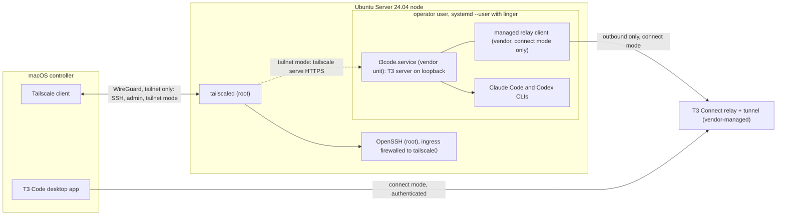

# Harbor design specification

- Status: proposed (PR 1), revised after technical review
- Date: 2026-09-01
- Repository: `kgarg2468/harbor`
- Author: Claude Fable 5.1; technical review: Codex; owner review pending

Harbor turns a spare machine into a private, always-on AI-agent node. It is the public,
reproducible glue between four things Harbor does not own: Ubuntu Server, Tailscale, the agent
runtimes (Claude Code and Codex), and T3 Code as the controller UI and server. Harbor provisions
the node, drives and verifies the vendor-owned T3 background service, sets up and verifies the
client route, reports health, and removes exactly what it created.

Harbor is a new repository rather than an extension of `kgarg2468/foreman`. Foreman holds
orchestration policy and configuration; Harbor holds machine and network plumbing and links to
Foreman as an optional layer without depending on it.

Where this document cites T3 Code behavior, the source of truth is the T3 source tree's
`docs/internals/` and `docs/user/` documents for remote access, T3 Connect, server updates, and
the background service at the pinned release. Harbor relies only on commands and fields those
documents or the CLI's `--help` promise.

## 1. Goals, non-goals, audience, success criteria

### Goals

1. A fresh Ubuntu Server 24.04 install becomes a working agent node with one root bootstrap
   run and one operator provision run, both re-runnable, plus the attended Tailscale login,
   vendor logins, and pairing steps the vendors require.
2. No inbound port on the node is reachable from any non-tailnet address. SSH is tailnet-only.
   The controller route is one of three explicit access modes (section 3.3); the default, T3
   Connect, is an authenticated outbound managed tunnel that needs no inbound port but is not
   tailnet-private.
3. The T3 server survives reboots, SSH disconnects, and lid closes with nobody logged in, using
   T3's own background service.
4. Every step is idempotent, observable through `harbor status`, and reversible through
   `harbor teardown`, which removes only artifacts recorded in Harbor's ownership journal.
5. The repository is safe to publish: no secrets, no owner tailnet or T3 Connect identifiers,
   no copied private application state.
6. Every automatable behavior has a test that runs in GitHub Actions without real credentials.
   Attended flows have documented manual acceptance checks.

### Non-goals

- Harbor is not an orchestrator and defines no policy. That is Foreman's job or the operator's.
- Harbor does not vendor, fork, patch, or re-implement T3 Code, Tailscale, Claude Code, Codex,
  or Foreman. It renders no T3 service unit, start wrapper, updater, or rollback (section 3.2).
- Harbor does not manage agent worktrees. T3 owns the worktrees it drives; Foreman owns
  orchestration policy. Harbor may recommend paths in its runbook but invents no branch or path
  semantics.
- Harbor does not manage, read, or observe T3 session or chat data, agent credentials, or
  pairing state beyond what vendor status commands report.
- Each Harbor installation manages only its local node.
- Harbor never opens public inbound ports, configures reverse proxies, or uses Tailscale Funnel.
- Harbor has no GUI. The GUI is T3 Code.

### Audience

Engineers who own a spare laptop or desktop, already use Claude Code or Codex, and want a
private remote node they can trust and explain. They are comfortable with a terminal, `sudo`,
and reading a systemd unit. They need not know Tailscale or T3 Connect internals.

### Success criteria for v1

| Criterion | Measure |
| --- | --- |
| Fresh node to connected controller | Under 30 minutes of operator time following the runbook, excluding OS install and attended browser steps |
| Idempotent reruns | A second `harbor bootstrap` and `harbor provision` on a healthy node report zero changes, mint no new pairing token, and exit 0 |
| Unattended recovery | After `sudo reboot`, `harbor status` reports healthy within 2 minutes with no login |
| Exact teardown | After `harbor teardown --level node`, every applied journal entry is reverted or named in a warning, nothing outside the journal has changed, and the operator user still exists. With `--delete-user`, the user and home are also gone |
| Public safety | Secret scanning and the placeholder scan pass on every commit in CI |
| Coverage | Every subcommand has Bats tests; the Ubuntu 24.04 integration lane exercises bootstrap, provision, vendor service install, status, and teardown end to end against fixture shims |

## 2. Supported topology and compatibility floor

### v1 topology

- Controller: one macOS machine running the T3 Code desktop app and the Tailscale client.
- Node: one x86_64 machine running Ubuntu Server 24.04 LTS. The reference hardware is an ASUS
  ROG Zephyrus G14 used headless; only the lid and power handling is laptop-specific.
- Network: one Tailscale tailnet containing both machines, MagicDNS enabled. The tailnet is the
  SSH and administrative route in every access mode.
- Runtimes: Claude Code and Codex CLIs on the node, authenticated interactively, running under
  the operator user.
- Controller server: the T3 Code server on the node, run by T3's own user-level background
  service (`t3code.service`), bound to loopback by the vendor default.
- Controller route: one of `connect` (default), `tailnet`, or `ssh` (section 3.3).



### Compatibility floor

| Component | Floor | Notes |
| --- | --- | --- |
| Node OS | Ubuntu Server 24.04 LTS, amd64 | systemd 255, bash 5.2, `apt`. Later releases untested in v1 |
| Controller OS | macOS 14 or later | Client scripts run under macOS's bundled bash 3.2 |
| Shell | bash 3.2 subset for `client/` and `lib/`; bash 5 permitted in `node/` | Enforced by ShellCheck and the pinned `macos-14` runner |
| Tailscale | Stable channel from `pkgs.tailscale.com` on the node; App Store or standalone client on the Mac | MagicDNS required |
| Node.js | An exact release satisfying the pinned T3 release's `engines.node` | See version pinning |
| T3 Code | The `t3` npm package at the locked exact version; a matching desktop release on the Mac | T3 warns on skew and offers its own update |

### Version pinning

All third-party versions live in `versions.lock` at the repository root, one exact value per
key: `ubuntu_release`, `tailscale_apt_channel`, `tailscale_version`, `nodejs_version`,
`nodejs_install`, `nodejs_sha256`, `claude_code_version`, `claude_code_install`,
`codex_version`, `codex_install`, `t3_version`. This document records the schema, not values.

- Values are first set in the PR that installs each component (PR 3 for Node.js and Tailscale,
  PR 4 for Claude Code, Codex, and T3; the macOS client installs none of them) and thereafter
  only by a dedicated version-bump PR containing `versions.lock` plus any
  adapter changes in `lib/<component>.sh` the new release requires, such as new
  `t3 service status` phrases. It must pass the integration and vendor-smoke lanes (section 7).
- Installers compare installed to locked before acting: match is a no-op, mismatch installs the
  locked version, never `latest`. Downloads outside a package manager require a recorded
  SHA-256 and fail closed. Methods must yield a verifiable exact version and work without root
  in the operator's home prefix, except Node.js, which root installs during bootstrap. If a
  pinned Tailscale version is unavailable from the vendor apt repository, the installer fails
  naming the lock file.
- T3 is driven through the `t3` npm package's CLI at the locked version; `t3 service install`
  and `t3 service update` install the CLI version that invokes them.
- Node.js: T3's `engines.node` range belongs to T3, so Harbor never hard-codes it. The
  version-bump PR re-reads it and proves `nodejs_version` satisfies it; `lib/versions.sh`
  repeats the check at provision time against the installed `t3` package and exits 3 on
  failure. Node lives at a fixed prefix on the operator's default `PATH`, resolvable from a
  non-interactive `sh -lc` shell, because T3's service launcher and desktop-managed SSH launch
  run without an interactive profile.

## 3. Trust and security model

### 3.1 Principals

| Principal | Runs as | Purpose |
| --- | --- | --- |
| `harbor bootstrap` | root via `sudo` | OS packages, Node.js, operator user, authorized key, operator-scoped sshd drop-in, firewall, power, Tailscale install or adoption and operator setting, linger, root journal |
| `tailscaled`, `sshd` | root system services | Vendor and distribution defaults |
| `harbor provision` and everything after | operator user, default `harbor`, no privileged groups | Agent CLI and T3 install, `t3 service install`, access-mode configuration, status, teardown of user-level state |
| `t3code.service` | operator user, `systemd --user` | T3's own service and launcher. Harbor never edits it |
| Managed relay client | operator user, child of the T3 service | T3 Connect's relay client, installed by `t3 connect link`. Harbor never invokes it |
| Agent processes | operator user, children of the T3 server or an SSH session | Read and write only under the operator home |

Root is used once per node lifetime under normal operation, and again only for
`harbor upgrade --system` or `harbor teardown --level node`. Every root step is inside
`node/bootstrap.sh`; no other script calls `sudo`. Bootstrap sets the Tailscale operator (section
5.2) so the operator user can run `tailscale status`, `serve`, and `up` without root.

### 3.2 The T3 service is vendor-owned

T3 Code ships its own Linux background service, and Harbor uses it as-is. `t3 service install`
writes `~/.config/systemd/user/t3code.service`, enables lingering, and starts a launcher that
owns exact-version runtimes, selection state, database snapshots before update trials, and
rollback when a trial fails. `t3 service status|update|uninstall` complete the lifecycle. The
service binds to loopback by vendor default; Harbor sets no bind address, port, or environment.

Harbor's role is orchestration around those commands: preflight (Node satisfies the engines
range, linger is on, disk has headroom for a snapshot), invocation at the locked version, and
verification. Harbor therefore has no unit template, start wrapper, T3 runtime directory, port
variable, or service rollback. `harbor service <start|stop|restart|status|logs>` prints the
vendor command it runs and runs it. The user manager has no `network-online.target`; T3
documents that the server retries its own networking, so Harbor adds no start gate.

**Service status adapter.** The `t3 service` CLI has no JSON mode. `lib/t3.sh` treats
`t3 service status` as a version-pinned adapter: exit code first, then the minimum set of stable
phrases needed to distinguish installed-and-current, update-pending, and not-installed, backed
by fixtures captured from the pinned release. Unrecognized output classifies as `unknown`, never
a guess. A vendor change to that text is an adapter change made in the dedicated version-bump
PR. A healthy service means the adapter reports installed and current and
`systemctl --user is-active t3code.service` is `active`; the vendor log file need not exist yet.

### 3.3 Access modes

The node-to-desktop route is an explicit choice recorded as `access_mode` in
`~/.config/harbor/config`. Exactly one mode is active. Modes map directly onto the access
methods T3 documents; Harbor invents no transport.

| Mode | Default? | Route | Inbound on node | Tailnet-only? | Vendor commands wrapped |
| --- | --- | --- | --- | --- | --- |
| `connect` | recommended, pending owner approval | Managed T3 Connect tunnel: the node links to T3's relay with the operator's T3 Connect account; the desktop, signed into the same account, reaches it through the relay with bearer and DPoP credentials | none | no | `t3 connect login`, `t3 connect link`, `t3 connect status --json`, `t3 connect unlink`, `t3 connect logout` |
| `tailnet` | `--access-mode tailnet` | T3 asks Tailscale Serve to front the loopback server over HTTPS at `https://harbor-node.TAILNET.ts.net/`; the desktop pairs through the ordinary pairing URL | 443 on `tailscale0`, terminated by `tailscaled` | yes | `t3 pair --tailscale`, `tailscale serve status`, `tailscale serve --https=443 off` |
| `ssh` | `--access-mode ssh` | Desktop-managed SSH launch over the tailnet; the desktop starts or reuses its own launcher-managed remote T3 server under `~/.t3/ssh-launch/<host-key>/`, separate from `t3code.service`, and forwards a loopback port | SSH only | yes | none on the node; Harbor prepares Mac SSH config and a non-interactive Node on the node |

Facts that hold in every mode:

- SSH is always available over the tailnet and is the only inbound service in `connect` and
  `ssh` modes.
- T3 Connect traffic never traverses the tailnet. Operators who require that no controller
  traffic leaves the tailnet must choose `tailnet`.
- Harbor never invokes `tailscale funnel`. The v1 invariant is no public inbound exposure, so
  any Funnel exposure on any port, whoever created it, is a security failure and makes
  `harbor status` exit 2. Harbor removes only Serve mappings its journal records as
  Harbor-created and never mutates a mapping it did not create; a foreign Funnel mapping is
  reported with the vendor command that would remove it.
- `harbor access set <mode>` reverts the previous mode's journal entries (section 5.7),
  configures the new one, and reports any attended step still needed.

### 3.4 Network posture on the node

- Ingress is allowed only on `tailscale0`, through `ufw` with preserved pre-state. If `ufw` is
  inactive before bootstrap, Harbor sets `default deny incoming`, `default allow outgoing`, adds
  `allow in on tailscale0 to any port 22 proto tcp comment harbor`, and enables it. If `ufw` is
  already active, Harbor adds only its tagged rule, journals the existing defaults, and changes
  nothing else. Changing those defaults requires `--adopt-firewall`, which journals the prior
  defaults so teardown restores them exactly. No rule references a physical interface.
- The `firewall.rules` health check matches the preserved pre-state. When Harbor enabled `ufw`,
  it expects Harbor's deny-incoming posture. When `ufw` was already active, it requires only
  Harbor's tagged rule and verifies the journaled original defaults are unchanged, unless the
  operator adopted firewall management, in which case it expects the adopted posture. A
  deliberately preserved pre-existing default is never reported as broken; a permissive one
  appears as an informational note that does not affect the exit code.
- In `tailnet` mode, HTTPS 443 arrives inside the WireGuard tunnel and needs no `ufw` rule.
- OpenSSH listens on all interfaces because `sshd` starts before `tailscale0` exists; the
  firewall provides the interface restriction.
- Break-glass access is the physical console. `--allow-lan-ssh` adds a journaled rule permitting
  port 22 from the node's current RFC 1918 network and is reported in status as a warning.

### 3.5 SSH hardening is scoped to the operator

Harbor writes one drop-in, `/etc/ssh/sshd_config.d/50-harbor-operator.conf`, limited to the
operator account: public-key-only authentication with password and keyboard-interactive
authentication disabled for that user. It contains no `AllowUsers`, `DenyUsers`, or other
directive that changes who may log in. Acceptance, tested in the integration lane: `sshd -t`
passes; `sshd -T -C user=<operator>` reports `passwordauthentication no` and
`kbdinteractiveauthentication no`; `sshd -T -C user=<installation user>` is unchanged for every
directive.

**Authorized-key bootstrap.** The operator needs a key before password login is disabled for
it. The default source is the invoking `SUDO_USER` only: bootstrap validates that it names a
non-root local user and copies that user's `~/.ssh/authorized_keys` only if the file exists, is
readable, and is non-empty. Otherwise it requires `--authorized-key-file PATH` and refuses to
proceed. Harbor never guesses another account. The journal entry records source path and mode,
target path, and the SHA-256 of both; after the copy, bootstrap verifies the target is owned by
the operator with mode 0600 inside a 0700 `.ssh`. An existing operator `authorized_keys` is left
untouched and journaled as `observed`.

Global hardening (`PermitRootLogin no`, global `PasswordAuthentication no`) is opt-in through
`--harden-sshd`, which writes a separately journaled `51-harbor-global.conf` removable on its own
with `harbor teardown --unharden-sshd`, and refuses unless the installation user has an
authorized key. Tailscale SSH is available with `--tailscale-ssh` where tailnet policy permits.

### 3.6 Authentication and pairing are attended, never scripted

Provisioning is idempotent and unattended. Anything that needs a browser or mints a credential
is a separate, explicitly invoked attended command.

- Tailscale: `harbor auth tailscale`, run unprivileged by the operator only after the section 5.2
  operator-access probe succeeds, is allowed only on a Harbor-installed, not-running install. It
  runs `tailscale up --hostname=harbor-node`, plus `--ssh` when bootstrap recorded
  `--tailscale-ssh`, and shows the login URL. Pre-auth keys are unsupported in v1. Pre-existing
  installs are never logged in, logged out, or reconfigured beyond the section 5.2 operator rule.
- Claude Code, Codex, and T3 Connect login: `harbor auth <claude|codex|connect>` journals the
  tool's documented machine-readable auth status, runs the tool's own login, and records an
  `auth` entry (`created`) only when that run transitioned logged-out to logged-in. A tool with
  no such status command gets no entry and is never logged out by Harbor. Credentials land in
  the tool's own store; Harbor never reads, copies, prints, or inspects them.
- T3 Connect (`connect` mode): `harbor auth connect` runs `t3 connect login` when
  `authenticated` is false (over SSH the CLI uses its out-of-band URL-and-code flow) and
  `t3 connect link` when `linked` is false, passing the vendor's relay-client download prompt
  through rather than pre-answering it, then restarts the service and verifies.
- Pairing (`tailnet` mode): `harbor pair` runs `t3 pair --tailscale`, which prints a one-time
  pairing URL and QR code the operator enters into T3 Code. Harbor shows the vendor output once
  and never logs it, writes it to disk, or includes it in diagnostics. `harbor pair` refuses to
  run in other modes.
- `harbor provision` never runs any of the above. It configures the selected mode and, when a
  vendor-observable precondition is unmet, reports `needs_tailscale_login`, `needs_login`,
  `needs_pairing`, `needs_connect_login`, or `needs_connect_link` with the command to run.
  Rerunning provision never mints a pairing token.
- Harbor cannot observe whether a desktop is paired or a session exists; it verifies
  vendor-reported preconditions (section 5.6) and the runbook has the operator confirm in T3 Code.

### 3.7 Ownership journal and reversibility

Every mutation Harbor makes is a journaled transaction. There is one journal per principal:
`/var/lib/harbor/journal/` for root steps, `~/.local/state/harbor/journal/` for operator steps,
and the same operator path on the Mac. Each transaction is one file, `NNNN-<op>.json`.

| Field | Meaning |
| --- | --- |
| `op` | `file`, `package`, `runtime-install` (Node.js, Claude Code, Codex, `t3`), `ufw-rule`, `ufw-default`, `systemd-mask`, `linger`, `user`, `authorized-keys`, `auth` (`claude`, `codex`, `connect`), `tailscale-install`, `tailscale-login`, `tailscale-operator`, `tailscale-serve`, `t3-service`, `t3-connect-link`, `ssh-include` |
| `target` | the path, package, runtime, tool, exact rule text, mapping, unit, or user |
| `pre_state` | normalized observation before mutation: `absent`, or file SHA-256 plus mode and owner, package or runtime version and install method, auth status, firewall default, `Linger=` value, `BackendState`, operator (`absent`, the exact value the pinned CLI's `tailscale get operator` prints, or the result of the unprivileged `tailscale status --json` probe when no exact value is readable), serve mapping, `linked` flag |
| `post_state` | the intended state after mutation in the same form, including the SHA-256 of any content Harbor writes |
| `ownership` | `created` (absent before; Harbor made it), `modified` (pre-existing; Harbor changed a recorded aspect), `observed` (pre-existing; unchanged; recorded for status only) |
| `phase` | `prepared`, `applied`, or `reverted` |

Write protocol: before mutating, Harbor writes the entry with `phase: prepared` to a temporary
file in the journal directory, `fsync`s it, renames it into place, and `fsync`s the directory.
It then mutates, re-observes, and verifies actual state equals `post_state`, and rewrites the
entry as `applied` by the same write, fsync, rename sequence. Reverting uses the same sequence
to reach `reverted`. The pre and post states, not a boolean flag, make recovery decidable.

Recovery: every Harbor command first scans its journal for `prepared` entries. For each, it
observes actual state. Equal to `pre_state`: the mutation never landed; mark `reverted`. Equal
to `post_state`: it landed; mark `applied`. Neither: refuse to continue, exit 2, and name the
entry for the operator to inspect. Nothing else proceeds until the journal is clean. This is the
only basis on which this document promises exact teardown across a crash.

Idempotency and teardown derive from this contract:

- A rerun applies a step only when inspection of real state fails, then journals and verifies as
  above. A rerun on a healthy node writes no new `created` or `modified` entry.
- Teardown walks `applied` entries in reverse order and observes actual state. Equal to
  `post_state`: apply the recorded inverse and mark `reverted`. Equal to `pre_state`: mark
  `reverted` with no action. Neither (for example a file edited after Harbor wrote it): skip,
  name it in a warning, leave the artifact in place.
- Only `created` entries are removed. `modified` entries are restored to `pre_state` only when
  the inverse is exact and verified (a firewall default, a `Linger=` value, a runtime whose
  recorded prior version the same method reinstalls and `--version` confirms); otherwise
  teardown warns and leaves the artifact. `observed` entries are never acted on.
- Journals are preserved until the whole requested teardown completes and every entry in scope
  is `reverted` or warned. Only then is the directory renamed to `journal.<timestamp>.done`. A
  partial teardown leaves the journal in place and a rerun resumes from the remaining entries.
- Harbor never runs `ufw reset`, never disables a firewall it did not enable, never purges, logs
  out, or reconfigures a Tailscale installation or identity it did not create beyond an operator
  adopted under section 5.2 with an exact prior value, never runs `tailscale serve reset`, never
  logs out a tool it did not log in, never removes packages, runtimes, or tools it did not
  install or `openssh-server`, and never touches paths outside its journal.
- Identity- or data-bearing removals (the operator user and home, a Harbor-installed Tailscale
  identity and package) each require a separate explicit flag and a typed confirmation. T3's
  home and data are never removed by Harbor.

### 3.8 No secrets on the command line or in the repository

- No Harbor subcommand accepts a token, key, password, or credential-bearing URL as an argument
  or environment variable. Secrets are handled by the vendor tool's own flow.
- The repository contains no secrets, live tailnet IPs, private hostnames, personal emails,
  pairing URLs, tunnel hostnames, bearer tokens, API keys, DPoP material, T3 Connect user IDs,
  or copied application state. Documentation and tests use only these placeholders:
  `harbor-node` (node hostname), `TAILNET.ts.net` (MagicDNS suffix), `TAILNET_IP` (node
  Tailscale IPv4), `OPERATOR` (non-default operator name), `operator@example.com` (any account
  email), `RELAY_HOSTNAME` (any relay or tunnel hostname).
- CI runs gitleaks with the default ruleset plus Harbor rules flagging: IPv4 literals in the
  Tailscale carrier-grade NAT range, any MagicDNS suffix other than `TAILNET.ts.net`, the
  Tailscale auth-key prefix, emails outside `example.com`, Clerk user-ID prefixes, and URL
  parameters or fragments named `token`, `code`, `key`, `secret`, or `wsTicket`.

### 3.9 Least-collection logging and fail-closed diagnostics

- Harbor's own logs (`~/.local/state/harbor/harbor.log`, `/var/lib/harbor/bootstrap.log`)
  record only step names, check identifiers, exit codes, versions, and vendor argv with
  secret-bearing arguments replaced by their flag names. Vendor stdout and stderr go to the
  terminal and are not stored.
- `harbor status --json` emits only the allowlisted identifiers and values in section 5.6.
- `harbor doctor --bundle PATH` is allowlist-based. It includes exactly: Harbor's own logs, the
  journals with hashes only, `versions.lock` versus installed, the text of Harbor-written
  drop-ins, `ufw status`, `tailscale status --json` reduced to `BackendState`, `Self.Online`,
  and key expiry, the adapter's classification of `t3 service status`, and
  `t3 connect status --json` reduced to `desired`, `authenticated`, `linked`, and
  `relayClient.status`. `cloudUserId`, `relayUrl`, and `publishAgentActivity` are never
  collected.
- Vendor logs are excluded from bundles in v1, with no flag to include them. Redaction cannot
  guarantee arbitrary log content is safe to share, so doctor prints the vendor log path and
  tells the operator to inspect it locally.
- Redaction of Harbor's own material is applied by `lib/diag.sh` and fails closed: if the
  pattern set cannot load or any gitleaks rule matches the rendered bundle, the bundle is
  deleted and doctor exits 2 naming the rule.
- Harbor never asks the operator to type a secret into a shell.

## 4. Components and repository boundaries

### Repository layout

```text
harbor/
  README.md, SECURITY.md, CONTRIBUTING.md, LICENSE   public front door (PR 2); LICENSE proposed MIT
  bin/harbor            single entry point; dispatches subcommands, contains no logic
  lib/                  log, checks, versions, journal, apt, diag, and one adapter per vendor:
                        node.sh, tailscale.sh, agents.sh, t3.sh
  node/                 bootstrap.sh (root), provision.sh (operator), dropins/ templates
  client/               setup.sh and verify.sh for macOS
  versions.lock
  tests/                unit/, integration/, smoke/ (Bats); shims/bin/ for every vendor binary;
                        fixtures/ including pinned t3 service status text; vendor/ bats submodules
  docs/                 architecture.md, security.md, runbook.md, troubleshooting.md, superpowers/specs/
  .github/workflows/    lint.yml, test.yml, integration.yml, vendor-smoke.yml
```

The adapter rule: any command that invokes a vendor binary lives in that vendor's `lib/` file
and nowhere else. Tests shim the binary, not the adapter.

### Subcommands

| Command | Runs as | Purpose |
| --- | --- | --- |
| `harbor bootstrap [--operator NAME] [--authorized-key-file PATH] [--tailscale-ssh] [--allow-lan-ssh] [--harden-sshd] [--adopt-firewall] [--adopt-tailscale]` | root | Section 5.2 |
| `harbor provision [--access-mode connect\|tailnet\|ssh]` | operator | Sections 5.4 and 5.5, unattended |
| `harbor auth <claude\|codex\|tailscale\|connect>` | operator | Attended vendor login, journaled as `auth` only when Harbor's run logs the tool in; `tailscale` only on a Harbor-installed install after the section 5.2 operator-access probe succeeds; `connect` also links (section 3.6) |
| `harbor pair` | operator | `tailnet` mode only: attended `t3 pair --tailscale` |
| `harbor access <show\|set MODE>` | operator | Section 3.3 |
| `harbor service <start\|stop\|restart\|status\|logs>` | operator | Transparent vendor wrapper (section 3.2) |
| `harbor status [--json]`, `harbor doctor [--bundle PATH]` | operator | Section 5.6 |
| `harbor upgrade [--system]` | operator, root with `--system` | Section 6.4, attended |
| `harbor teardown --level <access\|service\|agents\|node> [--delete-user] [--purge-tailscale] [--remove-packages] [--unharden-sshd]` | operator, root for `node` | Section 5.7 |
| `harbor client <setup\|verify> [--remove]` | Mac user | Section 5.5 |

### Boundaries with other repositories

Harbor owns provisioning, orchestration of vendor lifecycles, network posture, the ownership
journal, client verification, diagnostics, and teardown. Foreman owns orchestration policy;
`docs/architecture.md` links to it and Harbor has no code path that reads Foreman files. T3 Code
owns the server, service and launcher, updates and rollback, T3 Connect, Serve publication,
pairing and sessions, and agent worktrees; Harbor owns nothing inside T3's home or unit.
Tailscale owns mesh, identity, MagicDNS, and TLS. Claude Code and Codex own their runtimes and
credential stores, which Harbor never touches.

## 5. Provisioning and data flow

Each step lists the mutation and the inspection that makes it idempotent. Every mutation follows
the journal protocol in section 3.7.

### 5.1 Preconditions

Ubuntu Server 24.04 with a sudo-capable installation user, network configured, and hostname set
(`harbor-node` here). A tailnet with MagicDNS on and the Mac joined. For `connect`, a T3 Connect
account signed into the desktop app. The repository cloned onto the node at a pinned tag or
commit; `bin/harbor` refuses a dirty checkout unless `HARBOR_DEV=1`.

### 5.2 Root bootstrap: `sudo harbor bootstrap`

| Step | Mutation | Idempotency check |
| --- | --- | --- |
| Preflight | none | `/etc/os-release` reports 24.04 amd64; root with a valid `SUDO_USER` or `--authorized-key-file`; lock parses; journal recovery clean |
| Journal | create `/var/lib/harbor/journal/` | exists |
| Packages | `apt-get install` of `git`, `curl`, `ufw`, `jq`, `openssh-server`, `ca-certificates`; pre-state journaled | `dpkg-query` shows each installed |
| Node.js | install `nodejs_version` by `nodejs_install`, checksum-verified when downloaded, to a prefix on the default `PATH`; journal `runtime-install` with any pre-existing version | `sh -lc 'node --version'` as the operator equals lock |
| Operator user | `useradd --create-home --shell /bin/bash harbor`, no sudo, no extra groups | user exists with matching shell and home |
| Authorized key | copy per section 3.5 | target exists with journaled hash, owner, and mode |
| SSH | write `50-harbor-operator.conf`; `sshd -t`; the `sshd -T` assertions; reload | hash equals `post_state`; `sshd -t` passes |
| Firewall | rules from section 3.4 with pre-state journaled | `ufw status` contains the Harbor rule and the pre-state-appropriate defaults |
| Power | `/etc/systemd/logind.conf.d/harbor.conf` with `HandleLidSwitch`, `HandleLidSwitchExternalPower`, and `HandleLidSwitchDocked` set to `ignore`; mask sleep, suspend, hibernate, and hybrid-sleep targets unless already masked; restart `systemd-logind` | hash equals `post_state`; targets masked |
| Tailscale install | pre-existing: journal `observed`, compare to lock, report drift as `degraded`, change nothing unless `--adopt-tailscale`, which installs the locked version and journals `modified` with the prior version. Absent: add vendor keyring and apt source, `apt-get install tailscale=<locked>` | installed version equals lock, or pre-existing install recorded |
| Linger | `loginctl enable-linger harbor`, pre-state journaled | `Linger=yes` |
| Tailscale operator | Never run `tailscale up`. Probe: the operator user runs `tailscale status --json` without sudo. Harbor-installed: `tailscale set --operator=<operator>`, journaled `tailscale-operator` `created` with `pre_state` `absent`, no other preference touched. Pre-existing, probe fails: read the prior value only through the pinned CLI's documented `tailscale get operator`, and only when that command exists and prints an exact value; then, only with `--adopt-tailscale`, `tailscale set --operator=<operator>` journaled `modified` with that exact value. No exact value or no flag: mutate nothing, report a precondition with `sudo tailscale set --operator=<operator>` for the owner to run outside Harbor, and once the probe passes journal `observed`. Pre-existing, probe passes: journal `observed`. `--tailscale-ssh` is recorded for `harbor auth tailscale`. Then: `BackendState` `Running`: nothing more. Not running and Harbor-installed: report `needs_tailscale_login` naming `harbor auth tailscale`. Not running and pre-existing: print that the owner must bring it up with their existing preferences | `set` exited 0 and the operator user runs `tailscale status --json` without sudo; `BackendState` is checked separately |
| State record | `/var/lib/harbor/bootstrap.json` with lock hash, flags, timestamp | present and matching |

Bootstrap prints the operator's next command and exits without switching user. The node's
MagicDNS name is always read from `tailscale status --json`, never assumed.

### 5.3 Node join

Bootstrap never waits on a browser. On a Harbor-installed Tailscale, once the section 5.2
operator probe passes, the operator runs `harbor auth tailscale` unprivileged, opens the login
URL on the Mac, and approves the node; the command journals `tailscale-login`, waits up to 10
minutes for `Running`, then exits 0, or exits 3 on decline or timeout and is simply rerun.

### 5.4 Operator provision: `harbor provision`

Run as the operator over SSH from the Mac.

| Step | Mutation | Idempotency check |
| --- | --- | --- |
| Preflight | none | not root; `BackendState` is `Running`, else exit 1 with `needs_tailscale_login` (Harbor-installed) or the owner's own `tailscale up` (pre-existing); lock parses; `sh -lc 'node --version'` satisfies the pinned `engines.node`; `Linger=yes`; journal recovery clean |
| Journal and config | `~/.local/state/harbor/journal/`; `~/.config/harbor/config` with `access_mode`, mode 0600 | exist and parse |
| Runtime install | Claude Code and Codex at locked versions by locked methods into the operator's home prefix; journal `runtime-install` (`created`, or `modified` with the prior version, or `observed`) | `<cli> --version` equals lock |
| Runtime auth | none; report `needs_login` per CLI when its documented status command reports logged out, else `unknown` | attended through `harbor auth` |
| T3 install | `t3` at the locked version by the method PR 4 records; journal `runtime-install` likewise | `t3 --version` equals lock |
| Vendor service | `t3 service install` at the locked version; journal `t3-service` | adapter reports installed and current; unit `active` |
| Access mode | section 5.5 for the configured mode | mode-specific checks; attended steps reported, not run |
| State record | `~/.local/state/harbor/installed.lock`, a copy of the lock as installed, plus `provision.json` | present and matching |

If linger is off, provision prints the exact root command and exits 3. Provision exits 0 when
every unattended step holds and 1 when an attended step is still needed, naming it.

### 5.5 Access mode setup and macOS client

`connect` (default):

1. Read `t3 connect status --json`. The pinned adapter reads `desired`, `authenticated`,
   `linked`, and `relayClient.status` and ignores the rest. Unparseable output is `unknown`.
2. `authenticated` false: report `needs_connect_login`. `linked` false: report
   `needs_connect_link`. Both name `harbor auth connect`, which journals `t3-connect-link`
   (`created`, pre-state `linked: false`) before running `t3 connect link`, then restarts the
   service so it reconciles the link.
3. Healthy: `desired`, `authenticated`, and `linked` all true and `relayClient.status` is
   `available`, the valid value for the current pinned adapter. `missing` or `unsupported` is
   `degraded` with the vendor's own text.

`tailnet`:

1. Require `desired` false. If true, report that `connect` is still active and name
   `harbor access set tailnet`, which reverts the connect entries first.
2. Read `tailscale serve status`. No HTTPS 443 mapping: report `needs_pairing` naming
   `harbor pair`, because T3 configures the Serve mapping during `t3 pair --tailscale`.
   `harbor pair` journals `tailscale-serve` (pre-state of port 443) before invoking the vendor,
   then verifies the mapping. A mapping that pre-dates Harbor is `observed` and never removed.
3. Healthy: an HTTPS 443 mapping to a loopback target exists and no Funnel exposure exists.
   Harbor does not parse the target port.

`ssh`: nothing on the node beyond bootstrap and the vendor service. Provision verifies
`sh -lc 'command -v node && node --version'` succeeds for the operator, the check T3's SSH
launcher performs. The desktop starts or reuses its own launcher-managed server under
`~/.t3/ssh-launch/<host-key>/`, which Harbor neither manages nor observes; Harbor still installs
`t3code.service` in this mode for unattended direct, Connect, or tailnet access.

**Mac side.** `harbor client setup`, run from a clone on the Mac: confirm the Tailscale client is
logged in through the app-bundled CLI, exiting 3 if MagicDNS is off; print the T3 Code desktop
version next to `t3_version` (a mismatch is a warning, since T3 detects skew itself); write
`~/.ssh/harbor.conf` with a `Host harbor-node` block (`HostName` from the node's MagicDNS name,
`User harbor`, `IdentitiesOnly yes`) and add `Include ~/.ssh/harbor.conf` to `~/.ssh/config`
once, journaled as `ssh-include`. This block also serves T3's desktop-managed SSH launch.

`harbor client verify`, all modes: `tailscale ping harbor-node` succeeds, and
`ssh harbor-node harbor status --json` returns parseable JSON for every documented exit code (0
to 3); verify fails only on an unparseable body or undocumented code. By mode: `connect` requires
remote `linked: true`; `tailnet` requires a TLS connection to
`https://harbor-node.TAILNET.ts.net/` (connection, not body); `ssh` requires the remote `sh -lc`
Node check to satisfy `engines.node`. Manual acceptance per mode: the environment is listed and
connects under Settings → Connections in T3 Code; the `harbor pair` result entered in T3 Code
shows the environment; the environment is added through the desktop's SSH launch flow.

### 5.6 Health: `harbor status` and `harbor doctor`

`harbor status` performs read-only checks and exits 0 healthy, 1 degraded, 2 broken, 3 usage or
precondition error. With `--json` it always emits a JSON object: on 0 to 2 the check list below,
on 3 an object with a single `error` field. Each identifier is stable and documented in
`docs/troubleshooting.md`. Checks that cannot be evaluated report `unknown` rather than guessing.

| Identifier | Check | Failure level |
| --- | --- | --- |
| `os.release` | Ubuntu 24.04 amd64 | broken |
| `versions.drift` | each installed version equals `installed.lock`, which equals `versions.lock`; a preserved pre-existing Tailscale at another version is reported here | degraded |
| `node.engines` | `sh -lc 'node --version'` satisfies the installed T3 package's `engines.node` | broken |
| `tailscale.running` | `BackendState == "Running"`; the operator user can run `tailscale status --json` without sudo | broken |
| `tailscale.keyexpiry` | key expiry more than 7 days away or disabled | degraded |
| `tailscale.serve` | no Funnel exposure on any port; in `tailnet` mode an HTTPS 443 loopback mapping exists; in other modes no Harbor-created mapping exists | broken |
| `firewall.rules` | `ufw` active; Harbor's tagged rule present; defaults match the journaled pre-state or adopted posture (section 3.4) | broken |
| `ssh.config` | operator drop-in hash equals `post_state`; `sshd -t` passes | degraded |
| `power.lid` | logind drop-in present; sleep targets masked | degraded |
| `linger` | `Linger=yes` for the operator | broken |
| `service.t3` | adapter reports installed and current; unit `active`; `unknown` on unrecognized text | broken |
| `t3.connect` | `connect` mode: `desired`, `authenticated`, `linked` true and `relayClient.status` `available`; other modes: `desired` false | degraded |
| `t3.pairing` | `tailnet` mode: `needs_pairing` when no Serve mapping exists, else `unknown`; Harbor cannot observe desktop pairing | degraded |
| `agents.claude`, `agents.codex` | installed at locked version; login state from the CLI's documented status command when one exists, else `unknown` | degraded |
| `disk.free` | more than 5 GiB free on the operator home filesystem, the headroom T3's update snapshot needs | degraded |
| `thermal` | no CPU thermal zone under `/sys/class/thermal` above its critical trip point | degraded |

`harbor doctor` runs status, prints the troubleshooting fix for each failed check, and with
`--bundle PATH` writes the allowlisted bundle from section 3.9.

### 5.7 Teardown: `harbor teardown --level <level>`

Levels nest; each runs the ones below it first. Every level follows section 3.7: reverse order,
actual state compared to `post_state` and `pre_state`, journal finalized only when the whole
requested level completes.

| Level | Runs as | Reverses by default | Only with an explicit flag and typed confirmation |
| --- | --- | --- | --- |
| `access` | operator | `connect`: `t3 connect unlink`, which sets `desired` false, clears the persisted link, attempts live tunnel shutdown and remote relay revocation, and keeps the stored authorization. After a service restart Harbor verifies only `desired` and `linked` are false; the managed relay-client executable stays installed and may still report `available`. If vendor output does not confirm remote revocation, Harbor prints the manual account-cleanup checklist. `tailnet`: `tailscale serve --https=443 off` only if the journal records Harbor created that mapping. `ssh`: nothing | none |
| `service` | operator | show service status, warn the operator to finish active work, require typed confirmation, then `t3 service uninstall`; remove `~/.config/harbor` and `~/.local/share/harbor` | none. T3's home and data stay |
| `agents` | operator | `t3 connect logout` and each agent CLI's documented logout only for an `auth` entry journaled `created`; a pre-authenticated tool, or one with no machine-readable status, is never logged out. Remove Claude Code, Codex, and `t3` only when their `runtime-install` is `created`; restore a `modified` one to the prior version only with a verified exact inverse, else warn and leave it. Remove `~/.local/state/harbor` after finalizing the journal | none |
| `node` | root | revert Harbor-created drop-ins whose hashes match; unmask targets Harbor masked; delete Harbor's tagged `ufw` rules and restore only defaults Harbor changed; disable `ufw` only if Harbor enabled it; restore `Linger` to pre-state; remove Node.js under the same `runtime-install` rules; revert `tailscale-operator` only from its journal entry: `created` clears it with `tailscale set --operator=`, `modified` restores the exact journaled value with `tailscale set --operator=<prior>`, each verified by re-reading, and `observed` is never cleared or restored; remove `/var/lib/harbor` after finalizing the journal | `--delete-user`: `userdel --remove harbor` with the username typed back. `--purge-tailscale`: only when the journal records Harbor installed and logged in Tailscale, `tailscale logout`, `apt-get purge tailscale`, remove the Harbor-added apt source and keyring. `--remove-packages`: remove packages Harbor installed, never `openssh-server`. `--unharden-sshd`: remove `51-harbor-global.conf` |

The operator user is never removed without `--delete-user`. Pre-existing or adopted Tailscale
installations and identities are never removed or logged out; adoption reverts only the
recorded package version and exact operator changes. After the local steps, teardown prints a
checklist for actions only browser sessions can perform: confirm the environment is gone under
the T3 Connect account menu, remove the node from the Tailscale admin console if retired, revoke
the device in the Anthropic and OpenAI session lists for logins Harbor created, and forget the
environment in T3 Code.
`harbor client setup --remove` reverts the ssh include on the Mac.

## 6. Idempotency, failure handling, upgrades

### 6.1 Idempotency by inspection

No step relies on a marker file. Each step has a `check` that inspects real system state and an
`apply` that runs only when the check fails, inside a journal transaction; after `apply`, the
check runs again and a second failure aborts naming the step. The journal is authoritative for
recovery and teardown, inspection for control flow, so a partial install is fixed by a rerun.

### 6.2 Failure handling

- Every script runs with `set -euo pipefail` and an `ERR` trap that prints the failing step, the
  command, and the operator's next command. A `prepared` entry left behind is resolved by the
  recovery rules on the next run.
- Steps are ordered so a failure never leaves the node unreachable: firewall rules apply only
  after the `sshd` assertions pass, and the `tailscale0` allow rule precedes `ufw enable`. If
  Tailscale login times out, the console and, when requested, LAN SSH still work.
- Downloads and installs write to a temporary directory and move into place atomically.
- Exit codes: 0 success or no change, 1 degraded or attended step needed, 2 broken or apply
  failed, 3 precondition or usage error, 4 interrupted.

### 6.3 Reruns and partial installs

A rerun after any failure first recovers the journal, then resumes at the first failing check.
The integration lane kills bootstrap and provision at each step boundary, including between
mutation and the `applied` write, and asserts that a rerun converges.

### 6.4 Upgrades: `harbor upgrade` is attended

Harbor cannot prove the T3 server is idle: T3 exposes no lifecycle or idle API, and scanning
the service cgroup for agent processes is not a reliable proxy. In v1, `harbor upgrade` is
attended only and never runs from a timer or without a terminal.

1. The operator pulls the repository at the new tag. `harbor upgrade` diffs `versions.lock`
   against `installed.lock` and prints the plan.
2. Agent CLIs: install the locked version into the operator prefix and verify `--version`.
3. Node.js (root, `--system`): install the locked version and re-check the engines range against
   both the installed and the target T3 release before continuing.
4. T3: Harbor shows the service and T3 Connect status, warns the operator to finish active work
   in T3 Code, and requires an explicitly typed confirmation. It refuses if the adapter reports
   an update already pending. It then delegates entirely to `t3 service update` at the new
   locked version; T3's launcher stages, snapshots, trials, and rolls back on its own. Harbor
   verifies the adapter reports current at the new version and the unit is active.
5. Tailscale (root, `--system`): `apt-get install tailscale=<locked>`, only for a Harbor-installed
   or adopted installation.
6. On success, write the new `installed.lock`.

Harbor has no rollback command; T3 rollback belongs to T3's launcher, and rolling back an agent
CLI or Tailscale is checking out the previous Harbor tag and running `harbor upgrade` again.
Updates triggered from the desktop app use the same vendor launcher and need nothing from Harbor.

## 7. Test strategy

Every automatable behavior runs in CI. Attended flows (Tailscale and vendor logins, T3 Connect
link, pairing, desktop confirmation, attended upgrade) have manual acceptance checks written into
`docs/runbook.md`, and each PR touching them lists the checks it re-ran.

**Static, `lint.yml`:** ShellCheck (`-s bash -x -S warning`, `require-variable-braces`,
`check-sourced`); shfmt (`-i 2 -ci -bn -d`); gitleaks with the section 3.8 rules; a placeholder
scan over every tracked file except `tests/fixtures` for work-in-progress markers and any
identifier outside the placeholder list; markdownlint with line length disabled.

**Unit lane, `test.yml`:** runs on `ubuntu-24.04`, `macos-14` (the pinned compatibility runner,
system bash 3.2), and `macos-latest`; the macOS jobs run `client/` and `lib/` only. Every vendor
binary is a shim from `tests/shims/bin/` first on `PATH`; each appends its argv to
`$HARBOR_SHIM_LOG` and replies from a fixture selected by `$HARBOR_SHIM_SCENARIO`. Scenarios
cover healthy, not-running, wrong-version, funnel-enabled, connect-unauthenticated,
connect-unlinked, relay-client-missing, update-pending, unrecognized-service-text,
pre-existing-tailscale, pre-existing-ufw, the three `prepared` recovery outcomes, and timeout.
Tests assert on the shim log: an idempotency test reads "second run appends zero mutating
invocations and no pairing invocation"; a teardown test reads "no invocation outside the
journal's inverse list". `sudo`, `systemctl`, and `loginctl` are shimmed.

**Integration lane, `integration.yml`:** runs on the GitHub-hosted `ubuntu-24.04` VM with
systemd as PID 1. It uses Ubuntu archive packages and deterministic fixture shims or locally
built packages for every third-party component, so ordinary PRs never depend on npm, the
Tailscale repository, or vendor download hosts. The `t3` shim implements the pinned CLI contract
Harbor relies on: `service install` writes a real user unit running a trivial loopback listener
and enables linger, `service status` emits the pinned fixture text, `connect status --json`
emits fixture JSON. Actually executed:

- Operator user creation, authorized-key copy with owner and mode assertions, sshd drop-in with
  the `sshd -t` and `sshd -T` assertions for operator and runner user, logind drop-in, masking.
- `ufw --dry-run` with the rendered rule set asserted textually for both the inactive and
  pre-existing-active pre-states. Enabling `ufw` for real risks the runner's connectivity.
- `loginctl enable-linger`, then real `systemctl --user` against the operator's manager via
  `machinectl shell` or `runuser -l` with `XDG_RUNTIME_DIR` set; if the manager does not come up
  within 30 seconds the lane fails rather than skips.
- Shimmed installs with `--version` assertions; shimmed `t3 service install` producing a real
  active user unit; the Tailscale apt step against a local file-based apt repository holding a
  stub package at the locked version.
- Real `harbor status`, `harbor doctor --bundle` with the bundle secret-pattern assertion, and
  real `harbor teardown --level node` with the exact-teardown assertion, then `--delete-user`,
  then the assertion that the journal was finalized only after the last entry.
- Kill-and-rerun convergence at each step boundary via `HARBOR_FAIL_AFTER=<step>`, including
  between mutation and the `applied` write.

Always shimmed in every lane: `tailscale up|set|login|logout|serve|status`, `t3 connect`,
`t3 pair`, agent CLI login and logout, and anything requiring an account, credential, or peer.

**Vendor-smoke lane, `vendor-smoke.yml`:** scheduled weekly, runnable manually, and required on
version-bump PRs. It performs real installs of Node.js, Tailscale (package only, daemon started
just for the operator check, never logged in), Claude Code, Codex, and `t3` at the locked
versions, runs real `t3 service install`, asserts the adapter classifies real `t3 service status`
output and that real `t3 connect status --json` matches the pinned shape, and runs the operator
check in the map below. A failure opens an issue rather than blocking unrelated PRs.

### Test to requirement map

| Requirement | Test |
| --- | --- |
| Idempotent reruns | unit: zero mutating shim calls on second run; integration: second run exits 0 with no new `created` or `modified` entry |
| Crash-safe journal | unit: all three `prepared` recovery outcomes; integration: kill between mutation and `applied`, rerun converges |
| Unattended recovery | integration: restart of the user manager, then status within 120 seconds |
| Exact teardown | integration: after `--level node`, every entry `reverted` or warned, pre-seeded non-Harbor drop-in, `ufw` rule, and package untouched, `getent passwd harbor` succeeds; after `--delete-user`, it fails |
| Vendor lifecycle untouched | unit: no shim invocation writes under `~/.config/systemd/user/` or the T3 home; integration: unit content equals what the shim's `service install` wrote |
| Vendor status honesty | unit: unrecognized `t3 service status` text yields `unknown`; smoke: adapter classifies real output |
| No secrets in diagnostics | integration: gitleaks against the bundle; unit: bundle aborts on residual match and contains no vendor log content |
| No public exposure | unit: funnel-enabled scenario exits 2 and no removal is attempted for a foreign mapping; integration: rendered `ufw` rules contain no physical interface |
| Preserved pre-state | unit: pre-existing-ufw and pre-existing-tailscale scenarios show no default change, no `tailscale up`, no operator mutation without `--adopt-tailscale` and an exact `tailscale get operator` value, and status not broken; smoke: on the pinned Tailscale, whether `tailscale get operator` exists and prints an exact value is recorded, and after `tailscale set --operator` the operator user runs `tailscale status --json` without sudo |
| Operator-scoped SSH | integration: `sshd -T -C user=<runner user>` unchanged by bootstrap |
| Client verify accepts all codes | unit (macOS jobs): fixtures for exit 0 to 3 each parse; a non-JSON body fails |
| bash 3.2 compatibility | `macos-14` job |

## 8. PR plan

Every implementation PR must be independently testable, keep CI green, and not merge with an
unresolved Critical or Important finding from Greptile or the independent reviewer. The size
guideline is under 600 changed lines excluding fixtures and vendored test helpers.

| PR | Scope | Tests added | Merge gate |
| --- | --- | --- | --- |
| 1 | This design | none | owner approval of the decisions in section 9 |
| 2 | Foundation: minimal `README.md` with honest project status and architecture link, `SECURITY.md`, `CONTRIBUTING.md`, `LICENSE`, `bin/harbor`, `lib/log.sh`, `lib/checks.sh`, `lib/versions.sh` with a schema-only `versions.lock`, `lib/journal.sh`, Bats harness and shim skeleton, `lint.yml`, `test.yml` on all three runners | dispatcher, logging, lock parsing; journal prepare, apply, revert, and all three recovery outcomes; placeholder scan against fixtures | lint and unit green on all runners |
| 3 | Ubuntu bootstrap: `lib/apt.sh`, `lib/node.sh`, operator user, authorized-key bootstrap, operator-scoped sshd drop-in, pre-state-aware `ufw`, logind and sleep handling, Tailscale install, adopt, `get operator`, `set --operator`, and `up` adapter, `harbor auth tailscale`, linger, `node/bootstrap.sh`; real `ubuntu_release`, `nodejs_*`, and `tailscale_*` lock values; `integration.yml` with the bootstrap portion | unit: every check and apply pair including pre-existing scenarios; integration: real bootstrap against shims, kill-and-rerun | integration green; `ufw` dry-run rule sets and `sshd -T` assertions green; the section 5.2 operator flow verified on the pinned Tailscale by the smoke lane or a recorded manual acceptance |
| 4 | Provision and vendor service: `lib/agents.sh`, `lib/t3.sh` (locked invocation, service status adapter with fixtures, engines check), `node/provision.sh`, `harbor auth <claude\|codex\|connect>` with `auth` journaling, `harbor service`, real `claude_code_*`, `codex_*`, and `t3_version` lock values with each `*_install` method recorded, `vendor-smoke.yml` | unit: version drift, engines mismatch, status classification including `unknown`, no writes to vendor paths; integration: shimmed installs, active unit; smoke: real installs | `t3code.service` active in the lane; smoke lane green once |
| 5 | Remote access: `access_mode` config, `harbor access`, `connect` reporting and `harbor auth connect` link step, `tailnet` reporting and `harbor pair`, `ssh` checks, Funnel detection | unit: every mode in healthy, needs-login, needs-link, needs-pairing, relay-missing, and funnel scenarios; rerun mints no pairing token; mode switch reverts the previous mode's entries | unit green; no mode runs `tailscale serve reset` or `funnel` |
| 6 | macOS client: `client/setup.sh`, `client/verify.sh`, `harbor client`, journaled ssh include, T3 Code version report, per-mode verification | macOS jobs with shimmed Tailscale CLI and ssh, fixtures for every status exit code | both macOS jobs green |
| 7 | Status and diagnostics: `harbor status`, `harbor doctor`, `lib/diag.sh` allowlisted bundle with fail-closed redaction, pre-state-aware `firewall.rules`, troubleshooting identifiers | unit: every identifier in every scenario; bundle abort on residual match; integration: bundle secret scan | bundle scan green |
| 8 | Teardown and upgrade: journal-driven teardown at all four levels with finalization, destructive flags with typed confirmation, best-effort unlink with checklist, `client setup --remove`, attended `harbor upgrade` delegating to `t3 service update` | integration: exact teardown with and without `--delete-user`, pre-seeded artifacts untouched, journal finalized last; unit: upgrade refuses without confirmation and on update-pending | exact-teardown assertion green |
| 9 | Full documentation: `docs/architecture.md`, `docs/security.md`, `docs/runbook.md` with attended steps and manual acceptance checks, `docs/troubleshooting.md`, Foreman link, expanded README | placeholder scan; link check | reviewer walks the runbook against the integration lane output |

Dependencies: 2 before all others; 3 before 4; 4 before 5, 7, and 8; 5 before 6's per-mode
verification, otherwise 6 depends only on 2. PR 9 is last.

## 9. Decisions requiring owner approval

Each has a recommended default that PR 2 onward will implement unless changed.

1. Default access mode `connect` (authenticated but not tailnet-private), with `tailnet` and
   `ssh` as explicit alternatives. This is a recommendation; the alternative is defaulting to
   `tailnet` and making T3 Connect opt-in.
2. Firewall: `ufw` enabled with ingress only on `tailscale0` when no firewall pre-exists;
   pre-existing firewalls are only added to, never reconfigured without `--adopt-firewall`.
3. SSH: operator-scoped key-only authentication, key sourced only from `SUDO_USER` or an
   explicit file; global hardening opt-in and separately reversible; Tailscale SSH behind a flag.
4. Operator username default `harbor` with no sudo; Node.js installed by root to a fixed prefix
   on the default `PATH`; bash 3.2 floor for `lib/` and `client/`.
5. Version-bump policy: a dedicated version-bump PR containing `versions.lock` and any required
   adapter changes, gated on the integration and vendor-smoke lanes.
6. Pre-existing Tailscale preserved and reported as drift; its version and operator change only
   with `--adopt-tailscale`, the operator only when the exact prior value is readable.
7. Upgrades attended only in v1, with no automatic idle detection.
8. License: MIT, added in PR 2. This is a recommendation subject to owner review on this PR.

## 10. Acceptance criteria and deferred scope

### v1 acceptance

1. The success criteria table in section 1 is met and each row is backed by a test named in
   section 7 or a manual acceptance check in the runbook.
2. `harbor status` on the owner's node reports healthy after a reboot with no login.
3. T3 Code on the Mac drives an agent on the node through the configured access mode, with no
   port on the node reachable from any non-tailnet address, verified by a scan from the LAN.
4. `harbor teardown --level node` without flags leaves the operating system, the installation
   user, every pre-existing package, firewall rule, and Tailscale installation and identity, the
   operator user, and the operator's repositories. With `--delete-user` the operator user and
   home are also gone.
5. Lint, all three unit jobs, and the integration lane are green on `main`, and the vendor-smoke
   lane has passed at the locked versions.
6. `docs/runbook.md` has been followed verbatim on a fresh install by someone other than the
   author, including the attended pairing or T3 Connect steps and the attended upgrade.

### Deferred

- Fleet features: multiple nodes, node inventory, fleet-wide status.
- Tailscale pre-auth keys and any non-interactive authentication.
- Automatic or idle-aware updates, pending a stable T3 lifecycle or idle API.
- Vendor log collection in diagnostics, pending a redaction guarantee Harbor can honor.
- A Harbor worktree helper. T3 owns agent worktrees; Foreman owns orchestration policy.
- Harbor-owned hardening of the vendor unit, pending a vendor drop-in mechanism that survives
  `t3 service update`.
- Automated macOS installation of T3 Code; G14 battery and fan control; GPU drivers for local
  models; a Foreman integration beyond documentation; other Ubuntu releases or architectures.
